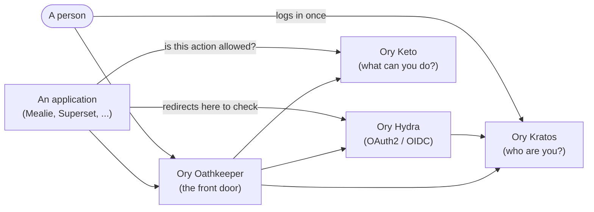
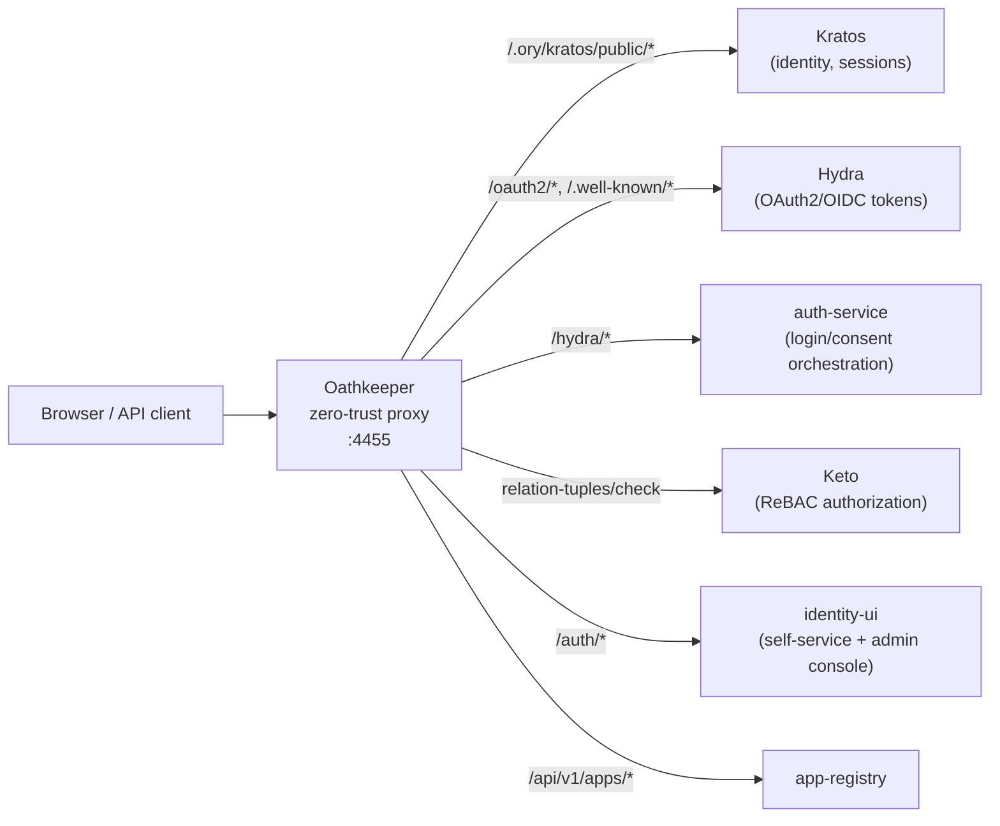

# 1. Introduction

## Purpose

This chapter answers one question: **what is this platform, in plain language, if you have never
used Ory, OAuth2, OpenID Connect (OIDC), or an identity/access-management system before?** It is
written for a reader on day zero — no prior Ory knowledge assumed, every term explained the first
time it's used. It also gives you the high-level architecture picture — which piece does what, and
how a request flows through the system. For the *deep* architecture reference (per-component
config internals, the full Keto namespace model, the honest current-state matrix across every
deployment surface, and the ADRs behind these decisions), see
[chapter 9 — Architecture](../09-architecture/README.md). This chapter deliberately stays at the
level a newcomer needs; it does not repeat that depth.

## Overview

The **NeoBIM Identity Control Plane** is a self-hosted system that answers two questions for every
request that reaches it:

1. **Who are you?** (authentication)
2. **What are you allowed to do?** (authorization)

Think of it as a bouncer, a receptionist, and a security guard rolled into one, sitting in front of
every application in the organization. A user (or another piece of software) never talks to an
application directly — they always pass through this platform first. The platform checks their
identity, checks their permissions, and only then lets the request through.

This is usually called **identity and access management (IAM)**. Instead of every application
inventing its own login page, password database, and permission rules, all of that logic lives in
one place, and applications simply trust the platform's decision.

### Why not just build login into each app?

Because that gets duplicated, inconsistent, and insecure very fast — one app hashes passwords
properly, another doesn't; one app has multi-factor authentication, another forgot to add it; one
app calls a permission "editor" and another calls the same thing "contributor." Centralizing
identity means:

- Users have **one account** across every connected application.
- Security fixes (password policy, MFA, session timeouts) happen **once**.
- Permissions are modeled **consistently** using one authorization engine.

## Who this platform is for

- **End users** signing into applications the organization runs (chapter 3).
- **Administrators** managing identities, organizations, permissions, and applications (chapter 4).
- **Developers** building new platform services, console pages, or integrating a new application
  (chapters 5 and 6).
- **Operators** deploying and running the stack day to day (chapter 7).

## The building blocks: Ory

This platform is built on top of the open-source **Ory** ecosystem — four purpose-built services,
each doing one job well, instead of one giant monolith trying to do everything. None of these four
are things this project wrote — they are the real, actively-maintained Ory open-source projects,
configured and wired together here.

| Component | Plain-language job | Technical job | Real local ports |
|---|---|---|---|
| **Kratos** | Keeps track of "who exists" and checks passwords/MFA at login | Identity and credential management: registration, login, account recovery, email verification, multi-factor authentication (TOTP), session issuance | public `4433`, admin `4434` |
| **Hydra** | Issues the "access badges" (tokens) apps use to talk to each other | OAuth2 / OpenID Connect (OIDC) provider: authorization code + PKCE flow, consent, access/refresh/ID tokens, token introspection | public `4444`, admin `4445` |
| **Keto** | Decides "is this person allowed to do this thing" | Relationship-based access control (ReBAC) engine implementing Google's Zanzibar model — permissions are modeled as a graph of relationships (e.g. "Alice is `admin` of `Organization:platform`") rather than a flat role list | read `4466`, write `4467` |
| **Oathkeeper** | Stands at the front door and checks ID + badge + permission before letting anyone in | Zero-trust reverse proxy / API gateway: every inbound request is authenticated (via Kratos session or Hydra token), authorized (via a Keto check), and only then forwarded upstream | proxy `4455`, admin `4456` |

**`http://localhost:4455` (Oathkeeper) is the only address you should visit day to day.** Every
real page — login, registration, the admin console — lives under that one address. The direct Ory
ports above exist for debugging and admin APIs and must never be exposed publicly in a real
deployment (see [chapter 7](../07-operations/README.md) and
[chapter 8's URL/port reference](../08-reference/README.md)).

### Kratos vs. Hydra vs. Keto — a simple analogy

- **Kratos** is the ID office: it issues and verifies your identity card (checks your password,
  your second factor, sends you a verification email).
- **Hydra** is the badge printer: once Kratos confirms who you are, Hydra can print you a temporary
  access badge (an OAuth2/OIDC token) that other applications will accept without asking you to log
  in again.
- **Keto** is the permissions rulebook: even with a valid ID card and badge, Keto is asked "does
  this badge holder's role allow entry to this specific door?" before access is granted.
- **Oathkeeper** is the security guard standing at the door who actually checks the ID card, the
  badge, and asks Keto the rulebook question — on every single request.

## What's custom-built on top: `platform/`

Ory gives you identity, tokens, and permissions — but a real organization also needs things Ory
intentionally does not provide out of the box: tenant/organization management, audit logging,
email/notification delivery, a registry of which applications are allowed to exist, and glue code
to orchestrate login/consent screens. That is what the **11 Python/FastAPI services under
`platform/`** are for — each service owns exactly one concern, none of them is a second, competing
source of truth over what Kratos/Hydra/Keto already track:

| Service | Purpose |
|---|---|
| `app-registry` | Syncs `integrations/applications/*.yaml` to Hydra OAuth2 clients |
| `auth-service` | Hydra login/consent/logout ↔ Kratos session bridge, at `/hydra/*` |
| `hooks` | Kratos registration/login webhook receiver; writes Keto `Organization` relation tuples |
| `tenant-service` | Multi-tenancy CRUD, own Postgres via SQLAlchemy async + Alembic migrations |
| `email-service` | Sends email via a plugin-selected provider |
| `notification-service` | Routes `email`/`sms` notifications; `email` forwards to `email-service`, `sms` is mocked |
| `console-api` | Backs the identity-ui admin console: identities, API keys, theme versioning, relation-tuple grants/revokes |
| `audit-service` | Real event log every console mutation writes to |
| `authorization-service` | Roles/Policies — a pure naming layer over real Keto tuples, never a parallel authorization store |
| `flow-service` | Authentication-flow definitions (login/registration method composition), enable-only publish semantics |
| `plugin-service` | Plugin manifest/discovery/registry surface backing the Plugins console page |

`platform/plugin-framework` is a twelfth package — a shared library, not a deployed service — used
by `email-service` and `plugin-service`. Full per-service depth is in
[chapter 5 — Development](../05-development/README.md).

## The frontend: `identity-ui`

**`identity-ui` (a Next.js application) is the only frontend in this platform.** It serves two
roles at different URL prefixes behind Oathkeeper:

- **Self-service auth screens** (`/auth/registration`, `/auth/login`, `/auth/recovery`,
  `/auth/verification`, `/auth/settings`) — the pages an ordinary end user sees when signing up,
  logging in, or managing their own account (chapter 3).
- **Admin console** (`/auth/console` and its `/console/*` sub-pages) — organizations, identities,
  roles, permissions, audit logs, clients, plugins, themes, and more, for platform administrators
  (chapter 4).

There is no separate admin dashboard project, no second UI framework, and no shadow frontend
anywhere else in the repository — `identity-ui` is it. A second, older upstream UI
(`kratos-selfservice-ui-node`) is also reachable at `/auth-legacy/*`, kept intentionally as a
documented fallback (see chapter 9 for why).

## Keto is the only authorization engine

It's worth stating plainly, because it's easy to assume otherwise coming from platforms with role
columns in a database: **there is no parallel "roles" table or separate permissions system anywhere
in this platform.** Every "can this user do this?" decision — including "is this user an admin?" —
is answered by a real Keto relation-tuple check. The `authorization-service`'s "Role" concept (see
[chapter 4's authorization section](../04-administration/README.md)) is just a human-friendly name
pointing at a real `(namespace, relation)` pair in Keto; assigning a "role" to someone writes an
actual Keto relation tuple. Nothing bypasses Keto.

## How a request actually flows through the system

Every external request enters through **Oathkeeper (`:4455`)**, which:

1. **Authenticates** the request — either by validating a Kratos session cookie
   (`GET /sessions/whoami`) or by introspecting a Hydra OAuth2 token.
2. **Authorizes** the request — by asking Keto a relation-tuple check question ("is `subject_id` in
   the `admin` relation on `Organization:platform`?" or similar), never by consulting any other
   permission source.
3. **Forwards** the request upstream — to `identity-ui` for anything under `/auth/*`, to
   `auth-service` for `/hydra/*` orchestration routes, to Kratos/Hydra directly for their own public
   APIs, or to one of the other `platform/` services for their respective API prefixes.

The exact routing table lives in `ory/oathkeeper/rules/access-rules.json` — that file is the ground
truth for which URL prefix goes where. [Chapter 9](../09-architecture/README.md) walks through this
same flow as a sequence diagram, step by step, in full technical depth.

## What's included — the whole picture

- **The Ory stack**: Kratos, Hydra, Keto, Oathkeeper (unmodified upstream).
- **11 platform services** plus the plugin-framework library (this project's own Python code).
- **`identity-ui`**: the one frontend (self-service + admin console).
- **A registry of sample applications** wired as real OAuth2/OIDC relying parties — Mealie,
  Superset, Airflow, Open WebUI, a NeoBIM-branded demo UI, BuildOS, CBM Demo, and several
  custom validation harnesses — see [chapter 6](../06-integrations/README.md).
- **Four deployment surfaces** of varying maturity — Docker Compose (real, tested), Kubernetes
  (partial), Helm (unexercised), Terraform (validated, never applied) — see
  [chapter 7](../07-operations/README.md) for day-to-day operation and
  [chapter 9](../09-architecture/README.md) for the honest status of each.

## One conceptual gap worth knowing up front

The *designed* Keto permission model described in `ory/keto/namespaces/namespaces.ts` (relation
names like `administer`/`manage_billing`, cascading `parent` relations) is **not** what the running
Keto instance actually enforces today — every real service in this platform checks only literal
relation names (`admin`, `member`, ...), and there is no compile/apply pipeline connecting the
TypeScript model to the live Keto instance. This is a documented, known gap, not a bug to chase —
see [chapter 9](../09-architecture/README.md) for the full account, and
[chapter 4](../04-administration/README.md) for how this affects the admin console's Roles/Policies
pages in practice.

## Plain-language glossary

Every other chapter in this documentation assumes you know what an "Identity," a "Session," "PKCE,"
or "ReBAC" mean. This glossary is where those terms are defined — in plain language first,
technical precision second.

**Identity** — A record for one real person or service account: their email, name, and
credentials. Kratos owns this — there is no separate "user" concept anywhere else in the platform.
An identity by itself carries no permissions; it only answers "who." What that identity is *allowed
to do* is always a separate fact, recorded in Keto (see **Relation tuple** below).

**Session** — Proof that a browser already logged in, stored as a cookie. Oathkeeper validates a
session by calling Kratos's `GET /sessions/whoami` — if that call succeeds, the request is
authenticated as that identity; if it fails (expired, revoked, or missing cookie), the request is
treated as anonymous.

**OAuth2** — A standard protocol for one application (say, "Superset") to ask another (this
platform) "is this person logged in, and can I get a token proving it?" — without Superset ever
seeing that person's password. Hydra is the OAuth2 provider; any application delegating login here
is an OAuth2 "client" or "relying party."

**OIDC (OpenID Connect)** — OAuth2 plus a standard way to also get the person's basic profile (name,
email). Every OAuth2 flow in this platform is really an OIDC flow.

**Token types** — a signed, time-limited piece of proof issued by Hydra: **access token** (proves
"this request is authorized"), **ID token** (proves "this is who logged in"), **refresh token**
(gets a new access token later without re-login).

**PKCE ("pixy")** — Short for Proof Key for Code Exchange — an extra protection OAuth2 clients add
so a stolen authorization code can't be exchanged for a token by anyone except the app that started
the login. This platform's Hydra **requires** PKCE for every client, confidential or not — several
real client integrations in this repository's history broke until their OAuth2 library was
explicitly told to send a `code_challenge` (see [chapter 6](../06-integrations/README.md) for the
real, verified incidents this caused).

**Relation tuple** — Keto's one and only data structure: a fact like
`Organization:platform#admin@alice`, read as "alice has the admin relation on the Organization named
platform." Every permission in this entire platform is one or more of these facts — nothing else.

**Tenant / Organization** — A business unit or customer account that owns its own members,
applications, and settings, isolated from other tenants. `platform/tenant-service` manages the CRUD
lifecycle (its own Postgres database); *membership* — who belongs to it and with what relation
(`admin`, `member`, `billing_admin`) — is, like every other permission fact, recorded as a Keto
relation tuple, not in `tenant-service`'s own database. "Tenant" and "Organization" are the same
concept, used interchangeably across this documentation.

**ReBAC (relationship-based access control)** — Instead of a simple list of "this user is an
admin," permissions are modeled as relationships — "this user is a *member* of that
*organization*" — and a permission check asks "does this relationship exist?" This is the model
Google's internal Zanzibar system popularized; Keto is an open-source implementation of the same
idea. The practical difference from a flat role list: relationships can express nested
organizations, resource-specific grants, "admin of this one project but not that one," without
inventing a new role for every combination.

**Zero-trust** — An architecture where no application behind the front door is ever trusted just
because a request reached it — every request is authenticated and authorized *at the door*, every
time. Oathkeeper is that door.

**AAL1 / AAL2** ("Authenticator Assurance Level") — Kratos's terms for "logged in with one factor"
(password, or a passkey) vs. "logged in with two factors" (password + a second factor like an
authenticator app).

## FAQ

**Do I need to know Docker, OAuth2, or Kubernetes to read this chapter?** No — every term is
explained above or on first use elsewhere in this documentation.

**Is this "Ory" itself, or something built on top of Ory?** Both, layered: Kratos/Hydra/Keto/
Oathkeeper are the real, unmodified upstream Ory projects; everything under `platform/` and
`identity-ui/` is this repository's own code, built to make those four pieces usable as one
product.

**Where do I actually run this?** [Chapter 2 — Installation](../02-installation/README.md).

## Common mistakes

- **Assuming Ory *is* this platform.** Ory is four of the building blocks; the admin console,
  organizations, audit logging, notifications, and plugin system are this repository's own
  `platform/` services and `identity-ui`, not part of Ory itself.
- **Looking for a "roles" database table.** There isn't one — see "Keto is the only authorization
  engine" above.
- **Treating `namespaces.ts` as documentation of live behavior.** It's a design document; see
  chapter 9.
- **Visiting a component's port directly** (e.g. `http://localhost:4433` for Kratos) **instead of
  `http://localhost:4455`.** Those direct ports exist for debugging and admin APIs. Everyday use
  always goes through Oathkeeper on `4455`.

## References / Related pages

- [Chapter 2 — Installation](../02-installation/README.md) — the fastest path to a running stack
- [Chapter 3 — User Guide](../03-user-guide/README.md) — registration, login, account settings
- [Chapter 4 — Administration](../04-administration/README.md) — the admin console in full
- [Chapter 5 — Development](../05-development/README.md) — the 11 platform services and how to extend them
- [Chapter 6 — Integrations](../06-integrations/README.md) — every application wired to this platform
- [Chapter 7 — Operations](../07-operations/README.md) — running and deploying this platform day to day
- [Chapter 8 — Reference](../08-reference/README.md) — API surfaces, config schema, glossary, port list
- [Chapter 9 — Architecture](../09-architecture/README.md) — deep architecture, ADRs, and the honest current-state matrix
- [Chapter 10 — Contributing](../10-contributing/README.md) — contribution guidelines
