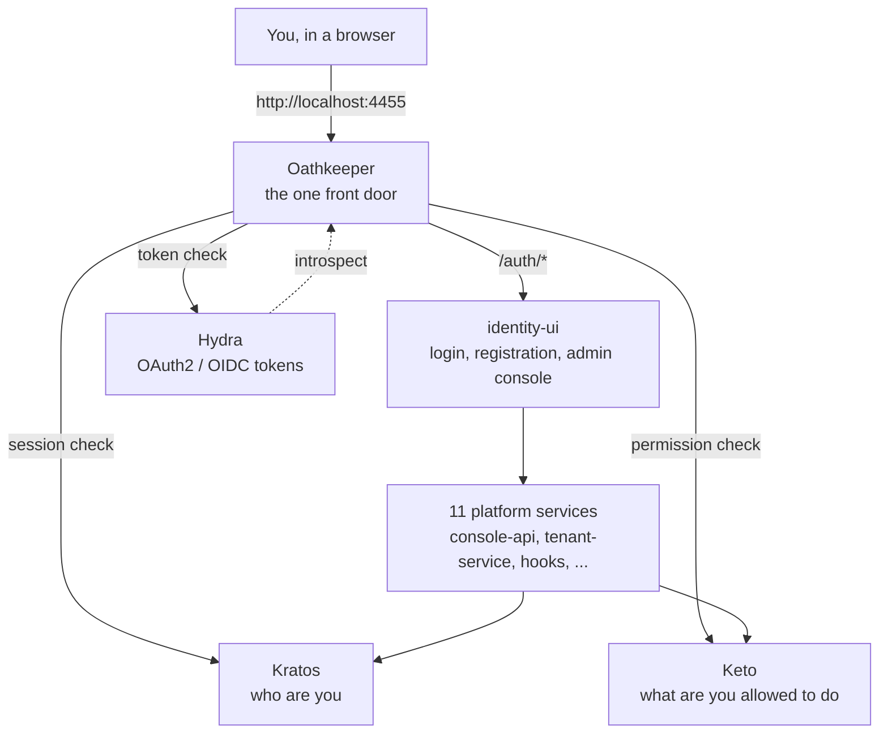
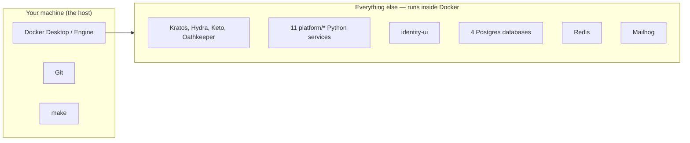
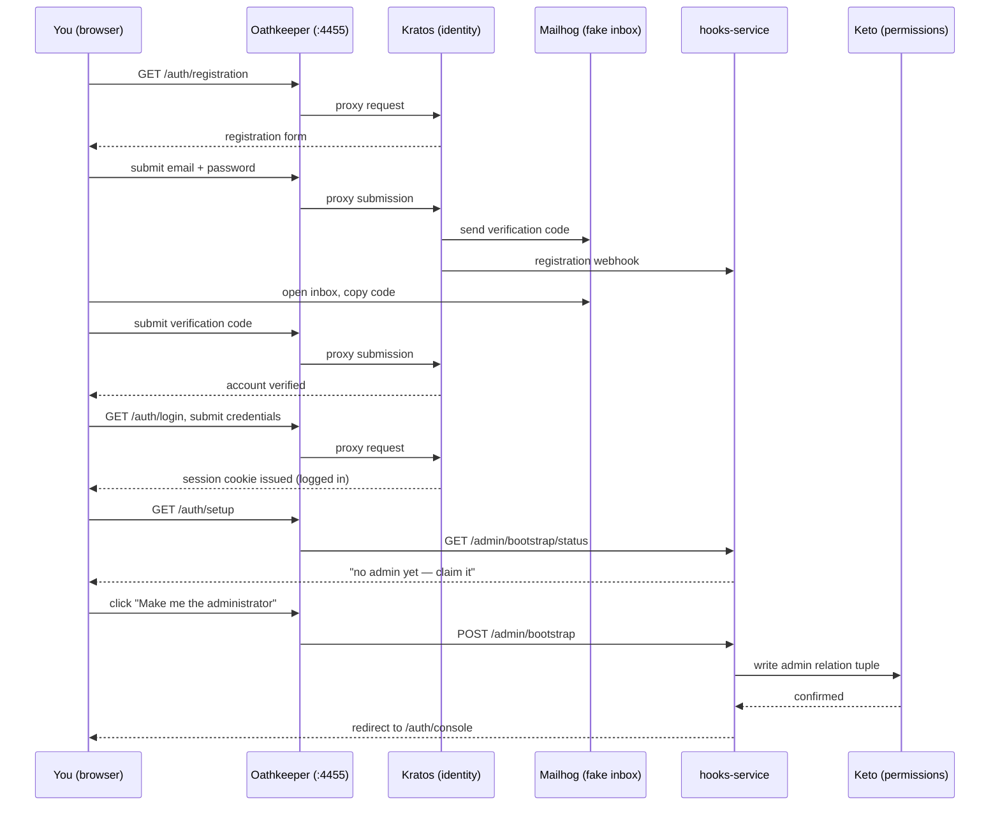
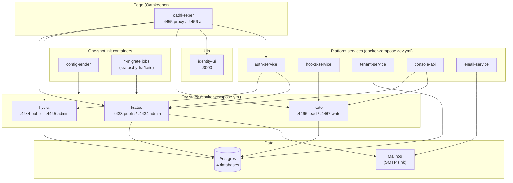

# 2. Installation

## Purpose

This chapter gets you from "I just cloned this repository" to "the platform is running on my
machine and I have a working administrator account." It covers prerequisites, the fast path
(`make up`), first boot, the Docker Compose mechanics behind it, and the full account-registration
and admin-bootstrap walkthrough. If you want the plain-language platform overview first, see
[chapter 1](../01-introduction/README.md).

## Overview

The **NeoBIM Identity Control Plane** runs entirely as Docker containers on your own machine.
Nothing needs to be installed on your computer beyond Docker itself, Git, and `make`. Four
open-source Ory components do the identity and access work; this repository's own **11 Python
backend services** add the admin console, multi-tenant organizations, notifications, and other
product features on top of them; **Oathkeeper** sits in front of everything else as the single
door every request must pass through — a "zero-trust" architecture, explained in
[chapter 1](../01-introduction/README.md).



**`http://localhost:4455` is the only address you should ever visit.** Every real page — login,
registration, the admin console — lives under that one address, at `/auth/*` (end-user and admin
pages) or `/auth/console/*` (the admin console specifically). A second, older UI is also reachable
at `/auth-legacy/*`, kept intentionally as a documented fallback — you won't need it for this
walkthrough.

## Phase 1: Prerequisites

This platform is **container-first**: every real piece of it — the four Ory components, all 11
custom backend services, the web UI, four separate Postgres databases, Redis, and a local
test-email inbox — runs as a Docker container. You are not expected to understand what's happening
*inside* the containers, only to have the tools below installed so Docker can run them.



### What you need installed

| Tool | Why | Notes |
|---|---|---|
| **Docker Desktop** (macOS/Windows) or **Docker Engine + Compose** (Linux) | Runs every container | This is the only real "runtime" you need on your machine |
| **Docker Compose v2** | Reads this repository's Compose files | Bundled with recent Docker Desktop; on Linux confirm with `docker compose version` (no hyphen — the older standalone `docker-compose` is a different, unsupported tool here) |
| **Git** | To clone the repository, including its pinned upstream submodules | Any recent version |
| **`make`** | The single entry point for nearly every operation (`make up`, `make health`, `make test`, ...) | Pre-installed on macOS and most Linux distributions; on Windows, use WSL2 |

That is genuinely the whole list. **No local Python, no `pip`, no `uv`, no Node.js, no `npm` are
required.**

### Recommended machine resources

Running the full stack means many containers at once: 4 Ory services, 4 Postgres databases,
Redis, Mailhog, `identity-ui`, and 11 Python backend services — more with sample applications or
the observability stack. Give Docker:

- **4+ CPU cores**
- **8 GB+ RAM** allocated to Docker specifically (Docker Desktop → Settings → Resources — a
  separate setting from your machine's total RAM)
- **A few GB of free disk space** for images and volumes

If containers crash, restart in a loop, or the stack feels extremely slow to come up, the first
thing to check is whether Docker Desktop actually has this much CPU/RAM allocated — this is the
single most common cause of "random," hard-to-explain failures on lower-resourced machines.

### Optional tools (only needed for advanced use)

| Tool | When you'd need it |
|---|---|
| `uv` | A fast Python package manager — every actual lint/test/build run happens *inside* a container regardless; installing `uv` on your host is only useful for editor autocompletion |
| `kubectl` | Deploying to Kubernetes (`make k8s-apply`) — see [chapter 7](../07-operations/README.md) |
| `terraform` | Provisioning AWS/GCP infrastructure (`make tf-init`, `make tf-plan`) — see [chapter 7](../07-operations/README.md) |
| `k9s` | A terminal UI for browsing a running Kubernetes cluster — a convenience, not a requirement |
| Helm | Installing the umbrella chart (`make helm-install`) |

### Important: this repo is container-first (ADR-0013)

> **Never run `pip install`, `uv sync`, `uv run`, `npm install`, or `npm run` directly on your host
> machine against `platform/*` or `identity-ui/`.** Every lint, type-check, test, and build for
> every Python service runs *inside a Docker container*, never on your host. This rule is written
> down formally as ADR-0013 — see [chapter 9](../09-architecture/README.md).

Running `pip install` on your host can silently succeed against a different Python version than
the one the service actually runs on in the container, hiding real bugs (or inventing fake ones).
The `Makefile` and the wrapper scripts under `automation/docker/` already do the right thing for you.
If you find yourself about to type `pip install ...` or `uv run ...` in this repository, stop and
look for the equivalent `make` target instead.

## Phase 2: Clone and configure

### Step 1 — Clone the repository

The repository uses Git submodules (pinned copies of upstream open-source projects, vendored at an
exact version), so clone with `--recurse-submodules`:

```bash
git clone --recurse-submodules <repository-url>
cd Ory_IDP
```

**Expected result:** a working tree including `ory/`, `platform/`, `identity-ui/`, `applications/`,
`deployment/`, and `docs/`. If you forgot the flag:

```bash
git submodule update --init --recursive
```

### Step 2 — Create your `.env` file

```bash
cp .env.example .env
```

`.env` is the single file that configures this entire local deployment — every port, every secret,
every feature flag. It is already listed in `.gitignore` — **never commit it**.

`.env.example` is heavily commented — read through it as you go. The variables that matter most
before your first run:

**Platform basics**

| Variable | Meaning |
|---|---|
| `PLATFORM_ENV` | `local` for this workflow |
| `PLATFORM_BASE_URL` | `http://localhost:4455` — the Oathkeeper proxy address; the URL you'll type into a browser |

**Ory service ports and URLs** — each of the four Ory components exposes two ports: a "public" one
(safe to expose to real users) and an "admin" one (privileged — must never be exposed outside your
own infrastructure).

| Variable | Default | Purpose |
|---|---|---|
| `KRATOS_PUBLIC_PORT` / `KRATOS_PUBLIC_URL` | `4433` | Kratos's public API — registration, login, recovery |
| `KRATOS_ADMIN_PORT` / `KRATOS_ADMIN_URL` | `4434` | Kratos's admin API — e.g. listing every identity directly, for debugging |
| `KRATOS_SECRETS_COOKIE` | *(generated)* | Session/cookie signing secret — 32+ bytes, base64-encoded |
| `KRATOS_SECRETS_CIPHER` | *(generated)* | **Must be exactly 32 raw characters** (used directly as an AES-256 key). Base64-encoding this one will make Kratos fail to start at all |
| `HYDRA_PUBLIC_PORT` / `HYDRA_PUBLIC_URL` | `4444` | Hydra's public OAuth2/OIDC endpoints |
| `HYDRA_ADMIN_PORT` / `HYDRA_ADMIN_URL` | `4445` | Hydra's admin API |
| `HYDRA_SECRETS_SYSTEM`, `HYDRA_SECRETS_COOKIE`, `HYDRA_PAIRWISE_SALT` | *(generated)* | Hydra's own signing/session secrets |
| `KETO_READ_PORT` / `KETO_READ_URL` | `4466` | Keto's read API — real-time permission checks |
| `KETO_WRITE_PORT` / `KETO_WRITE_URL` | `4467` | Keto's write API — creating/removing permission grants |
| `OATHKEEPER_PROXY_PORT` / `OATHKEEPER_PROXY_URL` | `4455` | **The main entry point** |
| `OATHKEEPER_API_PORT` | `4456` | Oathkeeper's own admin API (routing rule management) |

**Databases** — each Ory component gets its own isolated Postgres database, and the platform's 11
backend services share a fourth: `POSTGRES_KRATOS_*`, `POSTGRES_HYDRA_*`, `POSTGRES_KETO_*`, and
`POSTGRES_PLATFORM_*`. Passwords are marked `CHANGE_ME_*_db_password` in `.env.example` — set real
values for anything beyond a quick throwaway local run.

**`identity-ui`**

| Variable | Default | Purpose |
|---|---|---|
| `IDENTITY_UI_PORT` | `3010` | `identity-ui`'s internal container port (reached through Oathkeeper at `/auth/*`) |
| `COOKIE_SECRET` / `CSRF_COOKIE_SECRET` | *(generated)* | Session/CSRF cookie signing for the web UI itself |

**Email (Mailhog by default)** — `EMAIL_PROVIDER=smtp` with `SMTP_HOST=localhost` /
`SMTP_PORT=1025` point at **Mailhog**, a fake mail server that catches every email the platform
"sends" (verification codes, password recovery codes, notifications) and shows them in a web inbox
at `http://localhost:8025` instead of a real inbox. Nothing leaves your machine.

**Social login (Google, Microsoft, and others)** — this platform can let people sign in with an
existing Google or Microsoft account instead of a new password. `.env.example` documents the
placeholders (`SOCIAL_GOOGLE_CLIENT_ID`/`SOCIAL_GOOGLE_CLIENT_SECRET`, similarly for
Microsoft/GitHub/GitLab/Apple). Real credentials go through your own git-ignored `.env`. Which
providers actually appear on the login page is controlled separately, from the admin console's
Identity Providers page — see [chapter 4](../04-administration/README.md).

### Step 3 — Generate secrets and certificates

Never leave `CHANGE_ME_*` placeholders in `.env` beyond a throwaway test:

```bash
automation/setup/generate-secrets.sh        # fills real secrets into .env
automation/setup/generate-certs.sh          # generates a local TLS certificate (make gen-certs)
automation/setup/generate-jwks.sh           # informational only, see below (make gen-jwks)
```

**`generate-secrets.sh`** uses `openssl` to fill in every secret-shaped variable in `.env` —
including `KRATOS_SECRETS_CIPHER`, via a dedicated helper that produces exactly 32 raw characters
instead of base64. It edits `.env` in place, so run it *after* `cp .env.example .env`.

**`generate-certs.sh`** (also `make gen-certs`) creates a self-signed TLS certificate (30-day
validity, RSA-4096) under `security/tls/local/`. Only needed for testing HTTPS locally — the
default Compose stack talks plain HTTP on `localhost`.

**`generate-jwks.sh`** (also `make gen-jwks`) is intentionally a no-op: Hydra owns its own signing
key generation and rotation internally — you generate/import signing keys through Hydra's own
admin API after the stack is running.

## Phase 3: Start the stack

```bash
make up
```

This runs `docker compose --env-file .env -f docker-compose.yml -f docker-compose.dev.yml up -d` —
every Ory component plus all 11 platform services, every time — and then automatically runs
`make health`.

You do not need to run any database migration by hand — they happen as one-shot "init containers"
every time you bring the stack up:

- **Kratos, Hydra, and Keto** each have their own one-shot migration container (`kratos-migrate`,
  `hydra-migrate`, `keto-migrate`) that runs the Ory CLI's own `migrate sql`/`migrate up` command
  before the real service starts.
- **`tenant-service`** and **`audit-service`** each ship real **Alembic** migrations, run via
  one-shot init containers (`tenant-service-migrate`, `audit-service-migrate`) before their
  corresponding service container starts.

If you ever need to re-run migrations explicitly:

```bash
make migrate           # Kratos + Hydra + Keto migrations
make migrate-kratos    # just Kratos
make migrate-hydra     # just Hydra
make migrate-keto      # just Keto
```

Optional extras, additive on top of the same base + dev stack:

```bash
make up-applications   # Superset, Airflow, Mealie, Open WebUI, and other sample apps — see chapter 6
make up-full           # + Prometheus, Grafana, Loki, Tempo, OTel collector
```

## Phase 4: Verify health

```bash
make health     # readiness of every service
make doctor     # deeper diagnostics if something's unhealthy
make status     # current container status
```

If anything is not ready yet, wait a few seconds and re-run — first-boot database migrations take
a moment. Check `make logs` (or `make logs-kratos`, `make logs-hydra`, `make logs-keto`,
`make logs-oathkeeper` for one specific component) before assuming something is broken.

The real URLs you'll use, all through **Oathkeeper on port `4455`**:

| URL | What it is |
|---|---|
| `http://localhost:4455/auth/registration` | Create a new account |
| `http://localhost:4455/auth/login` | Log in |
| `http://localhost:4455/auth/recovery` | Recover a forgotten password |
| `http://localhost:4455/auth/verification` | Verify an email address |
| `http://localhost:4455/auth/settings` | Manage your own account |
| `http://localhost:4455/auth/setup` | First-run admin bootstrap — see Phase 5/6 below |
| `http://localhost:4455/auth/console` | The admin console (requires admin permissions) |
| `http://localhost:8025` | Mailhog — read every email the platform "sends" locally |

Full port/URL reference, including direct admin-only ports you should never expose in a real
deployment, is in [chapter 8](../08-reference/README.md).

Stopping/resetting:

```bash
make down       # stop all containers, keep data volumes
make restart    # stop and start again, data preserved — required after changing a
                # Theme/Flow/Identity Provider, since Kratos OSS has no runtime config-reload API
make reset      # drop data volumes, then bring the base+dev stack back up fresh
make destroy    # stop AND remove all data volumes — irreversible, asks for confirmation
```

## Phase 5: Understand admin bootstrap (before you need it)

This works differently from platforms with a simple "is_admin" checkbox. Kratos identities have no
built-in concept of "admin." Instead, **administrator status is a real authorization fact stored in
Keto** — this platform's ReBAC engine. Being an admin means your identity holds the **`admin`
relation** on the **`Organization`** object named **`platform`**. `identity-ui`'s own middleware
performs this exact check before letting anyone view `/auth/console/*`: it calls Kratos's `whoami`
endpoint for your identity ID, then asks Keto's `/relation-tuples/check` endpoint whether that ID
holds the `admin` relation on `Organization:platform`. If Keto says no, you get a 403 (redirected to
a friendly `/auth/unauthorized` page) — there is no other authorization path to that page.



Under the hood, `/auth/setup` calls a real, self-disabling endpoint (`platform/hooks`'s
`POST /admin/bootstrap`) that writes the `admin` relation on `Organization:platform` for your
identity — but only while zero admins exist yet. The moment any admin has claimed the role, every
future call to that endpoint (and every future visit to `/auth/setup`) is refused with a clear
"already configured" message. Every step happens in a browser — no command line, no API calls, no
curl required.

## Phase 6: First login — register, verify, log in, claim admin

### Register an account

**Step 1** — Open `http://localhost:4455/auth/registration`.

Registration is a genuine **two-step flow** — standard Ory Kratos behavior in this version, not
something custom: (1) profile step (name, email), (2) password step. When you submit the password
step, your identity is created immediately in Kratos, and a verification code is emailed to the
address you registered with. Choosing "Sign in with Google/Microsoft" instead creates your account
directly from your social profile, with no separate password step.

**Step 2** — Read the verification email in Mailhog at `http://localhost:8025`, copy the 6-digit
code, and enter it at `http://localhost:4455/auth/verification`.

### Log in

**Step 3** — Go to `http://localhost:4455/auth/login`, enter your credentials, and submit. You are
logged in and land on the ordinary user account area — **not** the admin console. Every brand-new
account starts as a completely ordinary, non-admin identity.

### Claim administrator access

**Step 4** — Go to `http://localhost:4455/auth/setup`. Since you're signed in and the platform has
zero administrators yet, you'll see a page confirming no administrator has been configured, with a
single button: **"Make me the administrator."** Click it. You're redirected straight into the admin
console (`http://localhost:4455/auth/console`) — you are now the platform's first administrator.

If you weren't signed in when you visited `/auth/setup`, it shows "Create an account" / "Sign in"
links instead of the claim button — finish registering and logging in first, then come back.

### Granting a second person admin access

Once you're an admin, you (not `/auth/setup`, which is now permanently disabled) grant admin
access to anyone else through the console itself — no curl, no manual Keto tuples. Ask them to
register their own account first, then use the Identities page, or the Roles/Policies pages, to
assign them the platform-admin role. A non-admin can also self-service request admin access from
their own `/auth/settings` page ("Request administrator access"), which an existing admin then
approves or denies from a "Pending requests" card — see [chapter 4](../04-administration/README.md).

### Why admin bootstrap works this way

This is a deliberate design choice, not an oversight: **Keto is the only authorization engine in
this platform.** There is no separate "roles" table anywhere that could disagree with Keto or drift
out of sync with it. Every access decision — including the most privileged one — goes through the
exact same relation-tuple mechanism `/auth/setup` used on your behalf.

## Optional: sample applications and observability

To see real third-party applications (Mealie, Open WebUI, Superset, Airflow, and others) sharing
this platform's identity:

```bash
make up-applications
```

To also run metrics/traces/logs (Prometheus, Grafana, Loki, Tempo) alongside the platform:

```bash
make up-full
```

See [chapter 6 — Integrations](../06-integrations/README.md) for the full application roster.

## Docker Compose mechanics — how `make up` actually works

`deployment/docker/compose/` holds four Compose files, layered by purpose. `make up` always
combines the first two:

| File | Contents | Included by `make up`? |
|---|---|---|
| `docker-compose.yml` | Base stack: Postgres (one database each for Kratos, Hydra, Keto, plus one shared platform database), Redis, Mailhog, the one-shot init containers (`config-render`, `identity-providers-render`, `flows-render`), each Ory component's `*-migrate` job, and the four Ory components | Yes |
| `docker-compose.dev.yml` | All 11 platform services plus the two UIs (`auth-ui`, `identity-ui`); dev bind mounts and each Dockerfile's `dev` build target | Yes |
| `docker-compose.applications.yml` | Optional sample third-party apps (Superset, Airflow, Mealie, Open WebUI, a NeoBIM UI demo) | Only with `make up-applications` |
| `docker-compose.observability.yml` | Optional Prometheus, Grafana, Loki, Promtail, Tempo, and an OTel collector | Only with `make up-full` |

**Status: real, tested.** Every service in the base and dev files starts and passes its health
check — this is the one deployment surface in this repository that has been fully built, started,
and health-checked end to end (see [chapter 9](../09-architecture/README.md) for how Kubernetes,
Helm, and Terraform compare).



### The container-first Python convention (ADR-0013)

Every `platform/*` service is Python/FastAPI and follows the same Dockerfile shape:

```dockerfile
FROM python:3.13-slim AS base
# uv sync --no-dev --no-install-project, then copy src/, uv sync --no-dev

FROM base AS runtime
ENV PATH="/app/.venv/bin:$PATH"     # invoke the synced venv directly, never `uv run`
USER 10001:10001                    # non-root
CMD ["sh", "-c", "uvicorn <module>:app --host 0.0.0.0 --port ${PORT:-...}"]

FROM base AS dev
RUN uv sync --all-groups
COPY tests ./tests
```

- **`runtime`** — installs only production dependencies, runs as the fixed non-root user
  `10001:10001`, and starts `uvicorn` by invoking the already-synced virtualenv's binary directly
  via `PATH` — deliberately *not* `uv run`, because `uv run` re-checks the lockfile and needs a
  writable `HOME`/cache directory the unprivileged runtime user doesn't have.
- **`dev`** — branches off `base` before the runtime `USER` switch, additionally installs dev
  dependencies (`uv sync --all-groups`), and copies in `tests/`. This is the stage every
  lint/format/mypy/pytest invocation runs against — nothing on the host needs a local Python
  install, `uv`, or a `.venv` at all. `docker-compose.dev.yml` targets this stage plus a bind mount
  of `src/`/`tests/` for services being actively edited.

## Alternative entry points: `automation/`

If you prefer typed-out script paths over `make` targets, thin wrapper scripts exist under
`automation/` that call the exact same `make`/Compose logic:

| Script | Equivalent to |
|---|---|
| `automation/deployment/start.sh` | `make up` |
| `automation/deployment/stop.sh` | `make down` |
| `automation/health/health.sh` | `make health` |
| `automation/restart/restart.sh` | `make restart` |
| `automation/status/status.sh` | `make status` |
| `automation/deployment/destroy.sh` | `make destroy` |
| `automation/backup/backup.sh` / `automation/backup/restore.sh` | backup/restore workflows |
| `automation/logs/logs.sh` | `make logs` |

## Troubleshooting

Real issues found and fixed while actually running this stack locally:

- **One-shot init containers failing to write into a shared volume.** `config-render` renders the
  Ory config templates into a named volume (`rendered-config`) using an image that effectively runs
  as root. Later steps that reuse unprivileged **runtime** images (`USER 10001:10001`) to patch that
  same rendered config need a narrowly-scoped `user: "0:0"` override — the volume's on-disk
  ownership is set by whichever container wrote to it first.
- **A theme editor feature silently had nowhere to write.** A Compose service that bind-mounts a
  single file (rather than its parent directory) only ever exposes that one file. Fix: mount the
  whole parent directory instead of one file.
- **"Port already in use" on `make up`.** Something else on the host is bound to one of this
  stack's ports — most commonly a previous, not-fully-stopped run of this same stack. Run
  `make down` first, or `docker ps` to find and stop the conflicting container.
- **A service is "unhealthy" right after `make up`.** Ory components run a migration job
  (`*-migrate`) before the real service starts; on a slow machine the dependent service can report
  unhealthy for the first few seconds. Re-run `make health` after a short wait.
- **Changed a Theme/Flow/Identity Provider in the console and nothing happened.** Expected — Kratos
  OSS has no runtime config-reload API. Run `make restart`.
- **`docker compose version` fails or shows a v1 version number.** You have the older standalone
  `docker-compose` instead of the Compose v2 plugin. Upgrade Docker Desktop, or on Linux install the
  `docker-compose-plugin` package.
- **`make: command not found`.** macOS: `xcode-select --install`; Debian/Ubuntu:
  `sudo apt install make`; Windows: use WSL2.
- **A value you changed in `.env` doesn't seem to take effect, even after `make restart`.** Some
  browser-facing URLs (Kratos's `ui_url`, CORS origins, Hydra's login/consent/logout URLs, and
  others) are baked into rendered YAML config files via a one-shot "config-render" step that runs
  *before* the Ory services start — a plain `docker compose restart` reuses the already-rendered
  file, so you need `make up` again (which re-triggers config-render) or a full
  `make down && make up`, not just `restart`, for these specifically.
- **Kratos, Hydra, or Keto crash on startup with a config-parsing error.** These YAML configs are
  strict about their schema — for example, Kratos's `secrets.cipher` must be exactly 32 raw
  characters (not base64, unlike its other secrets).
- **Verification/recovery emails never arrive.** They never leave your machine by design — check
  Mailhog at `http://localhost:8025`, not a real inbox.
- **`/auth/setup` says "Platform already configured."** An administrator already exists. Ask them
  to grant you access through the Identities/Roles console pages instead.
- **Need to inspect raw state directly** (debugging only, not required for normal use):
  ```bash
  curl http://localhost:4434/admin/identities              # lists every identity and its UUID
  curl http://localhost:8082/admin/bootstrap/status        # reports whether any admin exists yet
  ```

## FAQ

**Do I need to know Docker to use this?** No. You need it installed and running; every command
you'll actually run is a `make` target that wraps Docker for you.

**Do I need to know what OAuth2 or OIDC mean before I start?** No — see [chapter 1](../01-introduction/README.md)
for the full glossary and the concepts explained on first use.

**Do I need Kubernetes or Helm to try this platform?** No. Docker Compose (`make up`) is the
supported, tested way to run the full platform locally, and is sufficient for development and
demos.

**Can I run just one platform service against the rest of the stack?** Yes — bring up the base
stack plus dev file as usual, then use `automation/docker/docker-build-python-dev.sh <dir>` to build
and iterate on a single package's image without restarting the rest of the stack.

**Do I need to run `generate-secrets.sh` every time?** No — only once, right after creating `.env`
from `.env.example`. Running it again overwrites the secrets you already generated (fine for a
fresh start, but it invalidates any existing session cookies).

**Can I change ports after the stack is already running?** Yes — edit `.env` and run
`make restart` (or `make down && make up` if the change affects a value baked in by config-render).

**Can I un-claim admin access and let someone else claim it instead?** Not through `/auth/setup` —
once claimed, it's permanently disabled. An existing admin can grant admin access to someone else
through the console, and can also remove their own admin grant the same way.

## Common mistakes

- **Visiting a direct Ory component port** (e.g. `:4433`, `:4444`) instead of `:4455`.
- **Forgetting `--recurse-submodules`** on the initial clone.
- **Committing `.env`.** It's git-ignored for a reason.
- **Assuming you need `pip`/`uv`/`npm` locally.** You don't — this repo is container-first.
- Installing `uv`/Python/Node.js locally and trying to run services directly instead of through
  `make`.
- Skipping the resource-allocation step and assuming a genuine bug when containers are simply
  starved for CPU/RAM.
- Using the standalone `docker-compose` binary instead of `docker compose` (the plugin).
- Running `docker compose restart` instead of `make restart`/`make up` after changing a
  browser-facing URL in `.env`.
- Trying to visit `/auth/console` before registering/logging in at all.
- Assuming a second person can also "claim" admin via `/auth/setup` — the endpoint permanently
  disables itself after the first successful claim.
- Running `docker compose up` directly against only `docker-compose.yml` and wondering why none of
  the platform services or UIs are present — always use `make up`, or include
  `-f docker-compose.dev.yml` explicitly.

## References / Related pages

- [Chapter 1 — Introduction](../01-introduction/README.md) — what this platform is, in plain language
- [Chapter 3 — User Guide](../03-user-guide/README.md) — end-user flows in depth
- [Chapter 4 — Administration](../04-administration/README.md) — granting access to others
- [Chapter 5 — Development](../05-development/README.md) — a full set of realistic sample identities
  and departments you can seed instead of creating accounts one at a time
- [Chapter 6 — Integrations](../06-integrations/README.md) — the real sample applications wired to
  this platform
- [Chapter 7 — Operations](../07-operations/README.md) — day-to-day operation once the stack is up
- [Chapter 8 — Reference](../08-reference/README.md) — every real port and URL
- [Chapter 9 — Architecture](../09-architecture/README.md) — the two standing architecture mandates
  (Python-first, container-first) in full
