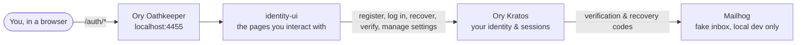
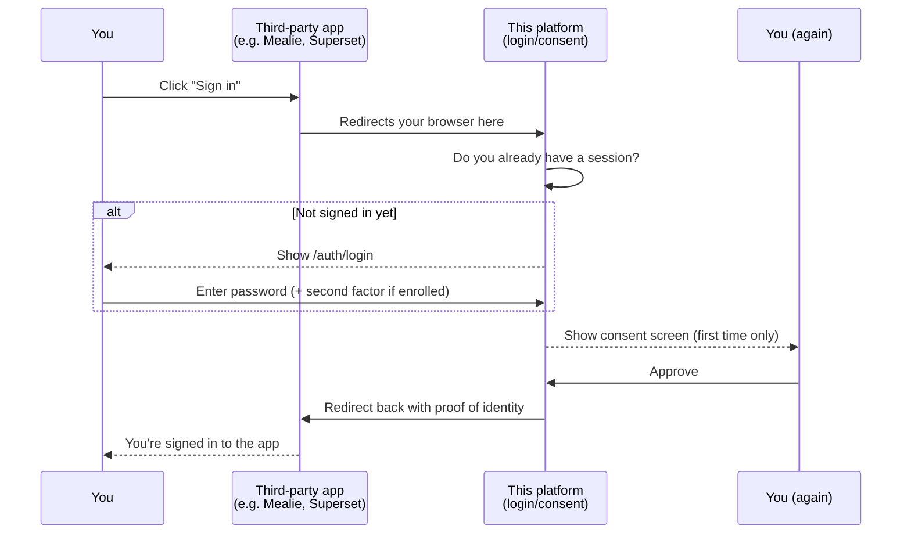
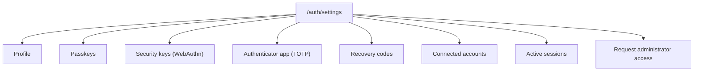

# 3. User Guide

## Purpose

This chapter is for **end users** — the people who create an account and sign in to applications
protected by the NeoBIM Identity Control Plane. It assumes you have never used a platform like this
before, and explains every term the first time it comes up. If you administer the platform itself
(organizations, applications, roles, themes), see [chapter 4 — Administration](../04-administration/README.md)
instead. If you are a developer integrating an application against this platform's OAuth2/OIDC
endpoints, see [chapter 5 — Development](../05-development/README.md) or
[chapter 6 — Integrations](../06-integrations/README.md).

## Overview

Everything in this guide is served by one web app, **identity-ui**, reached through **Ory
Oathkeeper** (the platform's front door / reverse proxy) at **`http://localhost:4455/auth/*`**. All
URLs in this guide assume the default local development setup (`make up`); a production deployment
uses your organization's own domain instead of `localhost:4455`.

A few terms used throughout this chapter — full definitions in
[chapter 1's glossary](../01-introduction/README.md#plain-language-glossary):

- **Identity** — your account record: name, email, credentials, and any second-factor methods
  you've enrolled. Managed by Ory Kratos.
- **Session** — proof that you're logged in, stored as a cookie in your browser.
- **AAL1 / AAL2** — "logged in with one factor" (password, or a passkey) vs. "logged in with two
  factors" (password + a second factor like an authenticator app).
- **OAuth2 / OIDC client** — a separate application (like Mealie, Superset, Airflow, or Open WebUI)
  that uses this platform to let you sign in instead of having its own separate password.



Every page under `/auth/*` is identity-ui talking to Kratos on your behalf. Kratos is the actual
system of record for your account; identity-ui is just the interface.

## Part 1 — Authentication: signing up, signing in, and signing in elsewhere

### The five flow types

Ory Kratos organizes everything you can do with your account into five named **flow types**:

| Flow type | What it's for | Where you reach it |
|---|---|---|
| Registration | Creating a new account | `/auth/registration` |
| Login | Signing in to an existing account | `/auth/login` |
| Recovery | Regaining access when you've forgotten your password | `/auth/recovery` |
| Verification | Proving you own an email address | `/auth/verification` |
| Settings | Changing your profile, credentials, and sessions | `/auth/settings` (see Part 2 below) |

Each flow type is built from a set of **methods** — the actual mechanisms you interact with. On
this platform, the methods that are turned on and genuinely working are:

- **`password`** — the classic email + password.
- **`oidc`** (social login) — **Google** and **Microsoft**, both configured with real, working
  credentials on this platform.
- **`passkey`** — passwordless sign-in via your device's fingerprint reader, face unlock, or a
  hardware security key, registered as a full password replacement.
- **`webauthn`** — a hardware security key or platform authenticator used as a *second* factor
  (after your password), not a replacement for it.
- **`totp`** — a time-based one-time code from an authenticator app, used as a second factor.
- **`lookup_secret`** — one-time backup recovery codes, used as a second-factor fallback.
- **`code`** — a short-lived (15-minute) numeric code sent by email, used to drive recovery and
  verification.

Which of these appear on any given flow's page is decided by the administrator's configuration —
see [chapter 4](../04-administration/README.md#authentication-flows). This chapter assumes the
platform's current, default configuration, where password and social login are available at
registration and login, and step-up second factors apply if you've enrolled one.

### How a login decides what to show you

```mermaid
flowchart TD
    A[Visit /auth/login] --> B[Enter your email, click Continue]
    B --> C{What's revealed next}
    C -->|Passkey registered on this device| D[Browser/OS passkey prompt]
    C -->|"Sign in with Google/Microsoft"| E["Redirect to provider,<br/>sign in there"]
    C -->|"Use password instead" (collapsed by default)| F[Enter password]
    D --> G[Redirected back, signed in]
    E --> G
    F --> H{Second factor enrolled?}
    H -->|No| G
    H -->|"Yes: TOTP, security key,<br/>or recovery code"| I[Enter second factor]
    I --> G
    G --> J[Session created - AAL1 or AAL2]
```

**The sign-in page is passwordless-first.** After you enter your email and click Continue, the
page reveals — in order — a passkey option (if your device/browser supports one), "Sign in with
Google"/"Sign in with Microsoft", and, collapsed behind a **"Use password instead"** link, the
classic password field. Password sign-in still works exactly as before (nothing about the actual
Kratos credential was removed), it's simply no longer the first thing you see.

**AAL1** means you completed one factor (password alone, or a passkey alone). **AAL2** means you
completed a password *and* a second factor. If you've enrolled a second factor, expect to always be
asked for it after your password.

### Registration

**Self-registration is currently disabled on this platform.** Visiting
**`http://localhost:4455/auth/registration`** shows a "Registration is currently disabled — contact
an administrator" message rather than a sign-up form. New accounts are created by an administrator
from the Admin Console's Identities page instead (see
[chapter 4](../04-administration/README.md)) or via the seed scripts described in
[chapter 2](../02-installation/README.md#phase-6-first-login--register-verify-log-in-claim-admin).
This is a deliberate, reversible configuration choice (`SELF_REGISTRATION_ENABLED=false` in
`.env`), not a removed feature — flipping that one variable and restarting Kratos re-enables the
real registration flow, which (when it's on) asks only for **email, first name, and last name** —
no username, phone, locale, timezone, organization, or consent fields; those are either not
collected at all, or set later by an administrator.

### Email verification

In local development, no real email is sent — Kratos's courier delivers through **Mailhog**, a
fake SMTP server with a web inbox at **`http://localhost:8025`**. Open it, find the message, copy
the 6-digit code (or click the link), and paste it into the verification form. An unverified
account can still log in, but some flows (like password recovery) require a verified address.
Codes are single-use and expire after 15 minutes.

### Login

Go to **`http://localhost:4455/auth/login`**. Enter your email and click **Continue** — the page
then reveals whichever of these apply to you:

- **Passkey** — if you've registered one, your device offers to sign you in with a fingerprint,
  face unlock, or hardware key with no password at all. Shown first.
- **Sign in with Google** or **Sign in with Microsoft** — social login, shown next. If you
  registered with a password and later linked one of these under Connected accounts (Part 2), you
  can use it instead of typing your password. Both genuinely redirect to Google's/Microsoft's own
  sign-in page. (GitHub/Apple/GitLab are not offered — this platform only wires up Google and
  Microsoft.)
- **"Use password instead"** — a collapsed link at the bottom. Clicking it reveals the classic
  email + password field, which every account still has and which continues to work exactly as
  before.

If your account has a **second factor** enrolled, you'll be prompted for it after your password is
accepted (step-up from AAL1 to AAL2).

If you arrived at the login page because another application redirected you there, a successful
login redirects you back to that application's consent screen and, once approved, into the
application itself — see "Signing in to other applications" below.

### Recovering a forgotten password

Go to **`http://localhost:4455/auth/recovery`**. Enter your email, check Mailhog for a recovery
code (same mechanism as verification, same 15-minute expiry), enter the code, then set a new
password — Kratos signs you in with the new credential. You do not need your old password. If you
still remember it and just want to change it, use Settings → Profile (Part 2) instead.

### Logout

Visit **`http://localhost:4455/auth/logout`**, or use **Sign out** on the settings page. This ends
your current Kratos session; if you were signed into any OAuth2/OIDC-connected application through
this identity, that application's own session is separate and may need to be signed out of
independently.

### Signing in to other applications

A growing number of separate applications on this platform — **Mealie** (recipe manager),
**Superset** (data dashboards), **Airflow** (workflow scheduler), and **Open WebUI** (chat
interface) — don't have their own separate username/password system; they all trust *this
platform* to confirm who you are. That's OAuth2/OIDC in practice: **one account, one password, used
to sign into several different applications**, without each of them ever seeing your password.

Two words you'll see on screen:

- **Authorize / Consent** — a screen asking "this application wants to know your name and email —
  allow it?" It appears the *first* time an application wants to use your identity.
- **Scope** — the specific pieces of information an application is asking for. Applications never
  get your password itself, no matter what scope they request.



If you already have an active session (you signed in recently and didn't sign out), the login/
consent steps may be skipped entirely and you land in the app already signed in — this is
single sign-on (SSO): sign in once, use it everywhere.

**Honest limitation: consent is not fine-grained yet.** On this platform's current configuration,
the consent step **auto-approves every request from every application** — there isn't yet a
per-application allow/deny policy for administrators to configure, and there's no scope-by-scope
picker for you to choose from item by item.

**Signing out of a connected application**: your session with this platform and your session
inside a third-party app are two separate things — signing out of one does not automatically sign
you out of the other unless that app specifically supports it. Sign out of the app itself, then
visit `/auth/logout` here too; check Active sessions (Part 2) if you're unsure.

Which applications currently use this platform: see [chapter 6 — Integrations](../06-integrations/README.md)
for the full, current list and their individual setup notes.

## Part 2 — Account management: your settings page

**`http://localhost:4455/auth/settings`** is the one place you manage your own account once you're
signed in: profile, passwords, passkeys, second factors, recovery codes, connected social accounts,
active sessions, and requesting admin console access. This page only shows a section if the
corresponding method is actually enabled and available for your account. Every section here is a
real, live Kratos self-service settings flow — nothing is a static form that only looks functional.



### Profile

Your name and email address. Editing your email starts a re-verification flow for the new address
(same Mailhog-based code flow as registration). If you still remember your current password and
just want to change it, this is also where you do that.

### Passkeys

Sign in **without a password**, using your device's fingerprint reader, face unlock, or an external
security key registered as a passkey — a full password replacement. You can register more than
one, useful for a primary device and a backup key.

### Security keys (WebAuthn, second factor)

Distinct from Passkeys. This registers a hardware security key or platform authenticator as a
**second factor** — used *in addition to* your password. Both Passkeys and Security keys can use
the same physical hardware key; the difference is which settings card you registered it under and
how Kratos treats it afterward at login time.

### Authenticator app (TOTP)

Enroll a standard time-based one-time-code authenticator app (Google Authenticator, 1Password,
Authy, etc.) as a second factor. Settings shows a QR code and secret; enter the 6-digit code your
app generates to confirm enrollment.

### Recovery codes

One-time backup codes to use if you lose access to your normal second factor. Generate a fresh
batch here and save them somewhere safe **before** you need them, not after you're locked out. Each
code works once.

### Connected accounts (social logins)

Social sign-in providers linked to your account — on this platform, **Google** and **Microsoft**
are configured and working. Link a new provider or unlink one you no longer use. Social login only
auto-links to an existing account if the email addresses match exactly — link providers manually
if they don't.

### Active sessions ("Devices")

Every place you're currently signed in — one row per active Kratos session, including your current
one. Click **Sign out** next to any entry to end that specific session immediately. If you have two
or more sessions, a **Sign out everywhere else** button also appears — a genuine bulk action
(Kratos's own `disableMyOtherSessions` self-service endpoint, not a loop of individual sign-outs)
that ends every *other* session immediately while leaving the device you clicked it from signed in.
Use it after a shared/public computer, or if you suspect another device is compromised.

### Requesting administrator access

If you need access to the Admin Console (`/console`), click **Request administrator access** at
the bottom of this page. This sends a real, pending request — it does **not** grant access by
itself. An existing platform administrator must approve it from their own Administrators page
before you can reach `/console`. While pending, this section shows its status and a **Cancel
request** button. Mechanically, this writes a real Keto tuple —
`Organization:platform#admin_requested@<your identity id>` — for your own identity only; the
subject always comes from your server-side session, never typed input. See
[chapter 4](../04-administration/README.md#becoming-an-admin) for the approval/denial flow from the
administrator's side.

### Account deletion — not available

There is currently **no self-service way to delete your own account** from this settings page. If
you need your account removed, an administrator can do so from the Identities page of the Admin
Console — see [chapter 4](../04-administration/README.md).

## Troubleshooting

- **I can't find a setting I expect.** Check Part 2 above first — most account-level controls live
  on `/auth/settings`.
- **The login page only shows password — no Google/Microsoft buttons.** Social login only appears
  if the administrator has it enabled.
- **I registered but never got a verification email.** Check Mailhog at `http://localhost:8025`
  directly — in local development, no email leaves the machine.
- **My verification or recovery code says invalid/expired.** Codes expire after 15 minutes and work
  once. Request a fresh one.
- **I'm asked for a second factor I don't remember setting up.** If your account was provisioned
  with a second factor already enrolled by an administrator, use your recovery codes or contact an
  administrator to reset it.
- **I can't test passkeys, security keys, TOTP, or recovery codes end-to-end myself.** These
  genuinely require a real hardware authenticator, your device's platform authenticator, or a
  virtual authenticator in an automated browser.
- **I signed in with Google/Microsoft but it created a second, separate account.** Social login
  only auto-links if email addresses match exactly — link the provider manually while signed into
  the correct account instead.
- **The app says it can't reach the platform / shows a connection error after I approve consent.**
  Some sample/demo applications have a known, disclosed limitation where their own server-side
  token exchange fails in local development due to how container networking resolves `localhost` —
  see [chapter 6](../06-integrations/README.md) for that specific application's status before
  assuming your account is at fault.
- **"Sign out everywhere else" isn't visible.** It only appears once you have two or more active
  sessions.
- **My "Request administrator access" seems to have disappeared.** Once approved, denied, or
  cancelled, the request is cleared — submit a new one at any time.

## FAQ

**Do I need to read both parts, or just one?** If you only ever sign in and never touch settings,
Part 1 is enough. If you need a second factor, a social account link, or session management, Part 2
is the one you want.

**Do I have to verify my email before I can use my account?** No — you can log in with an
unverified email. Verification is required for some flows (recovery requires a verified address).

**Why do I see different login options than a coworker?** Everyone sees the same methods — method
availability is global, not per-user. Differences are almost always about *your account's own
enrollment*.

**Can I make the platform skip my second factor?** Not from the end-user side — unenroll it
yourself if that control is offered for the method, or ask an administrator if you're locked out.

**Does the third-party app ever see my password?** No. Your password is only ever entered on this
platform's own `/auth/login` page.

**Why did I only have to sign in once for multiple apps?** Single sign-on (SSO) working as
intended.

**What's the difference between a passkey and a security key (WebAuthn)?** A passkey replaces your
password entirely; a security key registered as WebAuthn is a *second* factor used after your
password. Both can use the same physical hardware key.

**Can I delete my own account?** Not from this platform's current settings page — contact an
administrator.

**Does requesting administrator access guarantee I'll get it?** No — an existing administrator must
approve it; they can also deny it, and you can request again later.

## Common mistakes

- Looking for account settings on a general overview page — they're all on `/auth/settings`.
- Assuming this chapter covers administering the platform — see
  [chapter 4](../04-administration/README.md) for that.
- Typing your recovery/verification code slowly enough that it expires — copy-paste it instead.
- Assuming an unlinked social account will auto-merge with an existing password-based account with
  a different email — it won't.
- Assuming social login is available when the administrator hasn't enabled it.
- Assuming signing out of one connected app also signs you out of this platform (or vice versa) —
  they're separate sessions.
- Expecting a scope-by-scope consent picker — this platform currently auto-approves whatever an
  app requests.
- Blaming your account/password when a specific sample application fails after consent — check
  that application's own documentation page first.
- Losing your only second factor and your recovery codes at the same time.
- Confusing "Sign out" (ends the one session you clicked) with "Sign out everywhere else" (ends
  every *other* session).
- Expecting "Request administrator access" to grant access immediately.

## References / Related pages

- [Chapter 1 — Introduction](../01-introduction/README.md) — the platform overview and glossary
  these terms support
- [Chapter 4 — Administration](../04-administration/README.md) — for administrators: managing
  identities, organizations, roles, and platform settings, and approving admin-access requests
- [Chapter 5 — Development](../05-development/README.md) — for developers: the actual OAuth2/OIDC
  protocol mechanics, grant types, and API endpoints behind everything on this page
- [Chapter 6 — Integrations](../06-integrations/README.md) — the full list of applications
  integrated with this platform
