# 4. Administration

## Purpose

This chapter is the complete manual for the **Admin Portal** — the web console at
`http://localhost:4455/auth/console` (often written short as `/console/*`) that a platform
administrator uses to manage the NeoBIM Identity Control Plane day to day: who can sign in, which
applications can use single sign-on, who belongs to which organization, who can do what, and what
has happened recently.

Written for someone who has **never run an identity platform before** and has never heard of Ory,
OAuth2, OIDC, or "ReBAC." Every term is explained the first time it's used — if you already know
these concepts, skim [§1 Core concepts](#1-core-concepts-plain-english) and jump to the section you
need. The end-user-facing counterpart to this guide is
[chapter 3 — User Guide](../03-user-guide/README.md).

## Overview

Everything in this repository sits behind four open-source building blocks, all made by Ory:

| Building block | What it actually does |
|---|---|
| **Ory Kratos** | Stores identities and runs sign-up, sign-in, password reset, and email verification. |
| **Ory Hydra** | Issues OAuth2/OIDC tokens — proof one application shows another that "this is who signed in." |
| **Ory Keto** | The single yes/no authorization engine — every "can this person do that?" question is answered by Keto. |
| **Ory Oathkeeper** | Sits in front of everything else. Every request passes through here first. |

Around those four, this repository adds eleven small Python services (`platform/*`) that do the
things Kratos/Hydra/Keto/Oathkeeper don't do on their own — multi-tenancy, nicer emails, a friendly
naming layer over raw authorization facts. The Admin Portal (`identity-ui`, a Next.js web app) is
the single UI that ties all of this together into clickable pages. **Nothing in this chapter
describes a feature that doesn't exist and run today** — where something is a known limitation,
it's called out explicitly, the same way the console itself discloses it.

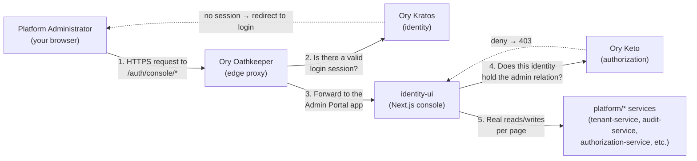

## Table of contents

This chapter has one section per topic area; use whichever matches what you're trying to do.

| Section | Covers |
|---|---|
| [§2 Becoming an admin](#2-becoming-an-admin) | The bootstrap flow, promoting/revoking other admins, self-service requests |
| [§3 Core concepts](#3-core-concepts-plain-english) | The one real authorization engine, "apply and restart," "no fabricated data" |
| [§4 Identities](#4-identities) | Managing individual user accounts |
| [§5 Organizations](#5-organizations) | Multi-tenancy: creating organizations, members, invitations |
| [§6 Authorization — Permissions, Roles, Policies](#6-authorization--permissions-roles-and-policies) | The raw Keto relation-tuple model, the Role naming layer, Policies |
| [§7 Identity Providers](#7-identity-providers-social--enterprise-login) | Turning social/enterprise sign-in on or off |
| [§8 Applications & OAuth Clients](#8-applications--oauth-clients) | The registry-backed Applications catalog vs. the raw OAuth Clients editor |
| [§9 Audit, Reports & Notifications](#9-audit-reports--notifications) | The admin action log, usage dashboards, email templates |
| [§10 Every other console page at a glance](#10-every-other-console-page-at-a-glance) | Sessions, Groups, Themes, Plugins, Authentication Flows, Developer Portal, Settings |
| [§11 End-to-end workflow example](#11-end-to-end-workflow-example) | Standing up an organization, inviting a member, registering an app, assigning a role |

## 2. Becoming an admin

### What "admin" means here — in plain English

There's no special "administrator" checkbox on an account. Instead, `identity-ui`'s route guard
(`middleware.ts`) checks, on every request to any `/console/*` page, two things in order:

1. **Are you logged in?** (a valid Kratos session — checked via `GET /sessions/whoami`).
2. **Do you hold a specific fact in Keto?** Written formally: `Organization:platform#admin@<your
   identity id>` — read as "your identity has the `admin` relation on the special object
   `Organization:platform`." This is the *only* thing that makes someone an administrator.

Failing check 1 sends you to the login page. Passing check 1 but failing check 2 redirects to a
friendly `/auth/unauthorized` page — and, deliberately, the page's own data-loading code never even
runs in that case, so a non-admin visiting a console URL never triggers admin API calls on your
behalf.

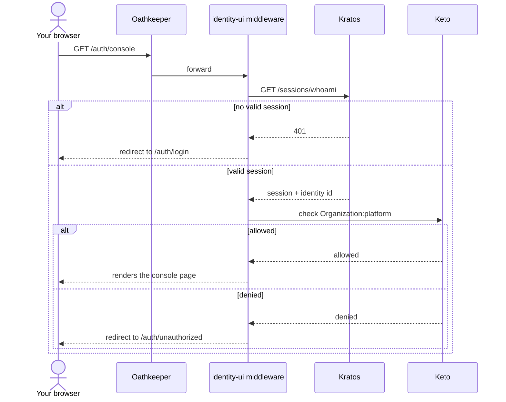

### Getting the very first admin

The very first administrator on a fresh install is granted through `/auth/setup`, a one-time
bootstrap flow that only works while **zero** admins exist anywhere on the platform. See
[chapter 2's Phase 5/6](../02-installation/README.md#phase-5-understand-admin-bootstrap-before-you-need-it)
for the concrete, step-by-step walkthrough.

### Adding a second, third, or Nth administrator

Once at least one admin exists, `/auth/setup` refuses to grant anyone else — by design, so a
compromised or curious visitor can't self-promote after the fact. From that point, there are two
real, entirely browser-based ways to add another administrator, both at
`/console/settings/administrators`.

**Path A — Direct promote (fastest, for an admin who already knows the person)**

1. Sign in as an existing administrator and go to **Settings → Administrators**.
2. Under **Promote a user to administrator**, type the exact email address the person already
   registered with, and click **Promote**.
3. This calls `platform/hooks`'s `POST /admin/platform-admins/{identity_id}` behind the scenes,
   which writes the real `admin` Keto tuple immediately — the person has console access on their
   very next page load.

**Path B — Self-service request → approval (for someone who wants access without asking directly)**

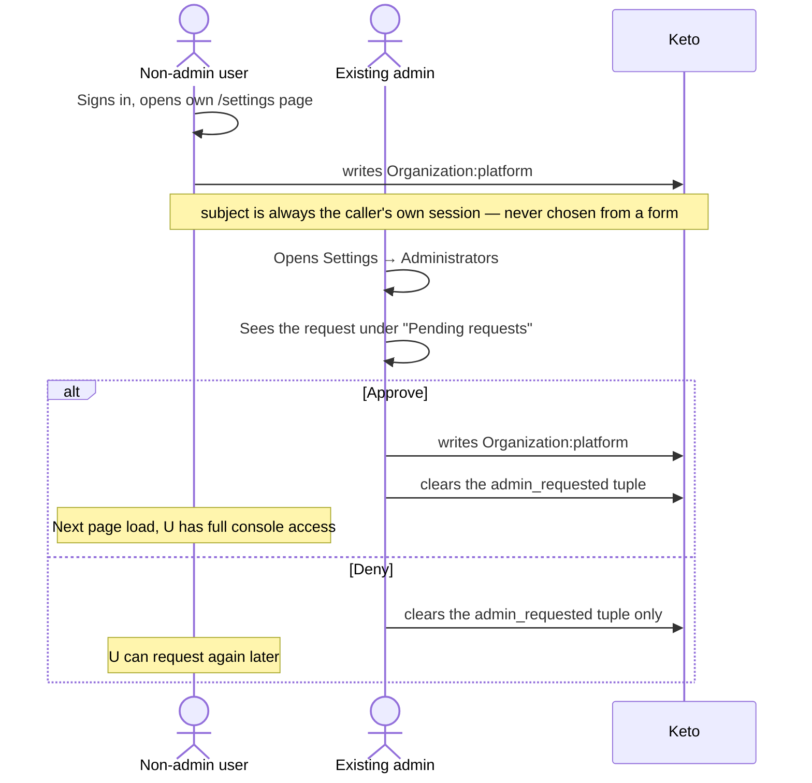

1. Any signed-in, non-administrator user goes to their own **Account settings** page (`/settings`,
   *not* `/console/settings`) and clicks **Request administrator access**.
2. This writes a real, pending Keto tuple — `Organization:platform#admin_requested` — for their own
   identity only. The subject always comes from their own server-side session.
3. An existing admin sees the request under **Settings → Administrators → Pending requests**, with
   the requester's email and **Approve**/**Deny** buttons, each behind its own confirmation dialog.
4. The requesting user can cancel their own pending request at any time from the same `/settings`
   card.

Both paths end with the identical Keto fact — the request/approval flow is just a different front
door onto the same grant. `admin_requested` isn't one of the relations Keto's own namespace model
formally declares for `Organization` — this works anyway because the running Keto instance doesn't
enforce that model at all (see [§6](#6-authorization--permissions-roles-and-policies) and
[chapter 9](../09-architecture/README.md) for the full, verified explanation).

**Revoking an administrator**: from the **Current administrators** list, click **Revoke** next to
anyone except yourself if you're the only admin left — the button is disabled in that one case, so
you can never lock yourself out of the platform entirely.

## 3. Core concepts (plain English)

### 3.1 There is exactly one real authorization engine

Several nav items — Organizations, Groups, Roles, Policies, Permissions, an application's own
Permissions tab — can look like separate systems. **They are not.** All of them ultimately read and
write the same underlying facts inside Ory Keto.

- **Organizations** = a row in `platform/tenant-service`'s database (name, domain, status) plus
  real Keto facts about who is `admin` / `member` / `billing_admin` of it.
- **Groups** (console label for Ory Keto's `Team` namespace) have **no database row at all** — a
  group exists purely because a Keto fact mentions its ID, and disappears the moment the last such
  fact is deleted.
- **Roles** and **Policies** are a *naming convenience*, not a second authorization system: a Role
  is a friendly name for one `(namespace, relation)` pair; a Policy is that Role assigned to someone
  on a specific object — which, mechanically, *is* a real Keto fact.
- **Permissions** (`/console/permissions`) is the raw, unfiltered view of every fact above, plus a
  live "would this be allowed?" tester.

### 3.2 "Apply and restart" — some settings don't take effect until you restart

Ory Kratos has no way to reload its own configuration while running — a genuine limitation of
Kratos itself. Themes, Authentication Flows, and Identity Providers save your change to a file
immediately, but that change only reaches the running Kratos process the next time an operator runs
`make restart`. Each affected section says this plainly; this chapter repeats it here once so it
isn't a surprise later.

### 3.3 "No fabricated data" is a design rule across every page

Every number, chart, and log entry in this console is a live read from a real backend. Where a
metric would be useful but no real backend exposes the data for it — failed login attempts, a
history of every past permission check, per-provider login volume — the relevant page says so
explicitly instead of showing a fake or estimated number. You'll see this rule referenced by name in
[§9](#9-audit-reports--notifications).

## 4. Identities

The Identities page (`/console/identities`) is where an administrator manages the Ory Kratos
identities that end users register through the [User Guide](../03-user-guide/README.md) flows —
searching, creating, enabling/disabling, deleting, and drilling into a single identity's full
profile, credentials, sessions, and access. An **identity** here is the same thing described from
the end-user's own point of view in [chapter 3](../03-user-guide/README.md) — nothing here is a
separate copy; every action is a real Kratos admin-API call.

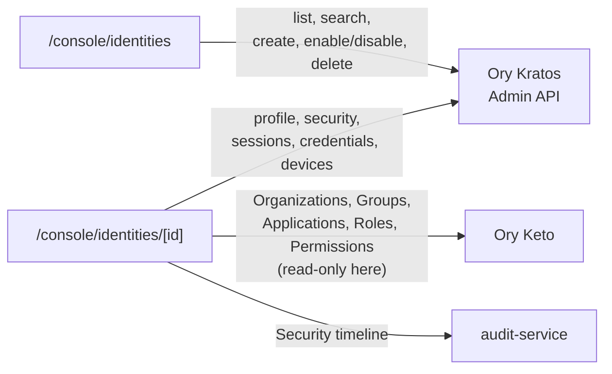

### List page (`/console/identities`)

- **Search** — a text box filtering by name/email (server-side, a real Kratos admin-API query, not
  a client-side filter).
- **Create** — register a new identity directly from the console.
- **Enable / Disable** — a disabled identity can no longer complete a login, but keeps its account
  data. Disabling does **not** revoke an already-active session — use Security → Revoke all
  sessions on the same detail page for immediate sign-out.
- **Delete** — behind a confirmation dialog; permanent. Deleting an identity does **not**
  automatically clean up Keto facts (Organization/Group/Application/Role) that reference the same
  identity ID — those are independent facts you may need to remove yourself.

### Identity detail page (`/console/identities/[id]`)

A single scrolling page of real, live-data cards, not client-side "tabs" over cached data:

| Section | What it shows |
|---|---|
| Profile | Editable name/email. |
| Security | Enable/disable, force-verify, revoke all sessions, delete, admin password reset. |
| Sessions | This identity's own sessions, each individually revocable. |
| Credentials | Current state per method (password/oidc/totp/webauthn/passkey/lookup_secret/code) — **current state only**, no change history (a real Kratos limitation). |
| Devices | IP address and browser/user-agent per session. |
| Verification & Recovery | Verifiable/recovery address state — current state only, same limitation as Credentials. |
| Organizations | Keto `Organization` facts naming this identity (read-only here — manage from [§5](#5-organizations)). |
| Groups | Keto `Team` facts naming this identity (read-only here — manage from the Groups page, [§10.3](#10-every-other-console-page-at-a-glance)). |
| Applications | Keto `Application` facts naming this identity (read-only here — manage from an application's own Permissions section, [§8](#8-applications--oauth-clients)). |
| Roles | Named Roles this identity holds — see [§6](#6-authorization--permissions-roles-and-policies). |
| Permissions | Any other Keto fact for this identity — see [§6](#6-authorization--permissions-roles-and-policies). |
| Security timeline | Real audit events with this identity as the resource — see [§9](#9-audit-reports--notifications). |

**Example workflow — locked out with no working second factor:** open their identity, use
**Security → Revoke all sessions** to force a clean re-login, or **Reset password to** for a
temporary password.

**Example workflow — offboarding:** **Security → Revoke all sessions**, then **Disable** (keeps
the record) or **Delete** (permanent). If they belonged to any Organization/Group/Application, clean
those up from their own pages — deleting the identity doesn't clear these Keto facts.

## 5. Organizations

The Organizations page (`/console/organizations`) manages **multi-tenancy** — grouping identities
into named organizations with role-based membership, and inviting new people into them by email.

### What an Organization actually is

There is no single "Organization" database table with members baked in. An Organization is the
combination of:

1. **A row in `platform/tenant-service`'s database** — a UUID `id`, a unique `name`, an optional
   unique `domain`, a `status` (defaulting to `"active"`), and a creation timestamp.
2. **Real Keto relation tuples in the `Organization` namespace.** Membership is expressed as facts
   like "identity X has relation `admin` on `Organization:<id>`," never as a column. Exactly three
   relations exist: **`admin`** (full administrative control), **`member`** (ordinary membership),
   **`billing_admin`** (billing operations). These are the *same* three relations `platform/hooks`
   writes automatically when someone registers into an organization at sign-up time.

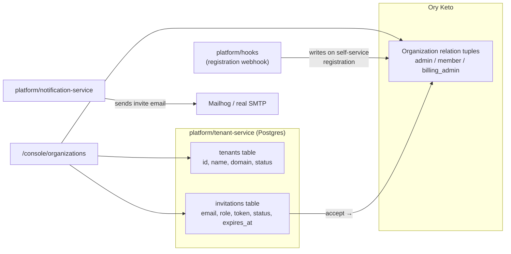

### List page

**Create an organization** — enter a **Name** (required) and optional **Domain**. Inserts a plain
row via `tenant-service`; no Keto tuple is written automatically — you (or the registration webhook)
grant the first `admin` afterward. **Delete** — behind a confirmation dialog; permanent, removes the
row and every membership relation on it.

### Detail page (`/console/organizations/[id]`)

- **Overview** — read-only domain and status. There is deliberately no logo/description/website/
  support-email/timezone/owner field, because `tenant-service`'s real schema only tracks name,
  domain, and status today.
- **Members** — add or remove `admin`/`member`/`billing_admin` relations directly. Type an
  Identity ID, pick a Role, click **Add member** — writes the real Keto tuple immediately.
- **Invitations** — see below.
- **Groups** — read-only list of Teams whose `parent` fact points at this organization.
- **Applications** — read-only list of registered applications scoped to this organization.
- **Roles** / **Permissions** — Role catalog entries scoped to `Organization`, and the raw escape
  hatch for granting any other Keto relation on this specific object.
- **Audit** — real audit events with this organization as the resource.
- **Settings** — Rename, Delete organization.

### How invitations actually work, end to end

A Keto tuple needs a real, already-existing subject (an identity ID). An invited email address
might not correspond to any identity yet, so it can't become a Keto tuple at invite time. Instead,
invitations are their own real thing, stored as rows in `tenant-service`:

| Field | Purpose |
|---|---|
| `tenant_id` | Which organization this invitation is for. |
| `email` | Who was invited. |
| `role` | `member` / `admin` / `billing_admin` — which relation to grant on acceptance. |
| `token` | A real, unguessable random string. |
| `status` | `pending` → `accepted` / `revoked` / `expired`. |
| `expires_at` | Defaults to 7 days (168 hours) from creation. |

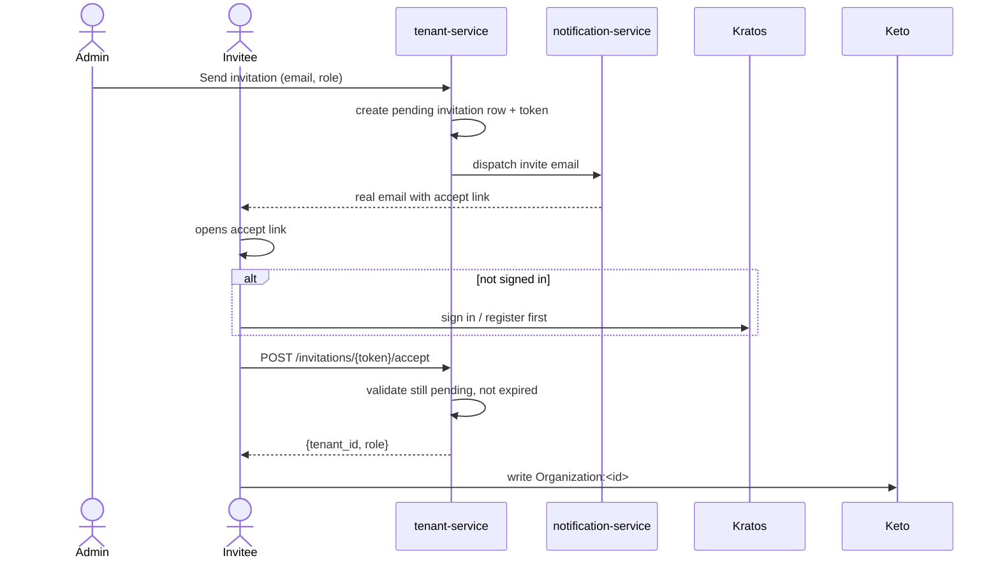

1. An admin fills in an email and role, clicks **Send invitation**. `tenant-service` creates the
   row and a real accept link.
2. `notification-service` emails the link. In local development it lands in
   [Mailhog](http://localhost:8025).
3. The invitee clicks the link; if not signed in, they register/sign in first.
4. Once signed in, the page calls the real accept endpoint, which validates the invitation is
   still `pending` and not expired, flips it to `accepted`.
5. **Only on that success** does the console write the real Keto tuple. If this last step fails,
   the invitation is already `accepted` in the database but no Keto tuple exists yet — the UI states
   this explicitly rather than silently reporting success.

**Resend** re-sends the identical email (same token, same expiry). **Revoke** marks the invitation
`revoked`; a revoked or expired invitation's link can no longer be accepted.

### Groups belong to Organizations

A Team ("Group" in the console) links to its parent Organization via a `Team.parent` tuple whose
**subject is a whole other object's rules, not one person** — a `subject_set` (see
[§6](#6-authorization--permissions-roles-and-policies)):

```
(namespace=Team, object=<team-id>, relation=parent, subject_set={namespace=Organization, object=<org-id>, relation=""})
```

Because of this, an Organization's admins are treated as administering every Team parented to it,
without a single tuple ever naming them individually.

## 6. Authorization — Permissions, Roles, and Policies

Three console pages — **Permissions** (`/console/permissions`), **Roles** (`/console/roles`), and
**Policies** (`/console/policies`) — together make up this platform's entire authorization story.
They are not three systems: they are three different *views* onto exactly one thing, **Ory Keto**.
If something on any friendlier page ever looks wrong, `/console/permissions` is where you go to see
the unfiltered ground truth.

### What a "relation tuple" is, for a total beginner

Ory Keto is a **Zanzibar-style** authorization engine. Everything Keto knows is a **relation
tuple** — one small, structured sentence, always with the same four parts:

> "**User X** has relation **admin** on **Organization Y**."

```
namespace = Organization   ← "what kind of thing is Y?"
object    = Y              ← "which specific Y?"
relation  = admin          ← "what's the relationship?"
subject   = X              ← "who has it?"
```

**Granting** access means writing one of these facts. **Revoking** means deleting one. **Checking**
means asking Keto "does this fact — or one derivable from it — hold?" There is no other mechanism
anywhere in this platform for deciding who can do what.

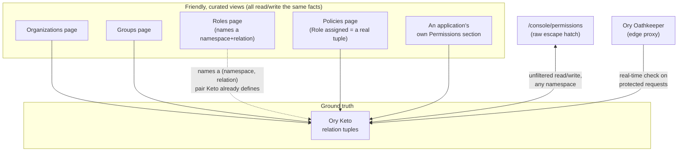

### The designed model vs. what Keto actually enforces — read this before trusting the Keto page

Keto's namespace model — which `(namespace, relation)` combinations exist and how they compose — is
*designed* in `ory/keto/namespaces/namespaces.ts`, a TypeScript-like schema language called Ory
Permission Language. **A verified, important correction: this `.ts` file is never actually compiled
into the running Keto instance** — there is no pipeline connecting it to what Keto enforces.
Confirmed live: writing a tuple with a relation name that appears nowhere in that file, Keto still
accepted it (`201 Created`); checking `relation=administer` (one of the file's *designed* `permits`
names) for a confirmed real admin returned `denied`, while checking the literal `relation=admin` for
the same identity returned `allowed`.

**What this means in practice:**

- Only the **literal relation names** that appear as `related` fields in `namespaces.ts` (`admin`,
  `member`, `billing_admin`, `manager`, `owner`, `editor`, `viewer`, and a few others) are ever
  actually written or checked by any real service in this platform.
- The *designed* higher-level permission names (`administer`, `view`, `manage_billing`, `manage`,
  `use`, `write`) — called **`permits`** in that file — **cannot be checked at all** against the
  running Keto instance. If you're using the Check tool on `/console/permissions`, always check a
  *literal* relation, never one of the `permits` names.
- **Parent-relation cascading does not happen automatically.** The designed model says a
  Resource's `view` should fall back to its parent Project's `view` — but Keto has no compiled
  schema telling it to do this, so it doesn't. Where this platform genuinely needs "an org admin can
  reach everything under their org," the calling service checks the `Organization admin` relation
  directly — it never relies on Keto to cascade a permission on its own.

Full technical detail and the exact verification steps: [chapter 9](../09-architecture/README.md).

### `subject_set`: when the "subject" is a whole other object's rules, not one person

Sometimes you want to say "the subject here isn't one person — it's *anyone who already satisfies
some other object's own rules*." That's a **`subject_set`**. The concrete example in this platform
is `Team.parent` (see [§5](#5-organizations)):

```json
{
  "namespace": "Team",
  "object": "<team_id>",
  "relation": "parent",
  "subject_set": {
    "namespace": "Organization",
    "object": "<org_id>",
    "relation": ""
  }
}
```

### The naming layer: what a Role is

A **Role** (`platform/authorization-service`) is nothing more than a friendly label glued onto one
`(namespace, relation)` pair — e.g. "Organization Admin" pointing at `(namespace=Organization,
relation=admin)`. **Keto itself has no idea what a "Role" is.** Keto is never asked "does this
identity have the Organization Admin role?" — only "does this identity have relation `admin` on this
object?"

The Role catalog lives in `platform/authorization-service` (`roles.py`), stored as plain YAML
files, one per role, under `configuration/authorization/roles/`:

```yaml
id: org-admin
name: Organization Admin
namespace: Organization
relation: admin
description: Full administrative control over an organization.
```

A Role can only ever be created against a `(namespace, relation)` pair in a hardcoded, verified list
(`VALID_ROLE_TARGETS`) mirroring exactly what Keto's namespace model declares as real relations:

| Namespace | Real relations you can name a Role after |
|---|---|
| `Organization` | `admin`, `member`, `billing_admin` |
| `Team` | `manager`, `member` |
| `Project` | `owner`, `contributor_team`, `viewer_team` |
| `Application` | `owner` |
| `Resource` | `owner`, `editor`, `viewer` |

On first boot, ten starter Roles are seeded automatically (one per real relation across every
namespace above), only if their files don't already exist.

### What a Policy is

A **Policy** is a Role assigned to a subject on one specific object. It has **no storage of its
own** — a Policy *is* a real Keto relation tuple, full stop. Listing policies means reading live
tuples back from Keto; creating/deleting is a direct Keto write/delete. A Policy's `id` in the
console is a stable base64 encoding of `[namespace, object_id, relation, subject_id]`, not a
database primary key.

### Two ways to write the same kind of tuple

`/console/permissions` and `/console/policies` ultimately call the exact same Keto write/delete
operations — they differ only in curation. `/console/permissions` is the raw escape hatch
(free-text namespace/object/relation/subject, plus a live Check tool). `/console/policies` is the
friendly, curated layer — pick a Role by name (fixes namespace/relation), supply object and subject.

### Sharp edge — a Role has no identity of its own

**Two Roles pointing at the same `(namespace, relation)` pair are completely indistinguishable to
Keto.** If you create "Organization Admin" and, separately, "Super Admin," and both point at
`Organization.admin`, they show identical Usage counts and identical tuples, and revoking a Policy
under one name revokes the exact same access under the other name too. Confirmed live with an
isolated test Role/tuple pair. **Practical rule:** if you need two Roles' usage tracked completely
separately, make sure each one points at a *different* relation.

### Two honest limitations

1. **Keto keeps no permission-check history of its own.** Every Check run on `/console/permissions`
   is a live, stateless call — nothing is persisted about the fact that the check happened. See
   [§9](#9-audit-reports--notifications) for the closest thing this platform has instead.
2. **Failed Kratos login attempts aren't tracked.** Only successful sessions are recorded.

## 7. Identity Providers (social / enterprise login)

The Identity Providers page (`/console/identity-providers`) controls which of Kratos's configured
"sign in with..." options (Google, Microsoft, GitHub, GitLab, Apple) are actually reachable by end
users right now.

**Verified in this deployment:** Google and Microsoft are genuinely configured for local
development with real client credentials (stored git-ignored in `.env`) — signing in with either
really works locally. Neither credential value is ever printed in this documentation or shown in
plaintext anywhere in the console; the page only ever states whether a client ID is configured
(yes/no). GitHub, GitLab, and Apple are defined in configuration too, but without real credentials
supplied by default.

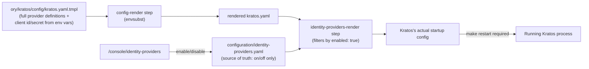

### Source of truth

`configuration/identity-providers.yaml` is a checklist, not a place credentials live:

```yaml
providers:
  - id: google
    enabled: true
  - id: github
    enabled: true
  - id: microsoft
    enabled: true
  - id: apple
    enabled: true
  - id: gitlab
    enabled: true
```

Client ID and client secret for each provider stay in `ory/kratos/config/kratos.yaml.tmpl`, sourced
from `SOCIAL_*_CLIENT_ID` / `SOCIAL_*_CLIENT_SECRET` environment variables in a git-ignored `.env`.
This page is purely an on/off switch layered on top of a configuration that already fully defines
each provider.

### Enable / Disable a provider

Click **Enable**/**Disable** — flips that provider's `enabled` flag through `platform/console-api`.
**There is deliberately no "create provider" or "delete provider" here** — the list of possible
providers is fixed to whatever `kratos.yaml.tmpl` already defines. There is also no "Test
connection" button — Kratos OSS has no admin API to dry-run an OIDC provider outside a real browser
sign-in flow.

### Apply + restart

**Toggling a provider here does not affect a running Kratos process.** The chain that makes a
toggle take effect: `identity-providers-render` (a one-shot step between config-render and Kratos's
own startup) reads the rendered `kratos.yaml`, reads `configuration/identity-providers.yaml`, and filters
the rendered config's OIDC provider list down to only enabled IDs — this only happens **the next
time Kratos restarts**:

```bash
make restart
```

Nothing on the console page itself tells you a restart is pending — this is the single most common
cause of "I disabled/enabled it but nothing changed."

### Reports: configuration state only, not usage volume

The Audit/Reports panel (§9) includes an "Identity providers configured" card, but it only shows
configuration state — not how many times anyone has actually signed in with each one. Kratos does
not track per-provider login counts.

## 8. Applications & OAuth Clients

Two real, distinct console areas over OAuth2 clients:

- **`/console/applications`** — the curated catalog of registered *applications* (Mealie, Superset,
  Airflow, Open WebUI, and this platform's own sample/validation apps), each backed by a
  `integrations/applications/*.yaml` file and a real Hydra OAuth2 client kept in sync.
- **`/console/clients`** — the raw Hydra OAuth2 client editor, for machine-to-machine clients,
  ad-hoc API integrations, or anything else with no `integrations/applications/*.yaml` entry.

These are genuinely two different pages — not one page with two tabs. This section is scoped to the
admin console's own UI for managing these entries; the sample applications themselves (Mealie,
Superset, Airflow, Open WebUI) and their own setup/integration notes live in
[chapter 6 — Integrations](../06-integrations/README.md).

### Why there are two pages for "the same thing"

Both pages ultimately manage real Hydra OAuth2 clients — there is only one Hydra, one client store.
The difference is entirely about **what else is attached**:

| | `/console/applications` | `/console/clients` |
|---|---|---|
| Source of truth for existence | `integrations/applications/*.yaml` **+** the Hydra client | The Hydra client alone |
| Who reconciles YAML ↔ Hydra | `platform/app-registry` | Nobody — nothing to reconcile |
| Extra structure | tenant/organization scoping, tags, enable/disable, a real Keto `Application:<client_id>#owner` permissions model, per-application audit history | None — a plain OAuth2 client |
| Typical use | A named application with real users, an organization, and permissions | A machine-to-machine client, a quick test client |

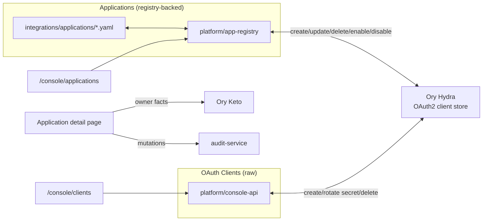

### `/console/applications`

**List page:** Create / Edit / Delete / Enable / Disable a registry entry. Creating or editing
writes both `integrations/applications/*.yaml` and the real Hydra OAuth2 client in one atomic operation.

**Detail page (`/console/applications/[clientId]`)** — every section is real, live data: Overview
(enabled state, tenant/organization, tags, scope, redirect URIs), OAuth (client name, redirect
URIs, grant types, response types, scope, token endpoint auth method, JWKS URI, audience, per-grant
token lifetime overrides), Secrets (**Rotate secret** — shown once, old secret stops immediately),
Permissions (Keto `Application:<client_id>` facts — currently only `owner`), Users (the same facts
resolved to emails), Organizations (scoping — see [§5](#5-organizations)), Theme/Authentication Flow
(read-only, platform-global), Audit/History, Settings (edit/enable/disable/delete).

**Known limitation:** disabling an application stops *future* syncs but does not currently revoke
the already-issued Hydra client.

### `/console/clients`

**List page:** every real Hydra OAuth2 client — whether created here directly, or via
`integrations/applications/*.yaml` + `make sync`. Actions: Create client (name, redirect URIs, grant types,
response types, scope, token endpoint auth method — calls `console-api`, no registry entry created
alongside it), Rotate secret, Delete.

**Detail page:** the same underlying OAuth2 client fields as the Applications OAuth section, plus
its own secret/delete sections — but with none of the application-specific extras.

### Deciding which page to use

Use `/console/applications` for a real, user-facing application, especially if you want it scoped
to an Organization or want to track ownership. Use `/console/clients` for a plain OAuth2/OIDC
client — a script, a machine-to-machine integration, or a throwaway test client.

### Presentation-layer merge: Application Integrations (implemented)

Applications and Clients were investigated and found **not** to be the same concept — they manage
the same underlying Hydra client object, but Applications is not a strict superset of Clients. It's
a different *persistence mechanism* (a YAML file + a reconciler) layered on top of a subset of
Hydra clients, while raw Clients talk to Hydra directly with no file of their own. A full backend
merge would still mean one of two breaking changes: forcing every plain Client to also carry a
`integrations/applications/*.yaml` entry (YAML-file overhead onto machine-to-machine clients with
no organization/tenant to scope), or moving Applications' extra fields (tenant, tags,
enable/disable, owner) directly onto the Hydra client (Hydra has no such fields — not achievable
without forking Hydra). Neither is a safe incremental step, so **both backends remain exactly as
they were** — `platform/app-registry` + `integrations/applications/*.yaml` for registered
applications, `platform/console-api` + Hydra directly for raw clients.

What *did* change is the console's presentation layer: `/console/applications` is now
**"Application Integrations"** — one merged `DataTable` (search/sort/paginate) listing both
registry-backed applications and raw Hydra clients side by side, distinguished by a `source`
badge ("registered app" vs. "raw client"). Each row's actions route to whichever backend actually
owns it: registry rows get Enable/Disable + Edit + Delete against `app-registry`; raw rows get
Rotate secret + Edit + Delete against `console-api`, linking to the unchanged
`/console/clients/[clientId]` detail page. `/console/clients` (the old list route) now redirects to
`/console/applications` so existing bookmarks keep working; its detail/edit page and
`./actions.ts` (create/rotate/delete) are untouched and still real. The sidebar's separate
"Clients" nav entry was removed since it's now reachable only through the merged table.

**What would still need to happen for a real backend unification**: Applications' registry-YAML
backing would need to move to a real persistent store (a database table, or — given this
platform's newer authorization work — a real `Group`-scoped record, since "which organization does
this application belong to" is exactly the kind of ownership question the
[Group model](#authorization--permissions-roles-and-policies) was built to answer generically).
Once that migration happens, the raw-client rows could become a genuinely first-class part of the
same store instead of a second, parallel Hydra-direct path — but that's a real schema/backend
change, not a console-page refactor, and remains future work.

## 9. Audit, Reports & Notifications

Three console pages — **Audit Logs** (`/console/audit`), **Reports** (`/console/reports`), and the
**Notification Center** (`/console/notifications`) — are, together, this platform's observability
surface for "what has happened."

**The single most important thing to understand about all three:** none of them audits Kratos,
Hydra, or Keto's internal decision-making directly. They record and display what platform services
*choose to report*, and what Kratos itself already tracks.

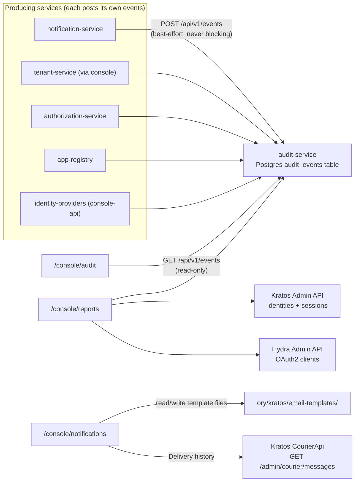

### Why `audit-service` exists at all — the Keto gap it fills

Ory Keto keeps **no history of its own decisions** — it answers "is this allowed right now" and
lists current facts, but never records that a check happened. `audit-service` compensates for this
specific gap by recording the **outcome at the moment of each Admin Portal mutation** — who changed
what, when a console action ran. This is narrower than a full Keto-native audit trail, and it says
so plainly.

Postgres-backed, in its own `audit_events` table: `id`, `actor_id` (nullable), `action`,
`resource_type`, `resource_id` (nullable), `metadata_json`, `created_at`. Recording is deliberately
**best-effort and never blocking**: if `audit-service` is slow or unreachable, the client logs a
warning and moves on — a down audit log never fails or delays the action it's describing.

### Audit Logs (`/console/audit`)

Three combinable filters (Resource type, Action, Resource ID). **Export CSV** downloads the
currently filtered result set client-side. **Coverage:** real events are recorded end to end for
Organizations/invitations, Applications, Authentication Flows, Identity Providers, and Permissions
mutations.

**Known, honest gap: every event's `actor_id` is always null.** No service in this platform
currently forwards the acting administrator's real session/identity when recording an event. Fixing
this is a real, cross-cutting change (forwarding the caller's Kratos identity ID across roughly five
services) and hasn't been attempted yet — this log answers "what happened, to what, and when"
reliably, but not yet "who did it."

### Reports (`/console/reports`)

Every number is computed **live, on each page load**. Metrics and exactly where each comes from:

- **DAU/WAU/MAU** — distinct identities with a Kratos session sign-in within 1/7/30 days. Reflects
  **successful logins only**.
- **Identities (verified/total)** — direct Kratos counts.
- **Active sessions, OAuth2 clients, Organizations, Applications (enabled/total), Audit events** —
  direct counts from each owning service.
- **Successful logins / Audit activity / Organization growth** — 14-day bar charts.
- **Flow usage** — `enabled/total` per flow type from `flow-service` — **how many are configured
  and turned on, not how many times used.**
- **Top audit actions** — the 10 most frequent action values.
- **Verifications** — per-address verification timestamps from Kratos identity records directly.
- **Password reset statistics** — counts only **admin-initiated** resets; self-service recovery
  never routes through `console-api`, so it's genuinely undercounted, and the card says so.
- **Identity providers configured** — configuration state, not login volume.

**What's not shown, and why:** failed login attempts (Kratos exposes no such data) and Keto
permission-check history (Keto keeps none) — both deliberately left off rather than faked.

### Notification Center (`/console/notifications`)

Lets an administrator view and edit the actual email templates Kratos's courier sends. No separate
notification database — this page reads and writes the very same files Kratos itself reads, at:

```
ory/kratos/email-templates/<flow>/<state>.<kind>.gotmpl
```

**A real, verified gap:** `kratos.yaml.tmpl`'s `courier.templates` block currently only wires up
`recovery` and `verification` — `login` and `registration` templates still exist and are editable
here, but Kratos ignores them and falls back to its built-in defaults. The page marks these with a
visible "not wired — see note" badge.

**Send test email** dispatches a genuinely new message through the same
`notification-service → email-service → SMTP` path as a real send. **Edit a template** overwrites
the real file immediately — no restart required, unlike most other settings in this console.
**Delivery history** shows two distinct real logs side by side: this platform's own admin actions,
and Kratos's own courier message log (`GET /admin/courier/messages`) — never merged.

**Known, honest gaps:** "Retry failed delivery" is not implemented — Kratos's courier admin API is
read-only (list/get only, no resend). Localization is not implemented — this repository's template
directories are flat, no per-locale subdirectory.

## 10. Every other console page at a glance

| Page | URL | One-line purpose |
|---|---|---|
| Overview | `/console` | Live dashboard: identity/session/client/org/group counts, service health, recent activity. |
| Sessions | `/console/sessions` | Platform-wide session list — filter active/inactive, revoke one or all of an identity's sessions. |
| Groups | `/console/groups` | Lightweight teams (Keto `Team` namespace) — add/remove members and managers, link to a parent organization. |
| Themes | `/console/themes` | Branding: product name, logo, colors, font — shared by the End-User Portal and this Admin Portal. |
| Plugins | `/console/plugins` | Registry of pluggable providers (e.g. the SMTP email plugin) plus admin-managed plugin metadata. |
| Authentication Flows | *(console page removed — see [§10.6](#106-authentication-flows-removed-from-the-console))* | Backend configuration now lives in `ory/kratos/config/kratos.yaml.tmpl` directly. |
| Developer Portal | `/console/developer` | OIDC discovery info, a client-credentials token tester, a full OAuth Playground, and API key management. |
| Settings | `/console/settings` | Export/import a configuration bundle across Themes, Flows, Plugins, Identity Providers, and Roles; also home to Administrators ([§2](#2-becoming-an-admin)). |

### 10.1 Overview (`/console`)

A single-glance dashboard: KPI tiles (Identities, Active sessions, OAuth2 clients, Organizations,
Groups, Permission tuples), a Services panel with live up/down badges for Kratos/Hydra/Keto, the
five most-recently-created identities, and the eight most recent audit events. If a backend service
is slow or unreachable, its tile shows `0` and its badge shows `down`, rather than a stale number
that looks fine but isn't. If every tile reads `0` and every service shows `down`, this almost
always means `identity-ui` can't reach the backend network — try `make health`.

### 10.2 Sessions (`/console/sessions`)

A platform-wide view across every identity's sessions. Filter by active/inactive, revoke an
individual session, or revoke every session belonging to one identity — both are real Kratos
mutations, effective immediately.

### 10.3 Groups (`/console/groups`)

A lighter-weight grouping than a full Organization. **Create a group** simply by adding its first
member or manager under a new team ID — there is no separate "create" button, because the group's
existence *is* that first fact. **Add/remove** member or manager relations. **Link/unlink a parent
organization** writes or deletes a real Keto `Team.parent` fact (see [§5](#5-organizations) and
[§6](#6-authorization--permissions-roles-and-policies) for the `subject_set` mechanics).

### 10.4 Themes (`/console/themes`)

Branding shared by both the End-User Portal and this Admin Portal — product name, company name,
logo, favicon, footer text, color palette, and font. `configuration/themes/neobim.yaml` is the one
currently active theme file:

```yaml
productName: NeoBIM Identity
companyName: NeoBIM
logo:
  src: /neobim-mark.svg
  alt: NeoBIM
favicon: /favicon.ico
colors:
  background: var(--background)
  foreground: var(--foreground)
  accent: var(--primary)
  accentForeground: var(--primary-foreground)
  border: var(--border)
typography:
  fontFamily: var(--font-sans)
footer:
  text: "© NeoBIM"
  links: []
```

`configuration/themes/example-other-company.yaml` also exists — a second, differently-branded example
proving the theming mechanism genuinely works for more than one company, though switching which
file is active still means changing the `THEME_CONFIG_PATH` environment variable and restarting;
there is no in-console "activate this theme" button yet.

Editing every brand field and color, **Export** as JSON, browse **version history** (every save
snapshots the previous file first, into `configuration/themes/history/<timestamp>.yaml`) and **roll back**
to any prior version. Every `PUT /api/v1/theme` first copies whatever is currently on disk into
history *before* writing the new content — automatically, on every save. A rollback also snapshots
the version it's replacing, so it's never a one-way, lossy action. A snapshot is only created by a
real save through the console/API — editing the YAML file directly on disk creates no history
entry.

**Important operational note:** saving does **not** take effect immediately —
`identity-ui/themes/load-theme.ts` reads the theme file once at process startup and caches it for
the process's lifetime. `make restart` is required.

**A real bug found and fixed:** an early Compose service bind-mounted only the single theme YAML
*file*, not its parent folder — so when the version-history feature tried to create a `history/`
folder next to it, there was nowhere on the host for that folder to exist. Fixed by mounting the
whole parent directory (`../../../configuration/themes:/etc/config/themes`) instead of the one file — a
generalizable lesson for any future service that bind-mounts a single file it might ever need a
sibling of.

### 10.5 Plugins (`/console/plugins`)

A generic plugin registry, separate from Applications and Identity Providers. Two distinct row
types: **`code` rows** (real plugin manifests, e.g. the SMTP email plugin actually in use — shown
read-only, this page can't mutate them) and **`config` rows** (admin-managed here: register,
enable/disable, version history, rollback, delete; dependency validation is real — registering a
plugin naming an unknown dependency ID is rejected). **Explicitly not implemented:** health checks
and upgrade detection — config-defined plugins have no runtime component to health-check, and
there's no external registry to compare a version against. See
[chapter 5](../05-development/README.md) for the full plugin mechanism.

### 10.6 Authentication Flows (removed from the console)

The `/console/flows` page (define which sign-in methods participate in each flow type, an
enable-only Publish step, a live Simulate preview, history/rollback) was **removed** from the
Admin Portal in a later pass — it exposed a level of Kratos method-composition control beyond what
this repository's initial feature set calls for, and its "enable-only, never disables a method
globally" behavior was a frequent source of confusion (a flow's methods looked scoped per-flow in
the UI but Kratos itself only ever turns a method on/off globally).

**Where this configuration lives now:** directly in `ory/kratos/config/kratos.yaml.tmpl`'s
`selfservice.methods` block — the same file `make restart` already rehydrates Kratos from. Enabling
or disabling a sign-in method (password, social login, passkey, WebAuthn, one-time codes, backup
codes, magic links) is a one-line edit to that file followed by `make restart`; there is no console
UI for it, by design, since the earlier console page could only ever offer the same global on/off
switch Kratos itself supports — never true per-flow branching (`kratos.yaml.tmpl` has the identical
limitation the removed page did: Kratos has no way to make a flow branch based on who the user is).
The `flow-service` platform service and its `enabled/total` counts still back the Reports page's
"Flow usage" card ([§10 Reports](#reports-consolereports)) — only the console *editing* surface was
removed, not the backend service or its read API.

### 10.7 Developer Portal (`/console/developer`)

Backed entirely by real, live endpoints. **OIDC discovery** — issuer, authorization endpoint, token
endpoint, JWKS URI, userinfo endpoint, read live from Hydra. **Test a client_credentials token** —
enter a real client's ID/secret/scope. **OAuth Playground (Authorization Code + PKCE)** — provisions
a real, temporary, public Hydra client and walks through an actual login/consent round trip
(Device Authorization Grant isn't offered — this platform's Hydra doesn't support it). **API
Keys** — each is a real Hydra client using `client_credentials`; **Disable** genuinely clears its
grant types. **SDK examples, downloadable Postman collection, and a live OpenAPI explorer** — full
endpoint reference in [chapter 5](../05-development/README.md).

### 10.8 Settings (`/console/settings`)

Export/import a configuration bundle across Theme, Flows, Plugins, Identity Providers, and Roles —
plus the **Administrators** sub-page ([§2](#2-becoming-an-admin)). **Export** downloads the current
real state of all five areas as one JSON bundle. **Import** — "Validate only" checks shape without
writing; "Apply" calls each section's real create endpoint (items that already exist fail
individually, not silently skipped). **Deliberately out of scope:** `configuration/platform.yaml` isn't
read by any running service, so a settings UI for it would look real and change nothing — this
console avoids that everywhere. Also out of scope: Kratos's own runtime security/session/cookie
policy (no admin API exists to read or write it) and feature flags/maintenance mode.

## 11. End-to-end workflow example

A complete, realistic walkthrough tying several pages together: standing up a new organization,
inviting a real member, registering an application for them, and assigning a role.

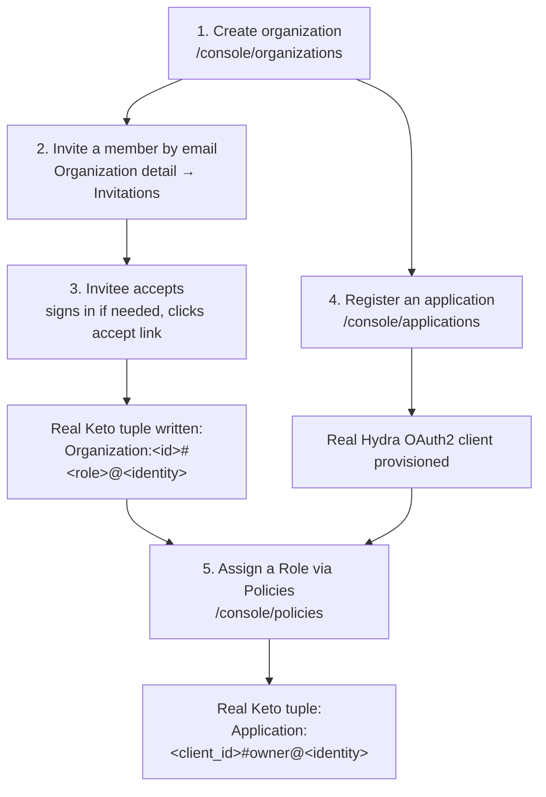

1. **Create the organization.** `/console/organizations` → **Create organization** → name (and
   optional domain).
2. **Invite a member by email.** Organization detail → **Invitations** → email, role, **Send
   invitation**. Check [Mailhog](http://localhost:8025) in local development.
3. **They accept it.** If not signed in, they're prompted to log in or register first (see
   [chapter 3](../03-user-guide/README.md)) — only then does accepting write the real membership
   fact.
4. **Register an application for the organization.** `/console/applications` → **Create** → client
   ID, name, redirect URI(s), scope. Set its organization under **Settings → Edit registry fields**.
5. **Assign a Role via Policies.** Confirm the Role exists on `/console/roles`, then
   `/console/policies` → pick the Role, the application's client ID as Object, the member's
   identity ID as Subject → **Assign**.

## FAQ

**Q: I created a Role but nobody got any access. Is that a bug?** No — a Role is only a name;
assigning it on `/console/policies` is the step that actually grants access.

**Q: I toggled something (an identity provider, a theme, a flow) and nothing changed. Why?** See
[§3.2](#32-apply-and-restart--some-settings-dont-take-effect-until-you-restart) — several settings
need `make restart`. This is a real Ory Kratos limitation, not a bug.

**Q: Where do I go to see "who did what, and when"?** [§9](#9-audit-reports--notifications) — with
one honest caveat about *who*.

**Q: Can I get a full history of every password an identity has ever had?** No — Kratos's admin API
only exposes the current credential state, never a change history.

## Common mistakes

- **Assuming Roles and Policies are a separate authorization system from Keto.** They are not — see
  [§3.1](#31-there-is-exactly-one-real-authorization-engine) and
  [§6](#6-authorization--permissions-roles-and-policies).
- **Forgetting to restart after a Themes/Flows/Identity-Providers change.** See
  [§3.2](#32-apply-and-restart--some-settings-dont-take-effect-until-you-restart).
- **Expecting a resend/retry button for a failed courier email.** Kratos's courier admin API is
  read-only.
- **Reading Reports numbers as "how many times X happened" when the page says "how many are
  configured."**
- **Confusing `/console/applications` with `/console/clients`.** Two different, real console pages
  over the same underlying Hydra clients.
- **Checking a `permits` name** (`administer`, `view`, `manage_billing`, ...) expecting it to
  reflect real access — it never will.
- **Assuming a deleted tuple always removes all access** — inherited access via `subject_set`
  requires removing the *parent* link instead.
- **Creating multiple Roles for the same relation** and expecting their Usage counts to show them
  as distinct.

## References / Related pages

- [Chapter 3 — User Guide](../03-user-guide/README.md) — the end-user's own view of registration,
  login, and account settings.
- [Chapter 2 — Installation](../02-installation/README.md) — bootstrapping the very first
  administrator.
- [Chapter 5 — Development](../05-development/README.md) — what each `platform/*` service does and
  the full API endpoint reference.
- [Chapter 6 — Integrations](../06-integrations/README.md) — the sample applications themselves and
  their individual setup notes.
- [Chapter 9 — Architecture](../09-architecture/README.md) — the technical deep-dive on Kratos,
  Hydra, Keto, and Oathkeeper this chapter simplifies for an admin audience.
