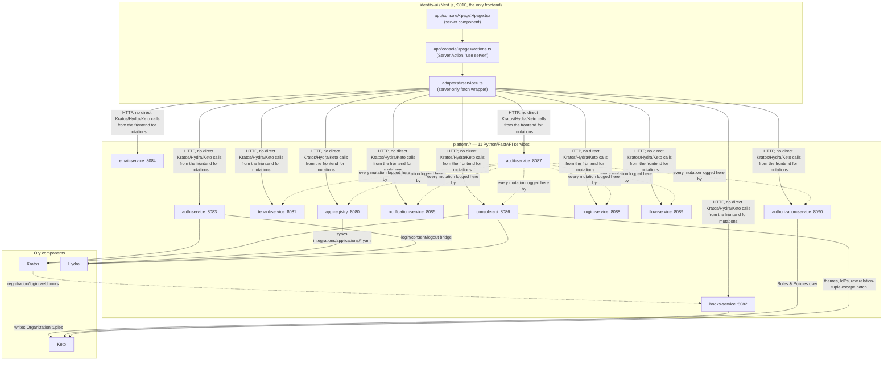
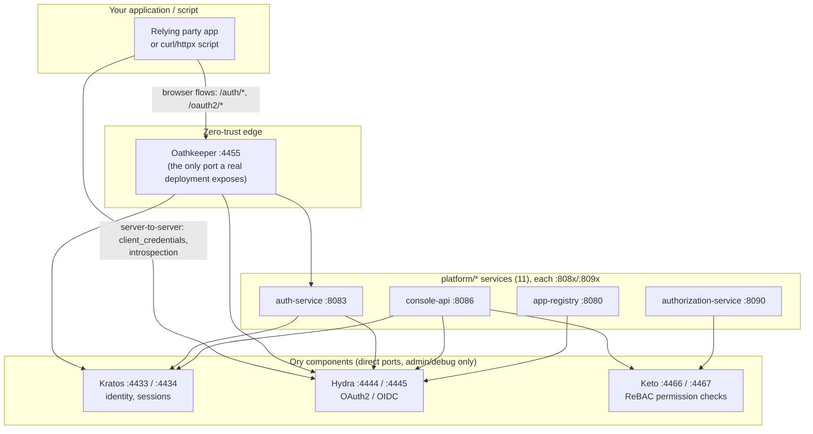
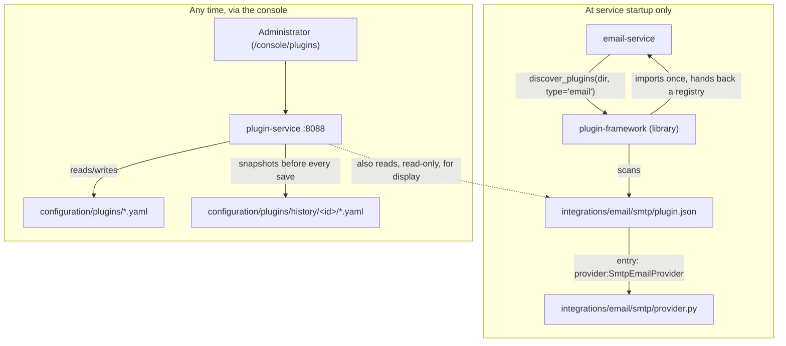
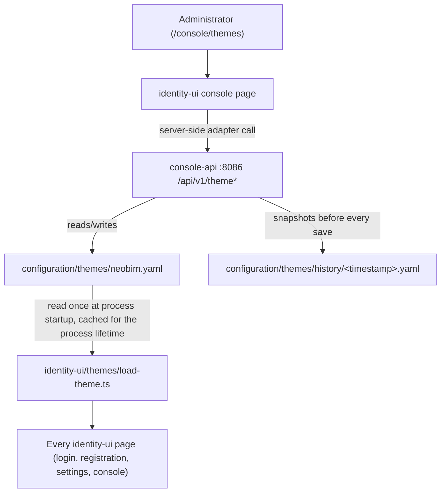

# 5. Development

## Purpose

You're adding new capability to the NeoBIM Identity Control Plane: a new `platform/*` Python
service, a new `identity-ui` console page, a new plugin, a new theme, or a new authentication flow.
This chapter is the *how* — the concrete directory layout, the container commands that actually run
your code, the full API reference for all 11 services, the plugin mechanism, theming, and a live
test dataset to develop against. For *what's currently true* about the platform (what's
live-verified, what's a known gap) and the deep architecture reference, see
[chapter 9](../09-architecture/README.md). This chapter assumes that context and the two standing
mandates below.

This chapter assumes you're comfortable with Docker, Python, and REST APIs, but have never used Ory
Kratos/Hydra/Keto/Oathkeeper before. If you need the underlying identity/OAuth2/ReBAC concepts,
start with [chapter 1's glossary](../01-introduction/README.md#plain-language-glossary) and
[chapter 3](../03-user-guide/README.md#part-1--authentication-signing-up-signing-in-and-signing-in-elsewhere).

Two rules apply to everything below, no exceptions:

1. **Python-first.** Every custom backend service is Python/FastAPI. Never introduce Go, a new
   Node.js/TypeScript service, Java, or Rust anywhere in `platform/`.
2. **Container-first, no local venv/pip.** Nothing here ever requires a local Python install,
   `uv`, or a `.venv` on your host. Every lint/format/mypy/pytest run happens **inside a Docker
   container**. Never run `uv run`, `pip install`, or activate a virtualenv directly on the host —
   use the container workflow described below.

Both are standing architecture mandates (ADR-0012, ADR-0013) — see [chapter 9](../09-architecture/README.md)
for the full rationale.

## What's in this chapter

| Section | What it covers |
|---|---|
| [Architecture](#architecture--the-platform-services-and-the-console) | The 11-service platform architecture, the read-through/write-never frontend rule |
| [§1 Adding a new service](#1-adding-a-new-platformpython-service) | Directory layout, container-first workflow, wiring it in |
| [§2 Adding a console page](#2-adding-a-new-identity-ui-console-page) | The adapter/action/page/nav layering |
| [§3 Adding an authentication flow](#3-adding-a-new-authentication-flow) | Flow YAML, the enable-only publish constraint |
| [§4 Testing conventions](#4-testing-conventions) | Unit vs. integration/e2e/security/smoke suites |
| [API reference](#api-reference) | Endpoint-by-endpoint reference for all 11 services, real Ory OSS limitations, the API-key flow |
| [Plugins](#plugins) | `plugin-framework` (code) vs. `plugin-service` (config registry) |
| [Themes](#themes) | The theme editor mechanism, version history, and the one real bug found building it |
| [Enterprise test dataset (retired)](#enterprise-test-dataset--neobim-retired) | The NeoBIM dataset's retirement — see [chapter 8](../08-reference/README.md#signing-up-signing-in-and-the-live-test-dataset) for the current live dataset |

## Overview

The platform is 4 Ory components (Kratos, Hydra, Keto, Oathkeeper) plus 11 Python/FastAPI
`platform/*` services plus one Next.js frontend (`identity-ui`). As a developer extending the
platform, you'll almost always be doing one of:

| You want to... | Go to |
|---|---|
| Add a new backend capability (new resource type, new integration) | [§1](#1-adding-a-new-platformpython-service) |
| Add a new admin console page | [§2](#2-adding-a-new-identity-ui-console-page) |
| Make a provider swappable (email, SMS, storage...) | [Plugins](#plugins) |
| Change what login/registration/recovery steps look like | [§3](#3-adding-a-new-authentication-flow) |

## Architecture — the platform services and the console

`identity-ui` is read-through/write-never with respect to Ory: it reads Kratos/Hydra directly only
for a small, explicitly-approved set of listing pages (sessions, identities, OAuth2 clients — see
`identity-ui/adapters/admin.ts`); every *mutation* goes through a `platform/*` service. This is the
single most important structural rule in this codebase.



### The eleven services, briefly

| Service | Port | Owns |
|---|---|---|
| `app-registry` | 8080 | Syncs `integrations/applications/*.yaml` OAuth2/OIDC client definitions into real Hydra clients |
| `tenant-service` | 8081 | Organizations (business units) and tenant invitations — own Postgres, SQLAlchemy + Alembic |
| `hooks-service` (`platform/hooks`) | 8082 | Kratos registration/login webhook target; writes `Organization` Keto tuples |
| `auth-service` | 8083 | Hydra login/consent/logout ↔ Kratos session bridge, at `/hydra/*` |
| `email-service` | 8084 | Sends email via a plugin-selected provider (today: SMTP only, see [Plugins](#plugins)) |
| `notification-service` | 8085 | Routes `email`/`sms` notifications; `email` forwards to `email-service`, `sms` is deliberately mocked |
| `console-api` | 8086 | Largest service — identities, sessions, OAuth2 clients, **API keys**, relation tuples, identity providers, theme + history |
| `audit-service` | 8087 | Append-only audit event log every console mutation writes to |
| `plugin-service` | 8088 | Config-plugin registry (enable/disable/order), backing `/auth/console/plugins` |
| `flow-service` | 8089 | Authentication-flow definitions (login/registration method composition), enable-only publish |
| `authorization-service` | 8090 | Roles/Policies — a pure naming layer over real Keto tuples, never a parallel authorization store |

Every service is independently deployable (own `pyproject.toml`/`uv.lock`/`Dockerfile`), reachable
only through its own HTTP API — no service imports another's Python code directly.
`platform/plugin-framework` is a shared library (not a 12th service, no port) — see
[Plugins](#plugins).

---

## 1. Adding a new `platform/*` Python service

Use an existing service as your template — `platform/authorization-service/` is a good one: small,
self-contained, and follows every convention other services follow.

### 1.1 Directory layout

```
platform/<service-name>/
├── Dockerfile              # multi-stage: dev stage (uv sync --all-groups) + runtime stage
├── README.md                # required — see below, uv sync fails without it
├── pyproject.toml            # readme = "README.md", [build-system]/[tool.hatch.build...] required
├── src/
│   └── <package_name>/       # underscored import name, e.g. authorization_service
│       ├── __init__.py
│       ├── main.py            # FastAPI app + routes
│       ├── logging_config.py  # structured logging setup, same shape across all services
│       ├── audit_client.py    # fire-and-forget client that POSTs to audit-service (:8087)
│       └── registry.py        # (if the service reads/writes a config/*.yaml file)
└── tests/
    └── test_*.py             # unit tests, run in-container, with fakes for Kratos/Hydra/Keto/
                                # audit-service where relevant (never real network calls)
```

Other services add extra modules as needed — `authorization-service` has `keto_client.py`,
`roles.py`, `policies.py`; `flow-service` has `apply_flows.py`. Follow whatever shape the closest
analogous existing service uses rather than inventing a new one.

### 1.2 Things that will silently break your service if skipped

These are non-obvious failure modes, not style preferences:

- **`Dockerfile` must `COPY <service>/README.md`** alongside `pyproject.toml`/`uv.lock`. Every
  `pyproject.toml` declares `readme = "README.md"`, and `uv sync`'s project-install step fails
  without the file present in the build context.
- **`pyproject.toml` needs `[build-system]` and `[tool.hatch.build.targets.wheel]`** configured.
  Without it, `uv sync` silently *skips* installing your project as an importable package, and the
  runtime `uvicorn <module>:app` CMD fails with `ModuleNotFoundError` — a confusing failure that
  looks unrelated to packaging.
- **Runtime (production) Docker stages must invoke the synced venv's binary directly** via
  `ENV PATH="/app/.venv/bin:$PATH"` and a plain `uvicorn ...` CMD — never `uv run` in the runtime
  stage. `uv run` needs a writable `HOME`/cache directory that the unprivileged runtime user
  (`USER 10001:10001`) doesn't have.
- **If your service needs files outside its own directory** (e.g. `configuration/schemas/`, or another
  `platform/*` package like `plugin-framework`), it needs a **repo-root Compose build context**,
  and must preserve the *same relative directory depth* inside the image as on the host (e.g.
  `WORKDIR /app/platform/<service-name>`). Several test fixtures resolve the repo root via
  `Path(__file__).resolve().parents[N]`, which breaks silently if the image layout is flattened
  relative to the host.
- **Tooling versions**: `ruff` with `select = ["E","F","I","UP","B"]`, line-length 100; `mypy
  --strict` (add `plugins = ["pydantic.mypy"]` if you use pydantic-settings — otherwise
  `Settings(field_name=...)` construction in tests fails type-checking, and in some
  pydantic-settings versions fails at runtime too, unless every field's `validation_alias`
  explicitly includes the bare field name via `AliasChoices`); `pytest` with
  `pythonpath = ["src"]`.

### 1.3 The container-first workflow (this is how you actually run/test your new service)

```bash
# Build (or rebuild) the dev-stage image for your service
automation/docker/docker-build-python-dev.sh platform/<service-name>

# Run the full check suite inside that container — this is the pattern to use every iteration
docker run --rm <service-name>-dev sh -c "uv run pytest -q && uv run ruff check . && uv run mypy"
```

Never run `uv run pytest`, `pip install -e .`, or `python -m venv` directly on the host. If you
need a quick one-off container instead of the Makefile targets,
`automation/docker/docker-build-python-dev.sh <dir>` is the direct entry point;
`platform/plugin-framework` (which has no `Dockerfile` of its own) instead builds via
`deployment/docker/configs/python-dev.Dockerfile`.

Once your service is wired into Compose, the repo-wide targets also cover it:

```bash
make lint-python              # ruff, containerized, across every platform/* package
make format-python             # the one target that writes back to the host (bind-mounts src/tests)
make test-python-services      # pytest, containerized, across every platform/* package
make validate                  # config schemas + Compose/Kustomize + all Python packages — CI baseline
```

### 1.4 Wiring a new service in

1. Add it to `deployment/docker/compose/` (service definition, port, env, depends_on) — pick an
   unused port; see [chapter 8](../08-reference/README.md) for every port already in use (the 11
   existing services occupy `8080`–`8090`).
2. If it's called by Oathkeeper directly, add a rule to `ory/oathkeeper/rules/access-rules.json` —
   see [chapter 9](../09-architecture/README.md) for existing rule shapes to copy from
   (`oauth2_introspection` + `remote_json` + `header` is the standard authenticated-API triple).
3. If identity-ui needs to call it, add an adapter (`identity-ui/adapters/<service>.ts`) — see §2.
4. If it reads/writes a `config/*.yaml` file, follow the "config-as-YAML" pattern: your service
   owns all reads/writes of that file; identity-ui never touches it directly.
5. Give it a real `README.md` documenting what it does and any constraints it discloses (Kratos's
   enable-only method flags, "apply + restart" requirements, etc.).

### Example: calling your new service once it's up

Every service gets a health check and a live OpenAPI document for free from FastAPI:

```bash
curl -s http://localhost:<your-port>/healthz
```

```json
{"status": "healthy", "service": "<your-service-name>"}
```

```bash
curl -s http://localhost:<your-port>/openapi.json | python3 -m json.tool | head -30
```

See [API reference](#api-reference) for the full, curated endpoint index across all 11 existing
services, and for a real worked example (`console-api`'s API-key/`client_credentials` flow) of a
service that issues and validates real Hydra OAuth2 tokens.

---

## 2. Adding a new identity-ui console page

`identity-ui` is the **only** frontend in this platform and is **read-through, write-never** with
respect to Kratos/Hydra/Keto: every mutation goes through a `platform/*` Python service. The one
documented exception is a small set of narrow, explicitly-approved **read-only** direct calls used
for listing live data that has no Python-service equivalent yet — sessions, identities, and OAuth2
clients listing pages read Kratos/Hydra directly (see `identity-ui/adapters/admin.ts`). Do not
extend that exception to new pages or to any mutation — new mutating surfaces must go through a
Python service, full stop.

The layering, bottom-up:

```
adapters/<service>.ts            (1) server-only fetch wrapper around one platform/* service
        │
app/console/<page>/actions.ts    (2) "use server" Server Actions — form-handling glue,
        │                             calls the adapter, then revalidatePath()
        │
app/console/<page>/page.tsx      (3) server component — reads data via the adapter,
        │                             renders it, wires actions to forms
        │
app/console/console.nav.tsx      (4) nav entry — only add once the page does something real
```

`identity-ui` runs under `basePath: "/auth"` — every in-page navigation link must use Next.js's
`<Link>` component, never a raw `<a href="/console/...">`; a raw anchor resolves without the
`/auth` prefix and 404s against Oathkeeper. This was a real bug found in ten files in this
codebase's history — see [chapter 9](../09-architecture/README.md) for the full account.

### 2.1 Adapter (`identity-ui/adapters/<service>.ts`)

- Starts with `import "server-only";` — this file must never be importable from client code.
- Reads the target service's base URL from `@/config/env` (`getEnv().<service>Url`).
- Exposes typed functions per endpoint: `list*()` returns `[]` on any fetch failure (never throws
  into a render path), mutating calls return a small `{ ok: boolean; error?: string }` result type.
- `cache: "no-store"` on every fetch — this is admin/control-plane data, never cached.
- No business logic here — it's a thin, typed HTTP client and nothing else. See
  `identity-ui/adapters/authorization-service.ts` for the reference shape.

### 2.2 Server action (`app/console/<page>/actions.ts`)

- Starts with `"use server";`.
- One exported `async function` per form submission, taking a `FormData` and returning
  `Promise<void>`.
- Pulls fields out of `FormData` with `formData.get(...)`, validates the shape defensively.
- Calls the adapter, then `revalidatePath("/console/<page>")` so the server component re-renders
  with fresh data. Never call Kratos/Hydra/Keto SDKs directly here.

### 2.3 Page (`app/console/<page>/page.tsx`)

A server component (no `"use client"` at the top) that calls the adapter's `list*()` functions
directly, then renders forms whose `action=` prop points at the Server Actions from `actions.ts`.

### 2.4 Nav entry (`app/console/console.nav.tsx`)

Add `{ href: "/console/<page>", label: "<Label>" }` to the `ITEMS` array — **only** once the page
is real and functional. This repo's explicit "no stub plugins / no placeholders" rule extends to
nav entries: don't add a link to a page that doesn't do anything real yet.

---

## 3. Adding a new authentication flow

Authentication flows (`configuration/flows/*.yaml`) describe, per flow type
(`login`/`registration`/`recovery`/`verification`), the ordered list of Kratos self-service methods
used — managed from `/auth/console/flows`, owned by `platform/flow-service`.

A flow file looks like:

```yaml
id: standard-login
name: Standard Login
type: login
enabled: true
steps:
  - password
  - oidc
```

To add a new flow:

1. Add a new YAML file under `configuration/flows/` (or create one via the flow-service API /
   `/auth/console/flows` page).
2. `flow-service`'s `apply_flows.py` renders enabled flows' methods into `kratos.yaml` via the
   `flows-render` one-shot Compose step (runs after `config-render`, before Kratos starts).
3. **Understand the enable-only constraint before you rely on any flow-level toggle**: Kratos's
   `selfservice.methods.<method>.enabled` flags are **global**, not scoped per flow. There is no
   way, in this Kratos version, to enable `password` for login but disable it for registration. So
   `flow-service`'s publish step is deliberately **enable-only**: it turns on any method used by an
   enabled flow, but never disables a method just because no flow currently references it — that
   could silently break some other flow that also depends on it. If you need a method fully off,
   that still requires hand-editing `ory/kratos/config/kratos.yaml.tmpl`.
4. **Publishing does not take effect immediately.** Kratos OSS has no runtime config-reload API — a
   published flow change only takes effect after `make restart`.

### Example: publish a flow change and see it take effect

```bash
# 1. Update the flow (adds a step)
curl -s -X PUT http://localhost:8089/api/v1/flows/standard-login \
  -H "Content-Type: application/json" \
  -d '{"id": "standard-login", "name": "Standard Login", "type": "login", "enabled": true, "steps": ["password", "totp", "oidc"]}'

# 2. Publish it
curl -s -X POST http://localhost:8089/api/v1/flows/standard-login/publish

# 3. Nothing changes yet for real users — restart is required
make restart
```

---

## 4. Testing conventions

Two tiers, deliberately kept separate:

| Where | What | Run with |
|---|---|---|
| `platform/<service>/tests/` | Per-service **unit tests**, with fakes for Kratos/Hydra/Keto/audit-service — never hit real network | `make test-python-services`, or `docker run --rm <service>-dev sh -c "uv run pytest -q"` for one package |
| `tests/` (repo root) | Cross-service **integration/e2e/security/performance/smoke** tests, against a **live** stack (`make up` first) — no mocks, real network calls | see table below |

`tests/` layout:

| Directory | Run with | Covers |
|---|---|---|
| `tests/unit/` | `make test-unit` | Repository config validation — no running stack needed |
| `tests/integration/` | `make test-integration` | Real cross-service flows: Role/Policy → Keto tuple, Invitation accept → Keto tuple, Flow publish |
| `tests/e2e/` | `make test-e2e`, `make test-e2e-platform` | Full browser-cookie user journeys (registration → verify → login → logout), Hydra/Keto/Oathkeeper/observability checks, application-plugin OIDC |
| `tests/performance/` | `make test-performance` | Basic single-request latency bounds — not a load-testing harness (no k6/Locust) |
| `tests/security/` | `make test-security` | Security-boundary checks: unauthenticated console access denied, Oathkeeper doesn't leak Kratos/Hydra admin surfaces |
| `tests/smoke/` | `make test-smoke` | Fast health-only tripwire across every platform service + every console page (with a real session cookie) |
| `tests/fixtures/` | — | Shared `conftest.py` (base URLs); not itself a testpath |

When adding a new service or console page: put its unit tests in its own `platform/*/tests/`
directory (containerized, fakes-only). Only add to the root `tests/` tree if your change needs to
be verified *across* services against a live stack. You can test against the
[Sparc Engineering test dataset](../08-reference/README.md#the-sparc-engineering-test-dataset-primary-live-dataset)'s
live-seeded identities instead of creating throwaway accounts for every manual check.

---

## API reference

Two different kinds of "API" exist in this platform:

1. **The Ory components' own APIs** — Kratos, Hydra, Keto, Oathkeeper. You call these directly only
   if you're building a relying-party application or writing platform code. Ports and full endpoint
   catalogs are Ory's own upstream documentation; [chapter 9](../09-architecture/README.md)
   documents exactly which behaviors and limitations were verified against *this* deployment.
2. **The 11 `platform/*` Python services' APIs** — these wrap and orchestrate the Ory APIs for this
   platform's own admin console, webhooks, and multi-tenancy layer.

Every service exposes a live, always-current OpenAPI document — `GET /openapi.json` on its own
port. The Developer Portal (`/auth/console/developer`) ships a real OpenAPI explorer that reads
these documents from the running services. **If anything on this page ever drifts from a running
service's own `/openapi.json`, the live document wins** — this is a curated index, not the source of
truth. Every service also exposes `GET /healthz` → `{"status": "healthy", "service": "<name>"}`.



### Service index

| Service | Port | Purpose |
|---|---|---|
| App Registry | 8080 | OAuth2/OIDC client (app) registry, synced to Hydra |
| Tenant Service | 8081 | Tenants (organizations) and tenant invitations |
| Hooks Service | 8082 | Kratos webhook targets (registration/login) and platform-admin bootstrap |
| Auth Service | 8083 | Hydra login/consent/logout orchestration against Kratos |
| Email Service | 8084 | Outbound email send (courier backend) |
| Notification Service | 8085 | Multi-channel notification dispatch and templates |
| Console API | 8086 | Backend for the admin console (identities, sessions, clients, API keys, relation tuples, identity providers, theme, developer tools) |
| Audit Service | 8087 | Append-only audit event log |
| Plugin Service | 8088 | Config-plugin registry (email/SMS/secrets/storage backends), enable/disable, versioned history |
| Flow Service | 8089 | Self-service flow definitions, enable/disable, publish, versioned history |
| Authorization Service | 8090 | ReBAC roles/policies management over Ory Keto |

### App Registry (:8080)

| Method | Path | Notes |
|---|---|---|
| GET | `/healthz` | Health check |
| GET | `/ready` | Readiness check |
| GET | `/api/v1/registry` | List registered application definitions |
| GET | `/api/v1/clients` | List OAuth2 clients |
| POST | `/api/v1/registry/{client_id}/enabled` | Enable/disable — `enabled:false` deletes the real Hydra client, it does not just flag it |
| POST | `/api/v1/registry` | Register a new application |
| PUT | `/api/v1/registry/{client_id}` | Update a registered application |
| DELETE | `/api/v1/registry/{client_id}` | Remove a registered application |
| POST | `/api/v1/sync` | Sync the registry with Hydra |

### Tenant Service (:8081)

| Method | Path | Notes |
|---|---|---|
| POST | `/tenants` | Create a tenant |
| GET | `/tenants` | List tenants |
| GET | `/tenants/{tenant_id}` | Get a tenant |
| PATCH | `/tenants/{tenant_id}` | Update a tenant |
| DELETE | `/tenants/{tenant_id}` | Delete a tenant |
| POST | `/tenants/{tenant_id}/invitations` | Create a tenant invitation |
| GET | `/tenants/{tenant_id}/invitations` | List invitations for a tenant |
| DELETE | `/tenants/{tenant_id}/invitations/{invitation_id}` | Revoke an invitation |
| POST | `/invitations/{token}/accept` | Accept an invitation by token |
| GET | `/healthz` | Health check |

**Example — create a tenant:**

```bash
curl -s -X POST http://localhost:8081/tenants \
  -H "Content-Type: application/json" \
  -d '{"name": "NeoBIM Robotics", "domain": "robotics.neobim.example"}'
```

### Hooks Service (:8082)

| Method | Path | Notes |
|---|---|---|
| POST | `/webhooks/registration` | Kratos after-registration webhook target |
| POST | `/webhooks/login` | Kratos after-login webhook target |
| POST | `/admin/platform-admins/{identity_id}` | Grant platform-admin to an identity |
| DELETE | `/admin/platform-admins/{identity_id}` | Revoke platform-admin from an identity |
| GET | `/healthz` | Health check |

You will not normally call `/webhooks/*` yourself — Kratos calls these. Granting/revoking
platform-admin from your own code is the one legitimate direct use.

### Auth Service (:8083)

| Method | Path | Notes |
|---|---|---|
| GET | `/hydra/login` | Hydra login-challenge handler, resolved against the Kratos session |
| GET | `/hydra/consent` | Hydra consent-challenge handler |
| GET | `/hydra/logout` | Hydra logout-challenge handler |
| GET | `/hydra/error` | Hydra error-callback handler |
| GET | `/healthz` | Health check |

These are called by Hydra itself, never by your application directly.

### Email Service (:8084)

| Method | Path | Notes |
|---|---|---|
| POST | `/send` | Send an email through the configured provider plugin |
| GET | `/healthz` | Health check |

### Notification Service (:8085)

| Method | Path | Notes |
|---|---|---|
| POST | `/dispatch` | Dispatch a notification through a channel/template |
| GET | `/api/v1/notifications/templates` | List notification templates |
| GET | `/api/v1/notifications/templates/{template_id}` | Get a template |
| PUT | `/api/v1/notifications/templates/{template_id}` | Update a template |
| POST | `/api/v1/notifications/test` | Send a test notification |
| GET | `/healthz` | Health check |

### Console API (:8086)

The largest service; endpoints grouped by area.

**Identities**

| Method | Path | Notes |
|---|---|---|
| POST | `/api/v1/identities` | Create an identity |
| POST | `/api/v1/identities/{identity_id}/enable` | Enable an identity |
| POST | `/api/v1/identities/{identity_id}/disable` | Disable an identity (enable-only pattern) |
| PUT | `/api/v1/identities/{identity_id}/traits` | Update an identity's traits |
| POST | `/api/v1/identities/{identity_id}/force-verify` | Force-mark address(es) verified |
| POST | `/api/v1/identities/{identity_id}/reset-password` | Admin-triggered password reset |
| DELETE | `/api/v1/identities/{identity_id}` | Delete an identity |

**Sessions**

| Method | Path | Notes |
|---|---|---|
| DELETE | `/api/v1/sessions/{session_id}` | Revoke a single session |
| DELETE | `/api/v1/identities/{identity_id}/sessions` | Revoke all sessions for an identity |

**Clients**

| Method | Path | Notes |
|---|---|---|
| POST | `/api/v1/clients` | Create an OAuth2 client |
| PUT | `/api/v1/clients/{client_id}` | Update an OAuth2 client |
| POST | `/api/v1/clients/{client_id}/rotate-secret` | Rotate a client secret |
| DELETE | `/api/v1/clients/{client_id}` | Delete an OAuth2 client |

**API keys — real `client_credentials` OAuth2 clients**

| Method | Path | Notes |
|---|---|---|
| GET | `/api/v1/api-keys` | List API keys |
| POST | `/api/v1/api-keys` | Create an API key — returns the client secret **once**, at creation |
| POST | `/api/v1/api-keys/{client_id}/enable` | Enable an API key |
| POST | `/api/v1/api-keys/{client_id}/disable` | Disable — a real behavior change, not a UI flag |
| DELETE | `/api/v1/api-keys/{client_id}` | Delete an API key |

**What an "API key" actually is.** Not a separate authentication mechanism — an API key created
from the Developer Portal or via `POST /api/v1/api-keys` **is a real Ory Hydra OAuth2 client**:

```json
{
  "client_id": "apikey-<16 hex chars>",
  "grant_types": ["client_credentials"],
  "token_endpoint_auth_method": "client_secret_post",
  "response_types": [],
  "scope": "<the scope you requested>",
  "metadata": {"kind": "api_key", "name": "<your label>", "enabled": true, "expires_at": null}
}
```

Disabling an API key sets `grant_types` to `[]` on the real Hydra client — a subsequent token
request against that `client_id` genuinely fails with `unsupported_grant_type`. `expires_at` is
informational only: Hydra has no native client-secret expiry, so nothing auto-revokes an expired
key.

**The full flow, verified live end-to-end** (create → issue token → introspect → revoke →
re-introspect). Every value below is an obviously fake placeholder — never publish a real
generated `client_secret` or `access_token` value, even truncated:

```bash
# 1. Create the API key (returns the secret once — store it now)
curl -s -X POST http://localhost:8086/api/v1/api-keys \
  -H "Content-Type: application/json" \
  -d '{"name": "reporting-bot", "scope": "read"}'

# 2. Get a token via the client_credentials grant, directly against Hydra's public API
curl -s -X POST http://localhost:4444/oauth2/token \
  -d "grant_type=client_credentials" \
  -d "client_id=apikey-EXAMPLE0000000000" \
  -d "client_secret=<PLACEHOLDER_SECRET>" \
  -d "scope=read"

# 3. Introspect it
curl -s -X POST http://localhost:4445/admin/oauth2/introspect \
  -d "token=<PLACEHOLDER_ACCESS_TOKEN_VALUE>"

# 4. Revoke it early
curl -s -X POST http://localhost:4444/oauth2/revoke \
  -d "token=<PLACEHOLDER_ACCESS_TOKEN_VALUE>" \
  -d "client_id=apikey-EXAMPLE0000000000" \
  -d "client_secret=<PLACEHOLDER_SECRET>"
# → HTTP 200

# 5. Re-introspect the same token — now correctly inactive
curl -s -X POST http://localhost:4445/admin/oauth2/introspect \
  -d "token=<PLACEHOLDER_ACCESS_TOKEN_VALUE>"
# → {"active": false}
```

`:4444` (Hydra public) and `:4445` (Hydra admin) are direct container ports — fine for local
development and for server-to-server calls from inside the Docker network, but a real deployment
should route the public port through Oathkeeper and keep the admin port internal-only.

**Relation tuples**

| Method | Path | Notes |
|---|---|---|
| POST | `/api/v1/relation-tuples` | Write a Keto relation tuple |
| DELETE | `/api/v1/relation-tuples` | Delete a Keto relation tuple |

**Identity providers**

| Method | Path | Notes |
|---|---|---|
| GET | `/api/v1/identity-providers` | List configured social/OIDC identity providers |
| POST | `/api/v1/identity-providers/{provider_id}/enabled` | Enable/disable an identity provider |

**Theme + theme history**

| Method | Path | Notes |
|---|---|---|
| GET | `/api/v1/theme` | Get the current theme |
| PUT | `/api/v1/theme` | Update the theme (creates a new history version) |
| GET | `/api/v1/theme/history` | List theme history versions |
| GET | `/api/v1/theme/history/{version_id}` | Get a specific theme history version |
| POST | `/api/v1/theme/history/{version_id}/rollback` | Roll back the theme to a prior version |

Full detail on the theme mechanism: [Themes](#themes) below.

**Developer / OAuth playground**

| Method | Path | Notes |
|---|---|---|
| POST | `/api/v1/developer/test-token` | Mint a test token for the OAuth playground |
| POST | `/api/v1/developer/exchange-code` | Exchange an authorization code for tokens (PKCE-aware) |
| POST | `/api/v1/developer/refresh-token` | Refresh an access token |

### Audit Service (:8087)

| Method | Path | Notes |
|---|---|---|
| POST | `/api/v1/events` | Record an audit event |
| GET | `/api/v1/events` | Query/list audit events |
| GET | `/healthz` | Health check |

### Plugin Service (:8088)

| Method | Path | Notes |
|---|---|---|
| GET | `/healthz` | Health check |
| GET | `/api/v1/plugins` | List plugins |
| POST | `/api/v1/plugins` | Create/register a plugin |
| PUT | `/api/v1/plugins/{plugin_id}` | Update a plugin |
| DELETE | `/api/v1/plugins/{plugin_id}` | Delete a plugin |
| POST | `/api/v1/plugins/{plugin_id}/enable` | Enable a plugin |
| POST | `/api/v1/plugins/{plugin_id}/disable` | Disable a plugin (enable-only pattern) |
| GET | `/api/v1/plugins/{plugin_id}/history` | List a plugin's version history |
| POST | `/api/v1/plugins/{plugin_id}/history/{version_id}/rollback` | Roll back a plugin to a prior version |

### Flow Service (:8089)

| Method | Path | Notes |
|---|---|---|
| GET | `/healthz` | Health check |
| GET | `/api/v1/flows` | List flows |
| GET | `/api/v1/flows/{flow_id}` | Get a flow |
| POST | `/api/v1/flows` | Create a flow |
| PUT | `/api/v1/flows/{flow_id}` | Update a flow |
| DELETE | `/api/v1/flows/{flow_id}` | Delete a flow |
| POST | `/api/v1/flows/{flow_id}/enable` | Enable a flow |
| POST | `/api/v1/flows/{flow_id}/disable` | Disable a flow (enable-only pattern) |
| POST | `/api/v1/flows/{flow_id}/publish` | Publish a flow — see the "apply + restart" caveat in §3 above |
| GET | `/api/v1/flows/{flow_id}/history` | List a flow's version history |
| POST | `/api/v1/flows/{flow_id}/history/{version_id}/rollback` | Roll back a flow to a prior version |

### Authorization Service (:8090)

| Method | Path | Notes |
|---|---|---|
| GET | `/healthz` | Health check |
| GET | `/api/v1/roles/namespaces` | List Keto namespaces available for roles |
| GET | `/api/v1/roles` | List roles |
| POST | `/api/v1/roles` | Create a role |
| PUT | `/api/v1/roles/{role_id}` | Update a role |
| DELETE | `/api/v1/roles/{role_id}` | Delete a role |
| GET | `/api/v1/policies` | List policies |
| POST | `/api/v1/policies` | Create a policy |
| PUT | `/api/v1/policies/{policy_id}` | Update a policy |
| DELETE | `/api/v1/policies/{policy_id}` | Delete a policy |

A "Role" here has no identity of its own in Keto — it is purely a name for a `(namespace,
relation)` pair (see [chapter 4](../04-administration/README.md#6-authorization--permissions-roles-and-policies)).

### Real Ory OSS limitations — verified, not assumed

Each was confirmed against the running system, not guessed from generic Ory documentation. Full
detail in [chapter 9](../09-architecture/README.md):

- **No Device Authorization Grant.** `grant_types_supported` in the real OIDC discovery document
  does not list `urn:ietf:params:oauth:grant-type:device_code`, and `POST /oauth2/device/auth`
  404s. For a CLI/TV/headless client, use authorization-code+PKCE with a loopback redirect instead,
  or `client_credentials` for machine-to-machine calls with no human in the loop.
- **No Token Exchange (RFC 8693).** Also absent from `grant_types_supported` — no standard-grant
  way to exchange one token for another.
- **Kratos admin API exposes only current-state credential snapshots, no history.**
- **The courier admin API is read-only.** List and get message status only; no resend/retry
  endpoint.
- **Keto has no permission-check history of its own.** `/relation-tuples/check` answers "is this
  allowed right now" and nothing else.
- **The running Keto instance does not enforce `namespaces.ts`'s designed permission model** — only
  the literal relations it was actually written with are ever checked by any real service.

### Step-by-step: calling an authenticated platform endpoint from your own service

1. Create an API key from the Developer Portal or `POST /api/v1/api-keys`. Store the returned
   `client_secret` — shown exactly once.
2. Request a token: `POST http://localhost:4444/oauth2/token` with `grant_type=client_credentials`,
   your `client_id`/`client_secret`, and the `scope` you need.
3. Call the target platform service with `Authorization: Bearer <access_token>`.
4. If the endpoint sits behind Oathkeeper's `platform-api-rules`, Oathkeeper introspects the token
   against Hydra and then asks a `remote_json` authorizer for a Keto-backed permission decision
   before forwarding — a valid token alone is not sufficient if the calling identity has no
   matching Keto relation tuple.
5. When done with the key, disable or delete it — don't rely on `expires_at`, which is
   informational only.

### Troubleshooting

| Symptom | Cause | Fix |
|---|---|---|
| `invalid_client` on `/oauth2/token` | Wrong `client_id`/`client_secret`, or the key was disabled | Re-check the secret; re-enable via `POST /api/v1/api-keys/{client_id}/enable` |
| `unsupported_grant_type` on `/oauth2/token` | The API key is disabled — its Hydra `grant_types` was cleared to `[]` | `POST /api/v1/api-keys/{client_id}/enable` |
| `{"active": false}` immediately after issuing a token | Token already expired, or it was revoked | Request a new token |
| 500 at a resource server's token-exchange step (own OIDC client) | The "single external issuer" limitation — your app's server-side call resolves `localhost:4455` to itself, not Oathkeeper | See [chapter 9](../09-architecture/README.md) and [chapter 6](../06-integrations/README.md); route server-side calls through Oathkeeper's internal Docker address |
| A Keto check on a `permits` name always returns `false` | That name was never compiled into the running Keto instance | Check the literal relation instead |
| `GET /openapi.json` 404s for a service | Wrong port, or the service isn't up | Confirm the port against [chapter 8](../08-reference/README.md) and `docker compose ps` |

---

## Plugins

Un-confusing the two different things this repository calls "plugin":

| | `platform/plugin-framework` | `platform/plugin-service` |
|---|---|---|
| What it is | A code-loading strategy (a small library) | A runtime admin plugin marketplace/registry (an HTTP service) |
| When it acts | Only when a service starts up | Any time, whenever an admin uses the console |
| What it loads | Real Python code (`plugin.json` → an `entry` field → an `import`) | Nothing — YAML configuration records, no code is ever executed |
| Who uses it | Another service (today: `email-service`) importing a provider implementation | An administrator, from `/console/plugins` |
| Port | none — it's a library, not a service | `:8088` |
| Example | `integrations/email/smtp/` supplies which email-sending code `email-service` runs | `configuration/plugins/*.yaml` entries an admin creates, edits, enables, or disables |

**One sentence:** plugin-framework changes what code runs (only at service startup);
plugin-service changes what's *configured* (read/written any time, no code execution involved — it
merely also *displays* plugin-framework's real code plugins for visibility).

Real plugins live at the repo root under `integrations/email/<name>/` — currently only `integrations/email/smtp/`,
consumed by `email-service`.



### `platform/plugin-framework` — the code-loading library

Given a directory of `integrations/email/<name>/plugin.json` manifest files matching a requested `type`, find
them, import each one's declared Python entry point, and hand back a registry a consuming service
can pick ("select") a provider from.

**Manifest format:**

```json
{
  "name": "smtp",
  "version": "1.0.0",
  "type": "email",
  "description": "SMTP email provider",
  "entry": "provider:SmtpEmailProvider"
}
```

`integrations/email/smtp/plugin.json` declares `entry: "provider:SmtpEmailProvider"`, resolving to the
`SmtpEmailProvider` class in `integrations/email/smtp/provider.py`. Its constructor takes `(settings,
logger)`, and it has one async method, `send_mail(to, subject, html, text) -> bool`, built on the
`aiosmtplib` library. `email-service` is the only consumer.

**`email` is the only category with a real plugin.** The original plugin-architecture design lists
eight categories in total (email, SMS, secrets, storage, cloud, identity providers, notification
channels, UI themes, auth hooks), but per this repository's "no placeholders" standard,
plugin-framework does not ship stub plugins for the other seven — **a plugin only gets added when
there's a genuine second implementation that needs the abstraction.**

**Lifecycle: discovered once, never hot-swapped.** At process startup, the consuming service calls
`discover_plugins(...)`; each matching manifest's `entry` module is imported exactly once. There is
**no hot-swap** — changing `plugin.json` or the plugin's own code on disk has zero effect on an
already-running process. Restarting the consuming service is required to pick up a change — the
same "apply + restart" pattern used elsewhere.

### `platform/plugin-service` — the runtime admin plugin registry (`:8088`)

A separate FastAPI service: a generic, admin-manageable plugin registry that lets an administrator
enable, disable, configure, reorder, or remove plugins across categories (`authentication`,
`identity-provider`, `theme`, `notification`, `application`, `policy`, `workflow`) from
`/console/plugins`.

`GET /api/v1/plugins` returns two kinds of entries, distinguished by a `source` field:

- **`source: "config"`** — entries backed by `configuration/plugins/<id>.yaml` files this service owns.
- **`source: "code"`** — real `integrations/email/*/plugin.json` manifests, shown **read-only**. No code is
  imported or run to produce this view.

**Real marketplace features:** dependency validation (rejects with HTTP 422 if a listed dependency
references an unknown plugin ID); version history and rollback (every write snapshots the previous
YAML file into `configuration/plugins/history/<plugin-id>/<timestamp>.yaml` before overwriting, and a
rollback itself snapshots the current state first).

**Explicitly NOT implemented (disclosed, not faked):** health checks (most config-defined plugins
have no real running process to health-check) and upgrade/update detection (no plugin distribution
index to compare a version against).

### How-to: adding a second, real plugin to an existing category

1. Confirm there is a genuine second implementation needed — not a placeholder.
2. Create `integrations/email/<name>/plugin.json` with `name`, `version`, `type`, `description`, `entry`.
3. Write the implementation module matching the consuming service's documented contract.
4. Point `configuration/platform.yaml`'s `<category>.provider:` at the new plugin's `name`.
5. Restart the consuming service — plugin discovery only runs at startup.

---

## Themes

`identity-ui`'s branding is driven by a single YAML file rather than being hardcoded — an
administrator edits it through a real theme editor at `/console/themes`, and every save is
automatically kept as a recoverable version. `configuration/themes/neobim.yaml` is the one currently
active theme file; `configuration/themes/example-other-company.yaml` is a second, differently-branded
example proving the mechanism genuinely works for more than one company. This YAML file mirrors
`identity-ui/themes/types.ts`'s `Theme` interface field-for-field.



The `/api/v1/theme*` endpoints are listed under [Console API](#console-api-8086) above. Version
history and rollback, "no hot-reload," and the theme editor's real bugs and fixes are documented in
[chapter 4's Themes section](../04-administration/README.md#104-themes-consolethemes) — this
section is the mechanism; that one is the operator-facing walkthrough.

### How-to: adding a new theme

1. Copy `configuration/themes/neobim.yaml` (or `example-other-company.yaml`) to a new file under
   `configuration/themes/`, matching every field in `identity-ui/themes/types.ts`'s `Theme` interface
   exactly — a missing or misspelled field will not be caught until `identity-ui` fails to render
   correctly (it silently falls back to a built-in default theme and logs a warning).
2. Point `THEME_CONFIG_PATH` at the new file.
3. Run `make restart`.
4. Confirm the new branding renders on a real login page and on `/console` before considering the
   change done.

**Is theme switching a full "pick from a list in the UI" feature yet?** No — switching which file
is active means changing the `THEME_CONFIG_PATH` environment variable and restarting; there is no
in-console "activate this theme" button that swaps files, per this repository's "no placeholders"
standard (only one theme is in active use at a time today).

---

## Enterprise test dataset — NeoBIM (retired)

**This dataset was retired in a later pass.** `automation/database/seed/seed_enterprise_dataset.py`
and its `seed_result.json` output were both **deleted**, and 37 of the 38 identities it had seeded
were deleted from the running platform via `console-api`'s real delete endpoint. This section is
kept only as historical record of what this dataset used to be — do not attempt to re-seed it, the
script no longer exists.

**Exactly one identity survives from this dataset**: `marcus.chen@neobim.example`, password
`NeoBIM2026!Secure`, deliberately preserved because it is the **sole holder** of the real Keto tuple
`Organization:platform#admin` — the one thing `identity-ui/middleware.ts` checks to grant `/console`
access. Deleting it would have locked every identity out of the admin console with no recovery
path, so it was kept even though every other NeoBIM identity (Anna Schmidt, Lukas Becker, Hannah
Wolf, Tobias Lindgren, Guest Visitor, and 32 others from the original 38-row design) was removed.
Its `traits.organization` field is also the last surviving reason the identity schema still can't
have that field fully removed — see [chapter 9](../09-architecture/README.md) for that narrower,
now-single-identity blocker.

**For all current, live test identities, groups, standings, and step-by-step sign-in
instructions, see [chapter 8's "Signing up, signing in, and the live test dataset"
section](../08-reference/README.md#signing-up-signing-in-and-the-live-test-dataset)** — that is now
the authoritative, up-to-date test-data reference. The Sparc Engineering dataset described there is
the platform's primary live dataset going forward.

## Troubleshooting (development-wide)

| Symptom | Cause | Fix |
|---|---|---|
| `uv sync` fails with a missing-file error during `docker build` | `Dockerfile` doesn't `COPY <service>/README.md` | Add the `COPY` line |
| `ModuleNotFoundError` at container startup, even though `uv sync` "succeeded" | `pyproject.toml` is missing `[build-system]`/`[tool.hatch.build.targets.wheel]` | Add the build-system section |
| Tests pass locally in your head but fail in CI/container with path errors | Test fixtures compute repo root via `Path(__file__).resolve().parents[N]`, and your Docker build context flattened the directory depth | Preserve the same relative depth inside the image as on the host |
| A published flow or theme or identity-provider change doesn't show up for real users | Kratos/Hydra have no runtime config-reload API | Run `make restart` |
| New console page's mutation "does nothing" | A Server Action was written but never called `revalidatePath`, or the adapter's mutate call silently failed | Check the adapter's returned `{ ok, error }` result |
| `mypy --strict` fails on `Settings(field_name=...)` in tests | Missing `plugins = ["pydantic.mypy"]`, or a field's `validation_alias` doesn't include the bare field name | Add the mypy plugin; use `AliasChoices` including the bare name |
| A console link 404s even though the page works when its URL is typed directly | A raw `<a href="/console/...">` instead of `<Link>` | Convert the anchor to `<Link>` |
| I edited `integrations/email/smtp/provider.py` and nothing changed | plugin-framework only imports a plugin once, at process startup | Restart `email-service` |
| I saved a theme change and it isn't showing up anywhere | Expected — `identity-ui` caches the theme for the process lifetime | `make restart` |

## FAQ

**Do I ever call Kratos/Hydra/Keto directly from `identity-ui`?** Only for the small, explicitly
documented read-only listing exception in `identity-ui/adapters/admin.ts`. Every mutation and every
new page must go through a `platform/*` service.

**Can I add a new Go or Node.js service?** No — see the Python-first mandate. The only non-Python
code intentionally present is Keto's own `namespaces.ts` DSL, which Keto itself requires.

**Do I need a local Python installation to develop a service?** No, deliberately never — see the
container-first mandate.

**Why is `flow-service`'s publish action enable-only instead of also disabling unused methods?**
Because Kratos's method-enable flags are global, not per-flow — auto-disabling a method could
silently break a *different* flow that still depends on it.

**Why is there only one real plugin in the whole repository?** Per this project's "no
placeholders" rule, a plugin category only gets a second implementation when there's a genuine
second real use case.

## Common mistakes

- Writing a mutation directly in an `identity-ui` Server Component or client component instead of
  going through a `platform/*` service.
- Forgetting the Dockerfile `COPY README.md` and `[build-system]` steps.
- Running `uv run pytest` or `pip install` directly on the host "just to check something quickly."
- Adding a nav entry for a console page before it does anything real.
- Adding a stub/second plugin implementation to "future-proof" a category with only one real
  provider.
- Assuming a flow/theme/identity-provider publish takes effect immediately.
- Using a raw `<a href="/console/...">` instead of `<Link>` for in-page navigation.

## References / Related pages

- [Chapter 1 — Introduction](../01-introduction/README.md) — architecture overview and the
  config-as-YAML pattern
- [Chapter 4 — Administration](../04-administration/README.md) — the Role/Policy naming-layer
  disclosure, and every console page this chapter's services back
- [Chapter 6 — Integrations](../06-integrations/README.md) — real applications integrated against
  the API surface documented above
- [Chapter 8 — Reference](../08-reference/README.md) — every port in use, so you pick a free one
  for a new service
- [Chapter 9 — Architecture](../09-architecture/README.md) — Kratos/Hydra/Keto/Oathkeeper deep dive,
  every verified Ory OSS limitation, and the current-state matrix
