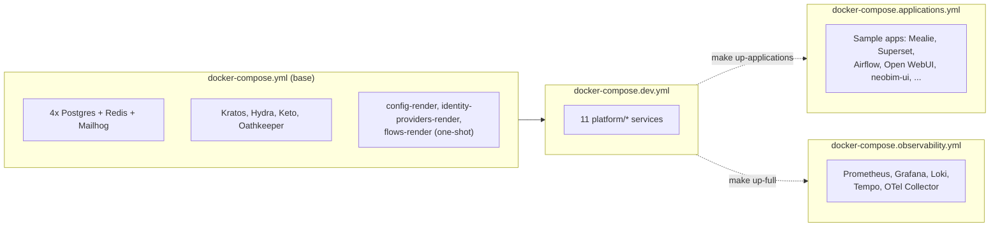
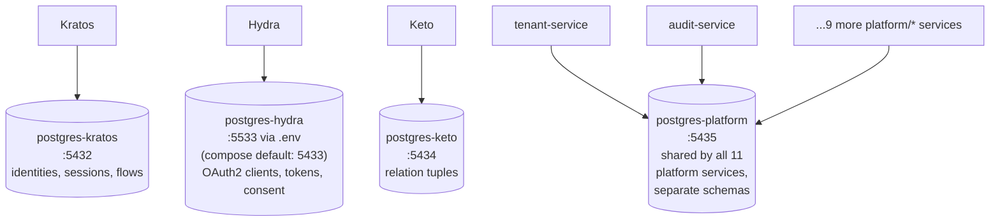
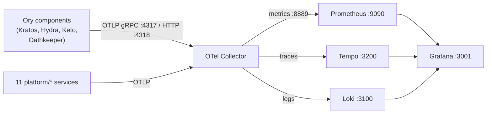
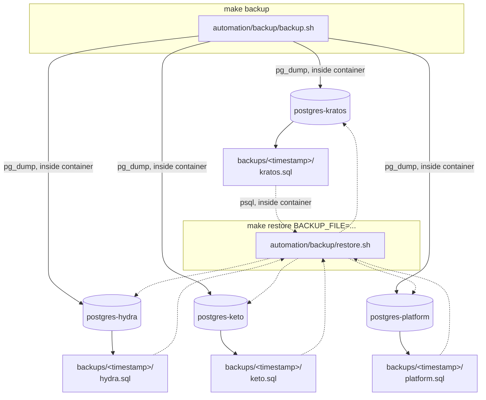
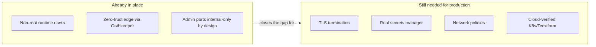

# 7. Operations

## Purpose

This chapter is for the person keeping an already-deployed NeoBIM Identity Control Plane
**running** — starting and stopping it, watching its health, reading its logs, backing it up,
upgrading it, deploying it beyond a single laptop (Kubernetes, Helm, Terraform), and knowing what
to check when something looks wrong. It assumes the platform is already installed —
[chapter 2](../02-installation/README.md) covers first-time setup and `make up` — and picks up from
there. For the honest, at-a-glance status of every deployment surface (what's tested vs. what's
merely validated), see [chapter 9](../09-architecture/README.md); this chapter is the operational
how-to for each of them.

## Overview

The platform is a set of Docker Compose services: 4 Ory components (Kratos, Hydra, Keto,
Oathkeeper), 11 Python/FastAPI platform services, 4 separate Postgres instances, Redis, Mailhog,
and an optional observability stack (Prometheus, Grafana, Loki, Tempo, an OTel Collector). Day to
day operation happens through two command surfaces that both wrap the same underlying Compose
files:

- **`make <target>`** — the newer, preferred surface (`up`, `down`, `restart`, `destroy`, `health`,
  `doctor`, `backup`, `restore`, `logs`, `logs-kratos`, `logs-hydra`, `logs-keto`,
  `logs-oathkeeper`, and more). This is what CI and this documentation assume by default.
- **`./automation/platform <command>`** — an older Compose lifecycle wrapper (`up`, `up-full`, `down`,
  `restart`, `destroy`, `status`, `health`, `logs`, `shell`, `backup`, `restore`, `sync`, `doctor`).
  Still real and functional — it calls the same Compose files — kept around because some commands
  (`shell <service>`, and `up-full` as a single word) are more convenient here than as separate
  `make` targets. Use whichever surface is at hand; don't mix a raw `docker compose` invocation in
  with either of them (see [Troubleshooting](#never-invoke-raw-docker-compose-directly) below).

Both surfaces always load `.env` before calling `docker compose` — this matters, because several
ports (notably `postgres-hydra`'s) are only correct once `.env`'s overrides are applied.

## Architecture

### Compose file layering



`make up` brings up `docker-compose.yml` + `docker-compose.dev.yml` — the baseline that every
other command in this chapter assumes is running. `make up-full` additionally layers in the
observability stack; `make up-applications` layers in the sample OAuth2 client apps (see
[chapter 6](../06-integrations/README.md)). `make down` always tears down all four layers together,
regardless of which combination you started, so it's safe to run unconditionally.

### The 4 Postgres instances — who owns what

Do not conflate these — each is a separate container, a separate volume, and (mostly) a separate
port:



`postgres-hydra` is the one real footgun here: the Compose file's hardcoded default port is
`5433`, but this repo's `.env` overrides it to `5533` to avoid colliding with an unrelated Postgres
container some machines already run on `5433`. As long as you go through `make`/
`./automation/platform` (both load `.env`), you'll never notice this. A raw `docker compose -f ...`
invocation that skips `.env` loading can bind `5433` and collide — see
[Troubleshooting](#never-invoke-raw-docker-compose-directly).

Full port table: [chapter 8](../08-reference/README.md).

## Starting, stopping, and restarting

```bash
make up          # start Kratos/Hydra/Keto/Oathkeeper + all 11 platform services
make up-full      # the above, plus Prometheus/Grafana/Loki/Tempo/OTel Collector
make restart      # make down; make up
make down         # stop everything (all 4 compose layers, whichever are running)
make destroy      # down -v --remove-orphans -- DESTROYS all volumes/data, prompts for confirmation
```

`./automation/platform` equivalents: `up`, `up-full`, `restart`, `down`, `destroy` (same prompt-then-
`down -v` behavior). `./automation/platform shell <service>` opens a shell inside a running
container (e.g. `./automation/platform shell kratos`) — there's no `make` target for this.

Restart, specifically, is the fix for one of the most common real-world situations: **a Theme,
Flow, or Identity Provider change made through the admin console doesn't seem to take effect.**
This is expected, not a bug — see [Known gotchas](#known-gotchas-real-issues-encountered-on-this-project)
below.

## Checking health

```bash
make health
```

or directly:

```bash
automation/health/health.sh
```

This checks, in order: **Kratos** (`http://localhost:4434/health/ready`), **Hydra**
(`http://localhost:4445/health/ready`), **Keto** (`http://localhost:4466/health/ready`),
**Oathkeeper** (`http://localhost:4456/health/ready`), **Mailhog**
(`http://localhost:8025/api/v2/messages`), all **4 Postgres databases** via `pg_isready`, and
**Redis** via `redis-cli ping`. If you're running `make up-full`, it additionally checks
Prometheus, Grafana, Loki, and Tempo, but only if those containers are actually running.

`make doctor` (`automation/health/doctor.sh`) is a separate, earlier check — it verifies your local
*tooling* (docker, curl, jq, openssl, kubectl, terraform, python3, uv, lsof, a working
`docker compose`, Python >= 3.13, a `.env` file) and that the ports the stack needs aren't already
occupied by something else on your machine. Run it before `make up` if things won't even start;
run `make health` after `make up` to check the running services themselves.

## Checking logs

```bash
make logs
```

Streams every service's logs (`docker compose logs -f --tail=100`).

```bash
automation/logs/logs.sh <service>
```

Scopes it to one service, e.g. `automation/logs/logs.sh kratos`, `automation/logs/logs.sh identity-ui`.
Run with no arguments, it falls back to `make logs`. There are also dedicated shortcuts for the
four Ory services: `make logs-kratos`, `make logs-hydra`, `make logs-keto`, `make logs-oathkeeper`.
`./automation/platform logs [service]` is the equivalent older-surface command.

## The observability pipeline (`make up-full`)



`observability/otel-collector/otel-collector-config.yaml` receives OTLP spans/metrics from every
instrumented service and fans them out: metrics to a Prometheus exporter, traces to Tempo, logs to
Loki's push API. Grafana is pre-provisioned with datasources for all three
(`observability/grafana/provisioning/`). This stack is optional — plain `make up` does not start
it, only `make up-full` does. Honest verification status: bringing the full stack up and checking
`make health` shows every Ory, platform, and observability container reporting healthy, and
services emit OTel spans (confirmed in logs) — but end-to-end confirmation that data actually lands
and renders correctly in Grafana/Loki/Tempo dashboards is real remaining work before relying on this
stack for production monitoring/alerting.

## Known gotchas (real issues encountered on this project)

### A one-shot init container fails with `PermissionError` writing into a shared volume

Some services (`config-render`, `identity-providers-render`, `flows-render`) are one-shot init
containers that render config into a shared named Docker volume before the real services start.
When such a container runs as a non-root user by default but a previous step in the chain wrote
files into that volume as root (or a different uid), the later container can fail with a
`PermissionError` trying to write into it.

**Fix:** add a `user: "0:0"` override to that specific init container's compose service block, so
it runs as root just long enough to write into the shared volume. This is already done for the
real init containers affected — the `identity-providers-render` and `flows-render` service
definitions both carry `user: "0:0"` specifically because they write into `rendered-config`, a
volume `config-render` owns. This is not something to "fix" by making everything run as root
generally — it's a narrow, per-init-container override for the one operation that needs it.

### `localhost:xxxx` inside a container resolves to the container's own loopback

If server-side code running *inside* a container tries to reach another service via
`http://localhost:4433`, it will hit its own container's loopback interface, not Kratos —
`localhost` is never a shortcut to a sibling container across the default bridge network.

**Fix:** always use the Docker network hostname for server-to-server calls, e.g.
`http://kratos:4433`, `http://hydra:4445`, `http://keto:4466`. Reserve `localhost` for URLs the
**browser** will actually load. This exact class of bug is also why several sample applications
doing a real server-side OAuth token exchange failed until fixed — see
[chapter 6](../06-integrations/README.md) for the full account.

### A Theme / Identity Provider / Flow change doesn't seem to take effect

Expected, not a bug. Kratos OSS has **no runtime config-reload API** — changes made through the
admin console are only picked up the next time Kratos's config gets re-rendered and the container
restarts.

```bash
make restart
```

See [chapter 4](../04-administration/README.md#32-apply-and-restart--some-settings-dont-take-effect-until-you-restart)
for the full "apply + restart" pattern.

### A new `.env` variable doesn't reach a rendered Kratos/Hydra/Oathkeeper config

`config-render` is a one-shot init container that renders `ory/{kratos,hydra,oathkeeper}/config/
*.yaml.tmpl` into a shared volume using `envsubst`. That script only substitutes the variables
named in its own explicit allowlist — this is deliberate, so a literal `$` anywhere else in a
rendered YAML file is never touched. Adding a brand-new `${SOME_NEW_VAR}` placeholder to a `.tmpl`
file and setting it in `.env` is **not enough** on its own.

**Fix — both steps required:**

1. Add the new variable name to the `vars=` allowlist in
   `deployment/docker/configs/config-render-entrypoint.sh`.
2. Add the same variable to `config-render`'s own `environment:` block in
   `deployment/docker/compose/docker-compose.yml`, **and rebuild the `config-render` image**
   (`config-render-entrypoint.sh` is baked into the image at build time, so a plain container
   restart does not pick up an edit to the script on disk):

   ```bash
   docker compose --env-file .env -f deployment/docker/compose/docker-compose.yml \
     build config-render
   make restart
   ```

A restart alone (without the rebuild) silently keeps rendering with the old allowlist — no error,
just a value that never made it into the rendered config.

### Kratos courier logs show `traces export: ... dial tcp: lookup otel-collector ... no such host`

If you run the stack with plain `make up` (not `make up-full`), Kratos's courier will repeatedly
log a failed OpenTelemetry trace export because it's trying to reach `otel-collector`, a hostname
that only exists when the observability stack is also running. **This is harmless noise** — it
does not affect courier delivery, login, registration, or any other real functionality. Run
`make up-full` if you want the noise gone.

### `curl http://localhost:4434/health/ready` returns a 307 redirect, not a bare 200

Kratos's admin port serves its ready-check at `/admin/health/ready`; hitting `/health/ready` on the
admin port returns an HTTP 307 redirect. **This is correct Kratos admin-port behavior.**
`automation/health/health-check.sh` already handles this correctly (`curl --fail` only treats 4xx/5xx
as failures).

### A container shows `Exited (0)` — is that broken?

No. `config-render`, `identity-providers-render`, `flows-render`, and each Ory component's
`*-migrate` job are **one-shot init containers** — they run once and exit. That's the normal,
healthy end-state. Only worry if the exit code is non-zero, or if a *long-running* service (Kratos,
Hydra, Keto, Oathkeeper, or any `platform/*` service) shows `Exited`.

### Never invoke raw `docker compose` directly

A real incident from this project: editing `ory/oathkeeper/rules/access-rules.json` on a bind
mount didn't hot-reload, so a raw `docker compose ... restart oathkeeper` was tried to force it —
this briefly broke the file watch entirely (a Docker Desktop bind-mount quirk). A follow-up
`--force-recreate oathkeeper` then cascaded into recreating `hydra`/`keto`/`kratos`/`postgres-hydra`
too, via the Compose dependency graph — and because that raw invocation didn't load `.env` the way
`make up` does, `postgres-hydra` tried to bind the compose file's hardcoded default port (`5433`)
instead of this machine's `.env`-overridden `POSTGRES_HYDRA_PORT=5533`, colliding with an unrelated
Postgres container already using `5433`.

It recovered cleanly with a plain `make up` (no data loss), but the lesson is the operating rule
for this whole chapter: **always go through `make` or `./automation/platform`, never a raw
`docker compose -f ... -f ...` invocation against this repo's Compose files directly.** If a
rule/config edit doesn't hot-reload, prefer `make restart` over force-recreating one service in
isolation.

## Container won't start / port conflict

```bash
docker ps       # check for a stale container holding the port
make down
make up
```

`make down` stops all four Compose layers together, so it cleans up regardless of which
combination you started with. If a port is still busy after that, `automation/health/doctor.sh` lists
the exact ports this stack expects to bind and will tell you which ones are already in use.

## Database migration issues

`tenant-service` and `audit-service` both run their Alembic migrations automatically, as one-shot
init containers, every time you `make up` — there is no manual migration step in normal operation.

Both services share the same physical database, **`postgres-platform`** — but each one owns **its
own, separate Alembic `version_table`**, rather than both using Alembic's default
`alembic_version` table name. This is a real fix for a real bug: when two independently-versioned
services share one database and both use Alembic's default version table name, their migration
histories collide in a single table. If a future service is added that also uses
`postgres-platform`, give it its own distinct `version_table` name too.

## Backup and restore

### Overview

Everything this platform stores lives in one of two places: the **4 Postgres databases**, or the
**`config/*.yaml` files** on disk (plus what gets rendered from them into the `rendered-config`
Docker volume). `automation/backup/backup.sh` / `automation/backup/restore.sh` cover the first. The
second is covered by a different, purpose-built mechanism — the admin console's Configuration
Export/Import feature (see [chapter 4](../04-administration/README.md#108-settings-consolesettings))
— not by these scripts.



### The real scripts

**`automation/backup/backup.sh`** (`make backup`, or `automation/backup/backup.sh [output-directory]`):
creates an output directory (default `backups/<YYYYMMDDHHMMSS>/`), and for each of the **4 real
Postgres databases** runs `pg_dump` **inside that database's own container**
(`docker compose exec -T <service> pg_dump -U <db> <db>`), writing plain-SQL output to
`<output-directory>/<db>.sql`. A backup is **a directory containing four `.sql` files**
(`kratos.sql`, `hydra.sql`, `keto.sql`, `platform.sql`) — plain `pg_dump` SQL dumps, not a single
archive and not a `.tar.gz`. (The Makefile's help text mentions a `.tar.gz` path as an example — in
the actual scripts, what you pass is a **directory path**.)

**`automation/backup/restore.sh`** (`make restore BACKUP_FILE=./backups/<timestamp>`, or
`automation/backup/restore.sh <backup-directory>`): requires exactly one argument — the backup
directory produced by `backup.sh`. For each of the 4 databases, checks that
`<backup-directory>/<db>.sql` exists (errors immediately if any file is missing), then pipes it
into `psql` inside that database's own container. There's no `DROP`/`CREATE DATABASE` step and no
confirmation prompt inside the script itself (though `make restore` prints a warning before calling
it) — restoring into a database that already has conflicting data can produce SQL errors; this is
meant for restoring into an empty/reset database, not merging into a live one.

(The old `scripts/restore/restore.sh` thin wrapper around this same script — `cd` to the repo root,
exec `backup/restore.sh "$@"` — was never actually invoked by `make`/Taskfile/CI, only mentioned in
docs, so the Phase 5 repository restructure retired it rather than relocating it; call
`automation/backup/restore.sh` directly.) `./automation/platform backup` creates
`backups/<timestamp>/` itself then calls the same script; `./automation/platform restore <timestamp>`
takes just the timestamp (not a full path) and resolves `backups/<timestamp>` for you.

### Step-by-step: taking a backup

```bash
make backup
```

Verify it wrote 4 files:

```bash
ls backups/20260724091500/
# kratos.sql  hydra.sql  keto.sql  platform.sql
```

### Step-by-step: restoring a backup

```bash
make restore BACKUP_FILE=./backups/20260724091500
```

You'll be prompted to confirm. Because the restore replays SQL directly with no `DROP`/`CREATE`
step, the safest full-restore pattern is:

1. `make destroy` (or otherwise ensure the 4 target databases are empty/fresh).
2. `make up` (recreates empty databases and reruns Kratos/Hydra/Keto/Alembic migrations).
3. `make restore BACKUP_FILE=./backups/<timestamp>`.
4. `make health` to confirm everything came back healthy.

### What's covered

- **`postgres-kratos`** — Kratos's own identity/session/flow state.
- **`postgres-hydra`** — Hydra's own OAuth2 client/consent/token state.
- **`postgres-keto`** — Keto's own relation-tuple store.
- **`postgres-platform`** — the shared database backing `tenant-service`'s and `audit-service`'s
  real tables.

### What's NOT covered

`backup.sh`/`restore.sh` only touch the 4 Postgres databases. They do **not** capture:

- `config/*.yaml` files — themes, flows, plugins, identity-providers, roles config on disk.
- Anything rendered into the shared `rendered-config` volume.
- Redis (session/cache state — not durable data; safe to lose, sessions just get re-established).

For the config side of the platform, use the real **Configuration Export/Import** feature in the
admin console at `/console/settings` instead — Export downloads the current real state of Theme,
Flows, Plugins, Identity Providers, and Roles as one JSON bundle; Import can validate-only or apply
it back. That console feature is the closest thing this repo has to a config backup/restore
mechanism — the scripts deliberately don't try to also capture `config/*.yaml`.

### Troubleshooting

- **`restore.sh` fails with "missing file: <db>.sql"** — the backup directory is incomplete; every
  one of `kratos.sql`, `hydra.sql`, `keto.sql`, `platform.sql` must be present.
- **Restore replays but reports SQL errors partway through (duplicate key, etc.)** — you're
  restoring into a database that already has data; use `make destroy → make up → make restore`.
- **Backup succeeds but file sizes look suspiciously small** — usually means the databases were
  empty at backup time, not a script failure.

### FAQ

**Can I restore just one database instead of all four?** Not with `restore.sh` as-is. Run the
equivalent single-database command it wraps directly:
`docker compose exec -T postgres-keto psql -U keto -d keto < backups/<timestamp>/keto.sql`.

**Does `make backup` include Redis?** No — Redis here is session/cache state, not durable
source-of-truth data.

**Is there an automated/scheduled backup?** No — `backup.sh` is a manual, on-demand script.
Scheduling it is real, unbuilt work for a production rollout.

## Upgrading

Three independent things can be upgraded, each with its own real procedure:

1. **Ory component images** (Kratos, Hydra, Keto, Oathkeeper) — version tags pinned in
   `deployment/docker/compose/docker-compose.yml`.
2. **A `platform/*` Python service's own dependencies** — pinned per-service in that service's own
   `pyproject.toml`.
3. **Database schema migrations** — run automatically by Kratos/Hydra/Keto themselves, and by
   `tenant-service`/`audit-service`'s Alembic migrations — no manual step in normal operation.

### Upgrading Ory component versions

Pinned tags, as of this writing:

| Component | Pinned image |
|---|---|
| Kratos | `oryd/kratos:v1.2.0` |
| Hydra | `oryd/hydra:v2.2.0` |
| Keto | `oryd/keto:v0.12.0` |
| Oathkeeper | `oryd/oathkeeper:v0.40.6` |

To upgrade one: edit the `image:` tag for that service in `docker-compose.yml` (Kratos and Hydra
each appear twice — once for the main service, once for its migration/init container — bump both
to the same tag), then `make restart` (or `make down && make up` for a larger version jump, so
containers are fully recreated). Watch `make logs` for migration success/failure, then `make
health`. **Take a backup before upgrading** (see above), so a bad migration can be rolled back by
restoring the prior dump. Renovate is configured to group all four Ory component updates together
(`groupName: "Ory ecosystem"`).

### Upgrading a `platform/*` Python service's dependencies

1. Edit that service's `pyproject.toml`.
2. Rebuild its dev image: `automation/docker/docker-build-python-dev.sh platform/<service>`.
3. Run its test suite **inside the rebuilt container** — this repo is container-first for Python
   tooling.
4. Rebuild that service's real runtime image and `make restart`.

### Database migrations

**No manual migration step is needed for a normal upgrade.** `tenant-service` and `audit-service`
each run `alembic upgrade head` automatically as a one-shot init container every time you
`make up` (or `make restart`).

### Renovate

This repo has Renovate configured (`renovate.json`) for automated dependency-update pull requests:
extends `config:recommended`, adds a dependency dashboard and vulnerability alerts, runs on a
Monday-before-9am schedule capped at 10 concurrent PRs / 4 per hour with a 3-day minimum release
age, groups Kratos/Hydra/Keto/Oathkeeper updates together, automerges patch updates for
non-critical non-`0.x` dependencies, excludes Postgres/Node.js major bumps from automerge, and
gives security-sensitive packages (`jsonwebtoken`, `jose`, `passport`, `bcrypt`, `argon2`) an
immediate PR on any schedule.

### Troubleshooting

- **After bumping an Ory image tag, the service won't come back healthy** — check `make logs`
  first; a failed schema migration is the most common cause. Restore the pre-upgrade backup rather
  than hand-fixing partial schema state.
- **Bumped Kratos's tag but not its migration container's tag (or vice versa)** — Kratos and Hydra
  each appear twice in `docker-compose.yml`; both must be bumped together.
- **A `platform/*` service fails to build after a `pyproject.toml` dependency bump** — remember the
  Dockerfile `COPY README.md` and `[build-system]` requirements from
  [chapter 5](../05-development/README.md#12-things-that-will-silently-break-your-service-if-skipped).

## Deployment surfaces beyond a single laptop

Docker Compose (above) is the one deployment surface in this repository that has been fully built,
started, and health-checked end to end. This section documents the other three — Kubernetes, Helm,
and Terraform — exactly as far as each has actually been exercised. See
[chapter 9](../09-architecture/README.md) for the at-a-glance honest status matrix across all four.

### Kubernetes — Kustomize manifests

`deployment/kubernetes/` is plain Kustomize: a shared `base/` plus five `overlays/` for different
environments/purposes.

```
deployment/kubernetes/
├── base/            # 11 manifests total (4 Ory components + auth-ui + 6 platform services)
└── overlays/
    ├── dev/          # per-env scaling/hostnames/tags
    ├── staging/
    ├── prod/         # + NetworkPolicies, PDBs, HPAs, TLS Ingress
    ├── local/         # self-contained: own Postgres, Mailhog, throwaway secrets
    └── applications/  # sample third-party apps' manifests
```

**Read this before trusting anything below:** the manifests have been validated for structural
correctness (they build cleanly with `kustomize`), but they have **not** been applied to a live
cluster in this repository's current verified state, and **5 of the 11 platform services have no
Kubernetes manifests at all yet** (`console-api`, `audit-service`, `authorization-service`,
`flow-service`, `plugin-service` — they run in Docker Compose but not in Kubernetes). This is a
real, currently-open gap.

```bash
kubectl kustomize deployment/kubernetes/base --load-restrictor LoadRestrictionsNone
```

run against the base and against every one of the five overlays, each exits `0` and produces valid
rendered YAML — this confirms the Kustomize graph is structurally sound. **Not verified:** none of
this has been `kubectl apply`'d against a live cluster. "Builds cleanly with kustomize" is a real,
useful signal, but it is not the same as "runs" — no live Service resolution, pod scheduling, or
probe has been exercised. Treat this surface as **build-verified, deploy-unverified**.

**Why `--load-restrictor LoadRestrictionsNone` is required**: Kustomize's default load restrictor
forbids a `kustomization.yaml` from reading files outside its own directory tree. This base's
`configMapGenerator` deliberately violates that — it reads the Kratos/Hydra/Oathkeeper config
templates directly from `ory/*/config/*.yaml.tmpl` (the same files Docker Compose renders via its
`config-render` init container), so there's only ever one copy of each Ory config template in the
repo, not a Kubernetes-specific copy that could silently drift. The repo's own `make validate` and
`make k8s-apply` targets already pass this flag for you.

**The ConfigMap/Secret/init-container pattern** mirrors Docker Compose's two-stage pattern:
ConfigMaps carry raw templates and static config; each Ory Deployment's Pod spec has a
`config-render` initContainer that mounts the templates read-only, reads a small `platform-urls`
ConfigMap via `envFrom`, and writes a fully-expanded config into a shared `rendered-config` volume
— because Kratos/Hydra/Oathkeeper do not expand `${VAR}` placeholders in their own YAML. A second
initContainer runs the schema migration against a database DSN pulled from a Secret. The main
container then starts the real binary pointed at the rendered config path (`--watch-courier` is
required on Kratos — the manifest's own comments flag this; omitting it leaves
verification/recovery emails logged as sent but never delivered to SMTP). Secrets ship with
`CHANGE_ME_*` placeholder literals by design — every non-local environment is expected to override
these via an overlay, Terraform-output-driven values, or an external secret manager.

**Overlay summary**: `overlays/local` brings its own throwaway Postgres and Mailhog and hardcoded
local secrets — meant for a disposable local cluster (k3s-in-Docker or kind), never a shared one.
`overlays/dev`/`staging`/`prod` layer in per-environment replica counts, hostnames, and image tags;
`prod` additionally adds `hardening.yaml` (NetworkPolicies, PodDisruptionBudgets,
HorizontalPodAutoscalers, a TLS-terminating Ingress — written but never terminated a real TLS
connection against a real DNS name). `overlays/applications` mirrors
`docker-compose.applications.yml`'s role.

```bash
# Build the base
kubectl kustomize deployment/kubernetes/base --load-restrictor LoadRestrictionsNone

# Build each overlay
for ov in dev staging prod local applications; do
  echo "== $ov =="
  kubectl kustomize "deployment/kubernetes/overlays/$ov" --load-restrictor LoadRestrictionsNone >/dev/null \
    && echo "OK" || echo "FAILED"
done

# Or, as part of the repo's own baseline check
make validate
```

**Applying to a real cluster (once you have one)**:

```bash
kubectl apply -k deployment/kubernetes/overlays/<dev|staging|prod|local>
# or, via the Makefile wrapper:
make k8s-apply ENV=<dev|staging|prod>
```

Before applying to anything other than `local`, override the base's `CHANGE_ME` secret
placeholders with real values (from Terraform outputs, or an external secret manager). Validate the
overlay against a disposable cluster (e.g. `overlays/local` on kind/k3s) before pointing it at
anything shared.

**Troubleshooting**: `kubectl kustomize` failing with a load-restrictor error means you forgot the
flag. An overlay failing with "resource not found" usually means you're not running from the
repository root. A `configMapGenerator` picking up a stale-looking hash is expected — Kustomize
hashes generated ConfigMap/Secret names by content, so editing an underlying template changes the
generated resource name on the next build (forcing a rolling update by design).

### Helm (alternative)

`deployment/helm/platform/` is an umbrella chart alternative to Kustomize — same underlying
services, packaged as a Helm chart pinning the official Ory Helm charts (kratos, hydra, keto,
oathkeeper) as dependencies. It is **even less mature than Kustomize**: the `helm` CLI has not been
used to `lint`, `template`, or `install` this chart in this repository's current verified state.
Treat it as **written but unexercised** — metadata and values only. Per-environment value overrides
exist at `deployment/helm/environments/{dev,staging,prod,local}/values.yaml`, intended for
`make helm-install ENV=<env>` once actually validated. There is no bundled Postgres subchart
dependency (Bitnami withdrew their free Docker Hub Postgres images in 2025); local/dev installs are
meant to fall back to `templates/postgres-local.yaml` (plain `postgres:16-alpine`), gated behind
`postgresql.enabled`, while a real environment is expected to point at managed databases
provisioned by Terraform. Validating it (starting with `helm lint` and `helm template`) is future
work.

### Terraform — cloud infrastructure

`terraform/` provisions the cloud infrastructure the platform's Kubernetes-based surfaces would run
on top of, plus a serverless alternative compute layer (ECS Fargate / Cloud Run) for each of AWS
and GCP.

```
terraform/
├── modules/
│   ├── aws/{networking, postgresql, eks, ecs}/
│   └── gcp/{networking, cloudsql, gke, cloudrun}/
└── environments/
    ├── aws/{main,variables,outputs,backend,versions}.tf, *.tfvars, *.backend.hcl.example
    └── gcp/  (same shape)
```

**Read this before trusting anything below:** every module's HCL has been syntax- and
type-validated (`terraform init -backend=false && terraform validate`, all passing). **No
`terraform plan` and no `terraform apply` has ever been run against a real AWS or GCP account.**
Nothing in this repository's current verified state has actually provisioned real cloud
infrastructure. AWS and GCP execution are explicitly **out of scope** for this documentation.

AWS and GCP module trees are deliberately shape-identical — same roles, same output names
(`kratos_dsn`, `hydra_dsn`, `keto_dsn`, `platform_database_url`) — so switching cloud provider, or
switching compute target (Kubernetes vs. serverless) within a cloud, is meant to be a module/tfvars
choice, never an application change. This has been validated at the HCL level only.

**AWS modules**: `networking/` (VPC, public/private subnets, IGW, NAT gateway), `postgresql/`
(four isolated RDS PostgreSQL instances — Kratos, Hydra, Keto, platform — each restricted to the
compute layer's security group), `eks/` (an EKS cluster + managed node group, the target for the
Kustomize overlays), `ecs/` (the serverless alternative — same networking/postgresql modules, no
cluster to manage; only the one service marked `public = true`, Oathkeeper, gets an ALB target,
everything else is internal-only via Cloud Map service discovery).

**GCP modules**: `networking/` (VPC-native subnet, Cloud NAT/Router, private-services-access range),
`cloudsql/` (mirrors `aws/postgresql` 1:1), `gke/` (mirrors `aws/eks`), `cloudrun/` (mirrors
`aws/ecs`; only the `public = true` service accepts external traffic; service-to-service URLs come
from the module's `service_uris` output rather than a fixed DNS scheme, since Cloud Run URIs are
only known after the first apply).

```bash
# Validate a single module
cd terraform/modules/aws/networking   # or any of the other 7 module directories
terraform init -backend=false
terraform validate

# Validate an environment root
cd terraform/environments/aws   # or gcp
terraform init -backend=false
terraform validate
```

**All 8 modules and both environment roots pass this check.** `make validate` does not currently
include a Terraform validation step — running the two commands above manually is the only way to
check this today.

**Future / Planned — genuinely not done**: bootstrapping a remote state backend (S3 + DynamoDB
lock table for AWS; a GCS bucket for GCP — commands are documented but never run against a real
account); a real `terraform plan`/`terraform apply` against real credentials (the single largest
gap — `terraform validate` cannot catch quota limits, IAM permission gaps, or provider version/API
drift); the end-to-end handoff from a real `apply`'s outputs to the Kubernetes/Helm secrets that
would consume them; cross-cloud migration (never actually attempted); a Terraform step in
`make validate`.

**Applying, once you actually have cloud credentials and have made the deliberate decision to do
so:**

```bash
cd terraform/environments/aws   # or gcp
cp dev.backend.hcl.example dev.backend.hcl   # fill in real bucket/table/project
terraform init -backend-config=dev.backend.hcl
export TF_VAR_kratos_db_password=...   # ×4 — never in committed tfvars
terraform apply -var-file=dev.tfvars
```

This command is documented for completeness, not because it has been run in this repository's
current verified state. Never commit real secret values in a tracked `.tfvars` file — pass the four
per-component database passwords via `TF_VAR_*` environment variables or a gitignored
`*.secrets.tfvars` file.

**Troubleshooting**: `terraform init -backend=false` failing with a provider download error is
usually a network-access issue, unrelated to any cloud account. `terraform validate` complaining
about an undeclared variable usually means you're running it from the wrong directory (module-level
`validate` only checks that module's own `variables.tf`). `terraform init -backend-config=` failing
because the file doesn't exist means you need to copy the matching `.example` file first.

## Production hardening — an honest inventory

This section is the gap between "runs correctly on a laptop" and "safe to expose to real users and
real traffic." Nothing below claims work as done unless it was actually verified. See
[chapter 8](../08-reference/README.md) for the broader security posture reference.



### What's already in place

- **Non-root runtime users** — every `platform/*` service's Dockerfile runs its runtime stage as a
  fixed non-root user, `USER 10001:10001`, verified directly in each service's Dockerfile.
- **Zero-trust edge enforcement via Oathkeeper** — every request is authenticated and authorized by
  Oathkeeper before it reaches a backend service; there's no path that lets a request skip
  Oathkeeper's access-rule evaluation.
- **Admin ports are only meant to be internal** — Kratos's admin API (`:4434`), Hydra's admin API
  (`:4445`), and Keto's write API (`:4467`) are intended to be reachable only on the Docker-internal
  network in a real deployment. **Locally, for development, they are also published to the host** —
  this is exactly what makes the [chapter 2](../02-installation/README.md) walkthrough and local
  `curl` debugging possible, but a real deployment should not publish these ports to anything
  outside its internal network. Full port inventory in [chapter 8](../08-reference/README.md).

### What a real production rollout still needs beyond this repo's current state

- **TLS termination in front of Oathkeeper.** This repo's local dev stack talks plain HTTP
  end-to-end. A real deployment needs TLS terminated (load balancer, ingress, or a reverse proxy) in
  front of Oathkeeper before any of this is exposed beyond a trusted internal network.
- **A real secrets manager, not `.env` files.** `configuration/platform.yaml` already has a
  `secrets.provider` field documented as accepting `dotenv | vault | aws-secrets-manager |
  gcp-secret-manager` — but this is a name only. It isn't wired to an actual secrets-manager
  integration anywhere in the running code (in fact, `configuration/platform.yaml` as a whole isn't read
  by any running `platform/*` service today — see [chapter 4](../04-administration/README.md#108-settings-consolesettings)).
  Standing up a real secrets backend and actually wiring `SECRETS_PROVIDER` to it is real,
  unfinished work.
- **Network policies restricting reachability of the 4 Postgres databases and the 3 Ory admin
  ports.** Nothing in this repo currently enforces, at the network layer, which pods/containers are
  allowed to reach `postgres-kratos`, `postgres-hydra`, `postgres-keto`, `postgres-platform`, or the
  Ory admin ports. A real cluster needs explicit Kubernetes `NetworkPolicy` resources (or
  equivalent).
- **Validating the Kubernetes/Terraform paths against a real cluster.** Only `terraform validate`
  and `kustomize build` have been run — not `terraform plan`/`apply` against a real cloud account,
  and not an actual deploy to a live Kubernetes cluster.

### Troubleshooting

- **Admin ports are reachable from outside my network in a deployed environment.** The deployment
  surface you're using still has the dev-oriented host-port mappings from `docker-compose.yml` (or
  an equivalent K8s Service exposing them externally). Remove/override those port publications for
  anything beyond local development.
- **`configuration/platform.yaml`'s `secrets.provider` doesn't seem to do anything when I set it to
  `vault`.** Expected — `configuration/platform.yaml` isn't consumed by any running service yet.

## In this chapter

- [Backup and restore](#backup-and-restore) — the real backup/restore scripts and what's still
  needed for production DR
- [Upgrading](#upgrading) — upgrading Ory components, platform services, and migrations
- [Deployment surfaces](#deployment-surfaces-beyond-a-single-laptop) — Kubernetes, Helm, Terraform
- [Production hardening](#production-hardening--an-honest-inventory) — what's hardened today vs.
  what a real production rollout still needs

## FAQ

**What's the difference between `identity-ui` and `applications/neobim/neobim-ui`?** `identity-ui` is the
platform's own frontend — the Admin/User Portal every real user and administrator interacts with,
part of the always-on baseline stack (`make up`). `applications/neobim/neobim-ui` is a small, separate
sample OAuth2 client application that only starts with the optional applications stack (`make
up-applications`) — see [chapter 6](../06-integrations/README.md).

**Why do I need to restart after changing a theme, flow, or identity provider?** Because Kratos OSS
has no runtime config-reload API — see
[chapter 4](../04-administration/README.md#32-apply-and-restart--some-settings-dont-take-effect-until-you-restart).

**How do I become an admin?** See [chapter 2's Phase 5/6](../02-installation/README.md#phase-5-understand-admin-bootstrap-before-you-need-it)
for the full walkthrough. Short version: administrator status is a real Keto fact
(`Organization:platform#admin@<your identity id>`) — the browser-only bootstrap flow at
`/auth/setup` is the real day-one path; `/console/settings/administrators` handles it after that.

**Can I use GitHub Actions/CI with this repo?** Nothing in the platform's design prevents it —
`.github/workflows/validate.yml` already runs the same containerized `make`/script targets as local
dev, with no `setup-python`/`setup-uv` steps, so CI and local dev can never drift apart.

**Does this support SSO / social login?** Yes — Kratos's built-in `oidc` method, controlled through
`/console/identity-providers` — see [chapter 4](../04-administration/README.md#7-identity-providers-social--enterprise-login).

**Can applications use passwordless login?** Yes — passkeys (full passwordless WebAuthn), one-time
email codes, and magic links are all configured and real. WebAuthn (non-passkey) is configured as
an MFA factor, not a first-factor passwordless method, in this deployment specifically.

**Why does `make health` show Prometheus/Grafana/Loki/Tempo as missing when I only ran `make up`?**
Those four only start with `make up-full` — `make health` simply skips checking them when they're
not running, which is expected, not a failure.

**Which Postgres instance holds what, and why are there four?** Each Ory component gets its own
dedicated Postgres instance/database — a deliberate isolation choice — so one component's schema
migrations or outages can never touch another's data. All 11 `platform/*` services then share a
fourth, separate instance, each in its own schema/tables.

**`make` vs `./automation/platform` — which should I actually use?** `make` targets are the newer,
preferred surface. `./automation/platform` is still real and functional — reach for it specifically
for `./automation/platform shell <service>` or `up-full`/`backup`/`restore` as a single word. Never
substitute either with a raw `docker compose -f ...` invocation.

## Common mistakes

- Editing a config file on a bind mount and force-recreating one service directly instead of using
  `make restart` — see [Never invoke raw `docker compose` directly](#never-invoke-raw-docker-compose-directly).
- Assuming a container in `Exited (0)` state is broken — several are one-shot init containers by
  design.
- Passing a `.tar.gz` file to `make restore BACKUP_FILE=...` — the actual scripts want a directory
  path.
- Assuming `backup.sh` also captures `config/*.yaml` — it doesn't; use the console's Export/Import
  feature for that.
- Bumping only one of Kratos's/Hydra's two appearances in `docker-compose.yml` to a new image tag.
- Treating "kustomize build succeeded" or "terraform validate passed" as proof that a real
  cloud/cluster deploy will succeed — neither has been exercised against a live target.
- Applying `overlays/prod`'s `CHANGE_ME` secret placeholders as-is against a real cluster.
- Assuming the dev compose file's port mappings (which publish admin APIs to `localhost` for
  convenience) are a safe template for a production deployment.

## References / Related pages

- [Chapter 2 — Installation](../02-installation/README.md) — first-time setup and `make up`
- [Chapter 4 — Administration](../04-administration/README.md) — the Keto tuple mentioned above,
  and the console's own Configuration Export/Import feature
- [Chapter 5 — Development](../05-development/README.md) — the container-first tooling conventions
  referenced above
- [Chapter 6 — Integrations](../06-integrations/README.md) — the sample applications this chapter's
  `make up-applications` brings up
- [Chapter 8 — Reference](../08-reference/README.md) — every real port and URL, and the broader
  security posture
- [Chapter 9 — Architecture](../09-architecture/README.md) — the honest, at-a-glance status matrix
  across all four deployment surfaces, and the ADRs behind the database-isolation decision
