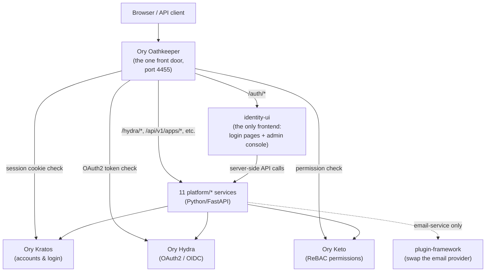
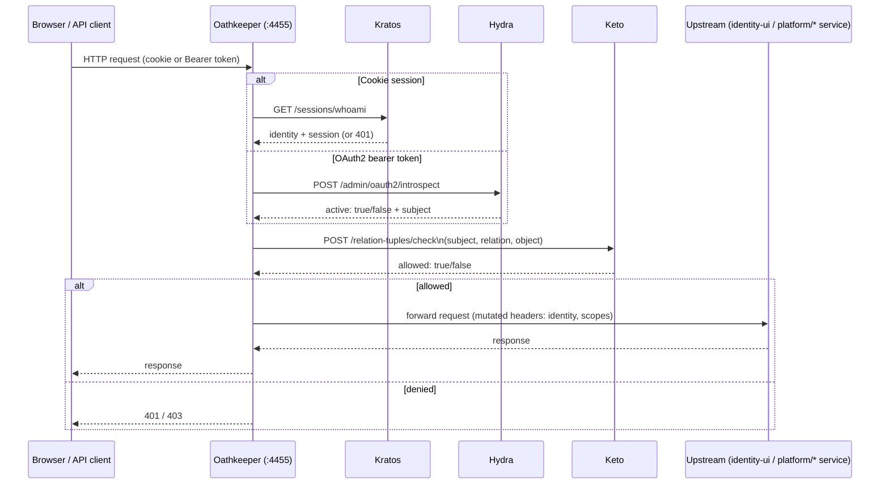

# 9. Architecture

## Purpose

This chapter explains **why** this platform is built the way it is, and gives the honest,
current-state account of what's actually verified versus merely designed. It contains: the deep
technical reference for Kratos, Hydra, Keto, and Oathkeeper (every enabled method, every real Ory
OSS limitation found in this project, the exact Oathkeeper routing table); the two standing
architecture mandates (Python-first, container-first) and the Architecture Decision Records behind
every major structural choice; the honest, at-a-glance deployment-surface status matrix; and a
condensed account of what's currently true, extracted from this repository's own session-by-session
handoff and audit history. If you want the plain-language "what is this platform" introduction
instead, see [chapter 1](../01-introduction/README.md); for the *how-to* of running each deployment
surface, see [chapter 7 — Operations](../07-operations/README.md).

## Overview — the four building blocks

This platform is built from four kinds of pieces, layered on top of each other:

1. **Ory components** — Kratos, Hydra, Keto, Oathkeeper. Pre-built, battle-tested open-source
   software doing the actual identity and authorization work. None of these are things this project
   wrote — they're adopted, configured, and glued together. This chapter is the ground truth for
   anything Kratos/Hydra/Keto/Oathkeeper-specific.
2. **Platform services** — 11 small custom-written Python backend programs giving an administrator
   friendly, purpose-built control over the Ory components above, without ever becoming a second,
   competing source of truth. Full detail: [chapter 5](../05-development/README.md).
3. **The plugin framework** — a small library that lets one specific thing (today: which email
   provider is used to send mail) be swapped without changing code. Detail:
   [chapter 5](../05-development/README.md#plugins).
4. **identity-ui** — the one and only web frontend. Detail: [chapter 5](../05-development/README.md).

## Component diagram — how the four blocks fit together



## Request-flow sequence diagram

The component diagram above shows *what* talks to *what*; this shows the actual *order of
operations* for one authenticated, authorized request passing through Oathkeeper:



Every external request enters through **Oathkeeper** and nowhere else. The exact routing table
lives in `ory/oathkeeper/rules/access-rules.json`; rule order matters — `/auth/<**>` (routed to
`identity-ui`) and `/hydra/<**>` (routed to `auth-service` for login/consent/logout orchestration)
are deliberately on different path prefixes so they don't collide.

## How this maps to the folders in the repository

| What | Where the code lives | Where it's documented |
|---|---|---|
| Ory components (Kratos/Hydra/Keto/Oathkeeper) | `ory/<component>/` | This chapter |
| Platform services | `platform/<service-name>/` | [Chapter 5](../05-development/README.md) |
| The plugin-loading library | `platform/plugin-framework/` | [Chapter 5](../05-development/README.md#plugins) |
| Real code plugins (e.g. the SMTP email provider) | `integrations/email/<name>/` | [Chapter 5](../05-development/README.md#plugins) |
| The frontend (self-service + admin console) | `identity-ui/` | [Chapter 5](../05-development/README.md) |
| Branding/theme configuration | `configuration/themes/` | [Chapter 5](../05-development/README.md#themes) |

## Design principles that show up everywhere in this codebase

- **Map to an existing mechanism, don't reinvent.** New admin-facing concepts (Roles, Groups,
  Organizations) are named, curated views over something Kratos/Hydra/Keto already models — never a
  second, parallel system of record.
- **Config lives in YAML files, one owning service per file.** Themes, Identity Providers, Plugins,
  Roles, and Authentication Flows are each a YAML file under `config/`, read and written by exactly
  one platform service — `identity-ui` never touches these files directly, only that service's API.
- **"Apply + restart," disclosed rather than hidden.** Ory Kratos has no way to reload its
  configuration while running. Anything that changes Kratos's behavior (a new theme, a new identity
  provider, a new authentication flow) is only saved by the owning service — making it take effect
  always requires `make restart`.
- **Everything is Python, everything runs in containers.** See ADR-0012 (Python-first) and
  ADR-0013 (container-first) below.
- **No stub plugins, no placeholders.** A plugin category, a nav entry, a config surface only gets
  built once there's a genuine, real second use case — never speculatively.

---

## Ory components deep-dive

The identity control plane is built on four Ory Network open-source projects, each doing one job:

| Component | Job | Public port | Admin port |
|---|---|---|---|
| **Kratos** | Identity, credentials, self-service flows | 4433 | 4434 |
| **Hydra** | OAuth2 / OpenID Connect provider | 4444 | 4445 |
| **Keto** | Relationship-based (Zanzibar-style) authorization | 4466 (read) | 4467 (write) |
| **Oathkeeper** | Zero-trust edge reverse proxy in front of everything | — | — |

Nothing else in the platform talks to a browser session directly — every credential check, token
issuance, and permission decision flows through one of these four services.

### Kratos — identity & credentials

Kratos owns identities and every self-service flow: registration, login, account settings,
recovery, and email verification. Configuration lives in `ory/kratos/config/kratos.yaml.tmpl`.

**Enabled authentication methods** — all eight of Kratos's self-service methods are turned on:
`password` (Argon2id, the built-in default hasher — no config key to select a different one; Have I
Been Pwned breach-checking enabled with `max_breaches: 0`), `oidc` (Google, GitHub, Microsoft
personal+work via the `common` tenant, Apple, GitLab, each with its own Jsonnet claim mapper),
`passkey` (WebAuthn passwordless), `webauthn` (as a *second* factor, `passwordless: false`), `totp`
(issuer `"Identity Platform"`), `lookup_secret` (backup codes), `code` (magic-link-style
passwordless codes, 15-minute lifespan, also the mechanism for recovery/verification), and `link`
(the legacy email verification link method, 1-hour lifespan, configured but not the active `use:`
selection for any flow).

**Identity schemas**: three registered, `enterprise_user` as the default — `enterprise_user`,
`service_account`, `organization_admin`.

**Flow hooks**: registration wires `hook: session` (auto-login), `hook: show_verification_ui`, and
a `web_hook` POST to `hooks-service` for both `password` and `oidc`. Login fires
`require_verified_address` then a webhook. Settings fires webhooks on password change and profile
update. Recovery revokes all active sessions on success. These webhooks are how `hooks-service`
learns about new identities and seeds their Keto `Organization` relation tuples.

**Self-registration is disabled by default, in every environment** —
`selfservice.flows.registration.enabled` in `ory/kratos/config/kratos.yaml.tmpl` is set to
`${SELF_REGISTRATION_ENABLED}`, and `.env` ships that as `false`. Confirmed live: with it `false`,
`GET /self-service/registration/browser` returns a real `400 self_service_flow_disabled` from
Kratos itself (not just a hidden UI link) — `identity-ui`'s registration page
(`identity-ui/app/(flows)/registration/page.tsx`) detects the same disabled state server-side and
renders a plain "Registration is currently disabled" message instead of forwarding the browser to
Kratos's flow-not-found redirect. **To re-enable**: set `SELF_REGISTRATION_ENABLED=true` in `.env`,
then `make restart` (config changes never hot-reload — see the "apply + restart" design principle
above). No code change is required in either direction; the registration page/route themselves are
always present.

**Real Ory OSS limitations found in this project** — each confirmed against the running system, not
just read from docs:

- **No branching/conditional-execution DSL for self-service flows.** A flow's `ui.nodes` are driven
  entirely by which methods are globally enabled (`selfservice.methods.<method>.enabled`) — there
  is no per-flow graph or conditional logic. You cannot enable `password` for login but not
  registration; enabling a method turns its node on everywhere. `flow-service` (see
  [chapter 5](../05-development/README.md#3-adding-a-new-authentication-flow)) exists specifically
  to manage this limitation transparently: its `publish` action is deliberately enable-only.
- **Admin API exposes only current-state credential snapshots.** No historical change log — the
  console's Identities pages can only show "credential exists, last updated at T," never a change
  history.
- **The courier admin API (`CourierApi`) is read-only.** List and get message status only — no
  resend/retry method on the SDK. `notification-service`'s "test-send" feature works around this by
  sending a *new* message rather than replaying a stored one.
- **Successful logins are visible; failed login attempts are not.** Kratos's session API exposes
  active/past sessions for successful authentications, but there is no equivalent record for failed
  attempts — that data simply isn't retained anywhere Kratos exposes.

### Hydra — OAuth2 / OpenID Connect

Hydra is the OAuth2/OIDC provider. It never touches credentials directly — it delegates "who is
this user" to Kratos via the login/consent challenge handshake, brokered by `auth-service`.
Configuration lives in `ory/hydra/config/hydra.yaml.tmpl`.

- **Flow URLs** (`urls.login`/`urls.consent`/`urls.logout`/`urls.error`) all point at
  `auth-service` under a `/hydra/*` prefix — deliberately distinct from Kratos's `/auth/*` prefix,
  because Oathkeeper routes by path and can't split one path across two backends.
- **Token lifespans**: auth code 10m, access token 1h, refresh token 720h (30 days), ID token 1h.
- **PKCE is enforced** for public clients (`pkce.enforced_for_public_clients: true`).
- **Grant types are per-client**, not global.
- **Pairwise and public subject identifiers** are both supported, with a configured salt for
  pairwise mode.

**Real Ory OSS limitations found in this project:**

- **No Device Authorization Grant.** Confirmed two ways: `grant_types_supported` in the real OIDC
  discovery document does not list `urn:ietf:params:oauth:grant-type:device_code`, and
  `POST /oauth2/device/auth` returns a live 404.
- **No Token Exchange (RFC 8693).** Also absent from `grant_types_supported` — no standard-grant
  way to exchange one token for another (impersonation, delegation, token downscoping).

### Keto — ReBAC / Zanzibar authorization

Keto is the single authorization engine for the platform — every permission check, in every
service, ultimately resolves to a Keto relation-tuple check. The namespace model is defined in
`ory/keto/namespaces/namespaces.ts` as Ory Permission Language.

#### Namespace model — designed vs. what Keto actually enforces

`ory/keto/namespaces/namespaces.ts` **designs** this model:

```
User                     — bare subject, no relations of its own

Organization
  related: admin[], member[], billing_admin[]
  permits: administer, view, manage_billing

Team
  related: parent -> Organization, manager[], member[]
  permits: administer (org admin OR team manager), view

Project
  related: parent -> Organization, owner[], contributor_team -> Team[], viewer_team -> Team[]
  permits: administer, write (admin/owner OR contributor_team member), view

Application
  related: parent -> Organization, owner[]
  permits: manage (org admin OR owner), use (any org member)

Resource
  related: parent -> Project, owner[], editor[] (User | Team#member), viewer[] (User | Team#member)
  permits: administer, write, view
```

**Important, verified-live correction**: this `.ts` file is never compiled and applied to the
running Keto instance (no `keto namespaces` config pointing at it, no `keto migrate` ever run
against it — confirmed by inspecting the running container's config and by writing a tuple with a
relation name that appears nowhere in this file, which Keto accepted with `201 Created`). This
means, in the actual running system:

- The `permits` names (`administer`, `view`, `manage_billing`, `manage`, `use`, `write`) **cannot
  be checked at all** — `GET /relation-tuples/check?...&relation=administer` on
  `Organization:platform` for a confirmed real admin returns `{"allowed": false}`, verified live.
  Only the literal `related` relation names (`admin`, `member`, `billing_admin`, `manager`,
  `owner`, `editor`, `viewer`) are ever actually written as tuples or checked by any real service —
  confirmed by grepping every `platform/*` service for relation-check calls; none references a
  `permits` name.
- **`parent`-relation cascading does not happen** — Keto has no compiled schema telling it that a
  `Resource`'s `view` should fall back to its parent `Project`'s `view`. Live inspection of every
  `Project` and `Resource` tuple in this deployment confirms zero `parent` relations have ever been
  written, and none would cascade automatically even if they were.
- In practice, any "an org admin can reach everything under their org" behavior in this platform is
  implemented by the calling service checking the `Organization admin` relation directly (or via
  `authorization-service`'s Role catalog), never by relying on Keto to cascade a permission itself.

`authorization-service` (see [chapter 5](../05-development/README.md)) is a naming layer on top of
the real, literal relations above — its "Roles" are just labeled `(namespace, relation)` pairs
pointing at `admin`/`member`/`billing_admin`/etc., and its "Policies" are real Keto tuples with no
storage of their own. `platform/authorization-service/src/authorization_service/roles.py` is the
ground truth for which literal relations the built-in role catalog actually uses. Full operator-
facing detail on this gap and its console-visible symptoms:
[chapter 4](../04-administration/README.md#6-authorization--permissions-roles-and-policies).

**Real Ory OSS limitations found in this project:**

- **The `namespaces.ts` designed permission model is not enforced by the running Keto instance at
  all** — see above. This is not a bug to fix by "compiling the schema," since doing so is a
  deliberate, larger architectural change (Keto's namespace config is set at process start, and
  every existing tuple would need re-validation against the new schema); it is disclosed here so
  nobody mistakes the `.ts` file for a description of live behavior.
- **No permission-check history or audit log of its own.** Keto answers "is this allowed right
  now" and can list current tuples, but keeps no record of past `/check` calls or past
  allow/deny decisions. Anything resembling a permission audit trail has to be built by another
  service recording the outcome at the moment of the check — which is exactly what `audit-service`
  does for every Admin Portal mutation (see [chapter 4](../04-administration/README.md#9-audit-reports--notifications)).

#### Group authorization model — `authz-architecture.html`'s design, implemented as a foundation

A second, ADDITIVE model was implemented alongside everything above, from a design document
("Keto access design for the federated model") whose whole premise is: no role table, no
permission catalog — a `Group` is a set of users, a **standing** (`owners` > `managers` >
`editors` > `viewers`) is which relation that set holds, and four computed **permits**
(`read`/`write`/`manage`/`admin`) resolve over a `parent`-linked tree of groups. Nothing about the
Organization/Team/Project/Application/Resource model above was removed or migrated — this is a new
namespace living beside it.

**What's real and verified live:**

- `Group` (namespace id 7) is declared in `ory/keto/config/keto.yaml` and accepts real tuples
  (confirmed: `PUT /admin/relation-tuples` with `namespace: Group` returns `201`).
- `platform/authorization-service/src/authorization_service/group_authz.py` implements the exact
  permit hierarchy from the design doc — `read` is granted explicitly via `viewers` and does **not**
  traverse the tree; `write`/`manage`/`admin` each fall through to the relation above them AND
  traverse to the parent group. This is application code, not a Keto-native feature — same
  reasoning as the gap described above: Keto v0.12's config here has no compiled userset-rewrite
  schema, so the traversal is computed by walking real tuples (`list_relation_tuples`) and real
  `check()` calls (which DO correctly resolve `subject_set` indirection, e.g. a project's `viewers`
  containing a whole contractor's `managers` set — that part Keto does natively).
- The delegation guard (`assert_can_grant`) enforces "grant strictly below your own standing," with
  the documented exception the design doc itself calls out: an **owner** may grant another owner
  (there's nothing above owner for "strictly below" to bite against); every other standing is held
  to the strict rule (a manager can never grant another manager or an owner). Verified live against
  the running stack: owner→manager succeeds (`201`), manager→manager is rejected (`403` with a
  clear message), manager→editor succeeds (`201`).
- New endpoints: `POST /api/v1/groups/{id}/authorize` (permit check), `POST`/`DELETE
  /api/v1/groups/{id}/grants` (delegation-guarded grant/revoke, both audited via `audit-service`
  with a real `actor_id` — unlike the rest of the Admin Portal, which has the disclosed
  null-`actor_id` gap noted in [chapter 4](../04-administration/README.md#9-audit-reports--notifications), these two endpoints
  populate it because the caller is required to pass their own identity as `granter_subject_id`).
- 56 unit/integration tests (`test_group_authz.py`, plus additions to `test_main.py`), all passing,
  ruff/mypy clean, run against the containerized dev image per this repo's own testing convention.
- `ory/keto/namespaces/namespaces.ts` documents the new `Group` class in the same file as the
  existing design (marked clearly, nothing deleted).

#### Try it yourself — the sample dataset and browser test scenarios

`automation/database/seed/seed_group_model_dataset.py` seeds a small, realistic engineering firm —
**Sparc Engineering**, running one project (**NorthBuild Clinic**) with three contractors (**Acme
MEP**, **Stahlbau Huber**, **Schmidt Architekten**) — that is literally the worked example from
`authz-architecture.html`'s Plates 3/4, reused as living, runnable documentation. Run it (see
`automation/database/seed/README.md` for the exact command) and sign in at
`http://localhost:4455/auth/login` with any of these (all use the password
`SparcEngineering2026!Secure`, all real Kratos identities, force-verified):

| Person | Email | Real standing | What they should be able to do |
|---|---|---|---|
| Marius Albrecht | `marius.albrecht@sparc-engineering.example` | `sparc#owners` | Reads/writes/manages/admins **everything** — `sparc`, `nbu-clinic`, and all three contractor groups (owner standing traverses the whole tree). Also a platform admin (`Organization:platform#admin`) — the only one of the seven with `/console` access; the other six are ordinary users. |
| Lena Brandt | `lena.brandt@sparc-engineering.example` | `sparc#viewers` | Reads everything, writes nothing anywhere — a pure junior/read-only account. |
| Paul Vogel | `paul.vogel@sparc-engineering.example` | `nbu-clinic#managers` | Reads/writes/manages `nbu-clinic` and all three contractor groups beneath it (manager standing traverses down); cannot touch `sparc` itself. |
| Jonas Weber | `jonas.weber@sparc-engineering.example` | `acme-mep#managers` | Reads/writes/manages `acme-mep` only — not `nbu-clinic`, not the other two contractors. |
| Timo Bauer | `timo.bauer@sparc-engineering.example` | `acme-mep#viewers` | Reads `acme-mep` (and, via the roster join, `nbu-clinic`); cannot write anywhere. |
| Sebastian Huber | `sebastian.huber@sparc-engineering.example` | `stahlbau-huber#editors` | Reads and writes `stahlbau-huber` only; cannot manage membership there and cannot touch any other group. |
| Katrin Schmidt | `katrin.schmidt@sparc-engineering.example` | `schmidt-architekten#editors` | Same shape as Huber, scoped to `schmidt-architekten`. |

**Test scenarios and expected results** (each verified live against the running stack when this
dataset was built — see `automation/database/seed/README.md` for the exact `curl` transcript):

1. **Delegation ceiling** — as Weber (a manager), try `POST /api/v1/groups/acme-mep/grants` granting
   someone `managers` → expect **403** ("only strictly lower standings than your own may be
   granted"). Grant `editors` or `viewers` instead → expect **201**.
2. **Owner exception** — as Marius (an owner), grant another identity `owners` on `sparc` → expect
   **201** (the one documented exception to "strictly below": an owner may mint another owner).
3. **Write does not leak sideways** — as Weber, call `POST /api/v1/groups/nbu-clinic/authorize`
   with `permit: write` → expect **403** (his `acme-mep#managers` standing does not reach a sibling
   contractor or the project above it, only downward from where it was granted... except it *was*
   granted at `acme-mep` itself, so "downward" here means nothing beneath `acme-mep` exists — the
   point is it does not reach *upward* to `nbu-clinic`).
4. **Read is universal on the project, write is not** — call `permit: read` on `nbu-clinic` for
   all seven identities → expect **`{"allowed": true}` for all seven** (the roster `subject_set`
   tuples make this work even for people who only have standing on a contractor group). Call
   `permit: write` on `nbu-clinic` for anyone except Marius/Vogel → expect **403**.
5. **In the Admin Portal**: only Marius can reach `/console` at all (the other six get redirected to
   `/auth/unauthorized` — they hold no `Organization:platform#admin` relation, only `Group`
   standings, which the console gate does not check — see the documented conflict below for why
   these two authorization models aren't yet unified).

**Documented conflict, not silently resolved**: `authz-architecture.html` states "there should not
be: role table, permission catalog" — but `authorization-service`'s Roles/Policies pages (see
above) are exactly that, and they were **not** removed, because doing so would break the working
Roles/Policies console pages, violating this pass's own "every existing feature must continue to
work" constraint. Instead, `Group` was additionally registered in `roles.py`'s
`VALID_ROLE_TARGETS`, so operators have both paths today: the old catalog-based Role/Policy UI
(no delegation guard) and the new dedicated Group endpoints (delegation-guarded). Reconciling these
into one path is real future work, not attempted here.

**Deferred by design, not forgotten:**

- **`node_lock`** (the design doc's Plate 6): a Postgres table for freezing individual
  elements/classes/subtrees, checked via `check(Group:{lock.group_id}, manage, subject)` on the
  same write path as the permit check. This platform has no `graph_node`/BIM-domain concept at all
  — that lives in the downstream consuming application (e.g. a NeoBIM/BuildOS-style app), not this
  identity platform. What belongs HERE is exactly what was built: the `manage` permit check the
  lock gate needs. The `node_lock` table itself, and the 403-then-409 two-gate write path (auth,
  then lock) it implies, is the consuming application's own schema and its own future work.
- **Semantic search / Pinecone compatibility**: no vector search infrastructure exists in this
  repo. The design's core insight — index `group_id` (a single low-cardinality, rarely-changing
  field) at ingest, and resolve the subject's readable groups fresh at query time via
  `keto.listObjects` (or, since Keto's reverse lookup is its slow path, a plain Postgres membership
  index kept for exactly this purpose) — requires no changes here to stay compatible: `Group` is
  already a real, checkable namespace, and nothing about today's identities/organizations blocks a
  future consumer from using `group_id` as its ownership column. Building the actual ingest/query
  pipeline is out of scope for an identity platform and deferred entirely.
- **Hardcoded `"platform"` checks**: `identity-ui/middleware.ts`'s admin-console gate and
  `ory/oathkeeper/rules/access-rules.json`'s `console-relation-tuples-rule` both check a literal
  `Organization:platform#admin` — the real, working access gate for the whole Admin Portal.
  `middleware.ts`'s literal was generalized to `PLATFORM_ORGANIZATION_ID` (an env var, same default
  value, zero behavior change — see `.env`/`docker-compose.dev.yml`). The Oathkeeper rule's literal
  was **not** touched: `access-rules.json` is bind-mounted directly into the Oathkeeper container
  (not run through `config-render`'s `envsubst` templating the way the `.yaml.tmpl` files are), so
  making it configurable would mean changing that container's mount/render pipeline — real,
  moderate-risk plumbing work for one string, not attempted in this pass. Migrating either gate to
  check a `Group` `admin` permit instead of the literal `Organization:platform#admin` relation is
  further future work: it needs the real bootstrap tuple migrated to the new namespace first (data
  migration, not a config change), so the console's own front door was deliberately left alone
  rather than risking the one thing that must never regress in this pass.
- **`traits.organization.*` on the identity schema — cannot safely be fully removed yet, but the
  blocker's scope shrank sharply this pass.** The Account Settings UI already excludes this field
  from rendering (see the settings-page section above) — but the tech-lead ask to "completely
  remove once data persistence is verified" refers to removing it from
  `ory/kratos/identity-schemas/enterprise-user.schema.json` entirely, not just hiding it in one
  page. Originally investigated and found NOT safe: `automation/database/seed/seed_enterprise_dataset.py`
  actively wrote real `traits.organization = {id, name, role, department, job_title}` values onto
  all 38 seeded NeoBIM identities, and the schema's `additionalProperties: false` means any FUTURE
  update to one of those identities would be rejected by Kratos the moment the field is removed
  from the schema while still present in stored trait data.
  **As of this pass, the NeoBIM dataset was retired** (37 of those 38 identities deleted,
  `seed_enterprise_dataset.py` itself deleted — see [chapter 4](../04-administration/README.md) and
  `automation/database/seed/README.md`), leaving exactly **one** identity anywhere in this stack
  with `traits.organization` still populated: `marcus.chen@neobim.example`, deliberately retained
  as the sole current holder of `Organization:platform#admin` (deleting it would have locked every
  identity out of `/console`). The blocker is real but now trivially small: a single admin-API
  `PATCH` stripping `traits.organization` from that one identity, followed by removing the schema
  property, would complete this removal safely — still a real two-step migration, still not
  attempted in this pass (out of caution around the one identity that currently gates all console
  access), but no longer the 38-identity migration it used to be. The `identities/[id]` detail
  page's own Organizations section already reads real Keto `Organization` relation tuples for
  membership display, not this trait, so the trait remains effectively write-only/unused today.

#### `authz-architecture.html` requirement matrix

Every section (`Plate`) of the target design document, and whether it belongs inside — and was
built into — this identity platform specifically, versus a downstream BIM/graph consuming
application:

| Section | Status | Technical reasoning |
|---|---|---|
| Namespace model (`Group`, standings, four permits) | **Implemented** | `Group` namespace (id 7) in `ory/keto/config/keto.yaml`; `group_authz.py` computes `read`/`write`/`manage`/`admin` exactly per the design's fall-through + parent-traversal rules. |
| Plate 1 — the four standings table | **Implemented** | Matches `STANDING_RANK` and the permit functions in `group_authz.py` 1:1; verified live for all 5 standing/permit combinations. |
| Plate 2 — delegation ceiling ("strictly below your own standing") | **Implemented** | `assert_can_grant`, with the documented owner-grants-owner exception; verified live (owner→manager 201, manager→manager 403, manager→editor 201). |
| Plate 3/4 — worked example (org → project → contractors, per-subject permit table) | **Implemented** | The Sparc Engineering / NorthBuild Clinic seed dataset *is* this worked example, expanded this pass from 7 to 10 people and from 5 to 6 groups (added a 3-level-deep `acme-mep-controls` sub-package) — all cells live-verified via `authorization-service`'s real `/authorize` endpoint, not asserted. |
| Roster `subject_set` indirection ("the project group's viewers is the roster") | **Implemented** | 16 real `subject_set` tuples (e.g. `Group:nbu-clinic#viewers@(Group:acme-mep#viewers)`), confirmed to resolve correctly for read access across every contractor. |
| Plate 5 — federated graph, elements carry `group_id`, ownership cuts across the `contains` tree | **Not applicable to this repository** | This platform has no `graph_node`/BIM-element concept at all — that's the downstream consuming application's own domain model. What belongs here (a checkable `Group` an element's `group_id` can point to) already exists; the graph schema itself is out of scope for an identity platform. |
| Plate 6 — `node_lock` (freeze node/class/subtree, `manage`-gated, 403-then-409 two-gate write path) | **Deferred** | Same reasoning as Plate 5 — the lock table is domain (graph) schema belonging to the consuming app. What's genuinely this repo's responsibility — a real, checkable `manage` permit for the lock gate to call — is implemented and live; the `node_lock` Postgres table and its write-path integration are not, and shouldn't be, built here. |
| Plate 7 — three gates, three status codes (401/403/409) | **Partially implemented, rest not applicable** | Gates 1 (auth) and 2 (Keto/`group_authz` permit check) are real and live in `authorization-service`. Gate 3 (`node_lock` check, 409) is the same deferred graph-domain concern as Plate 6. |
| Plate 8 — delegation operation table ("Onboard a contractor", "Split into packages", etc.) | **Implemented** | Every operation in this table maps directly to a real, exercised code path: `parent` tuple writes, roster joins, the delegation-guarded grants endpoint. The `acme-mep-controls` group added this pass is literally the "Split Acme into packages" operation, run for real (Marius, not Weber, granted it — verified live per the delegation-ceiling rule). |
| Plate 9 — semantic search / Pinecone compatibility (index `group_id`, resolve readable groups at query time) | **Not applicable to this repository** | No vector search infrastructure exists here. The design's compatibility requirement — `Group` being a real, checkable namespace with a working reverse-lookup path — is already satisfied; building an actual ingest/query pipeline is out of scope for an identity platform and is the consuming application's future work. |
| "Still open" — computed-permit subject sets, org sub-teams reaching projects, property-predicate locks, revocation latency | **Not applicable to this repository (design-doc's own open questions)** | These are the design document's own acknowledged open questions about the target model, not gaps in this repository's implementation of it — they'd need to be resolved by whoever builds the Plate 5/6/9 graph-domain features, not here. |
| Conflict: design doc says "no role table, no permission catalog" vs. this repo's existing Roles/Policies pages | **Documented conflict, deliberately not silently resolved** | Roles/Policies predate the Group model and are real, working console pages; removing them to match the design doc's premise would violate this project's "every existing feature must continue to work" constraint. `Group` was additively registered as a valid Role target so both paths coexist. Reconciling into one path is real future work. |
| Hardcoded `Organization:platform#admin` console gate vs. a `Group`-based admin permit | **Deferred, with reasoning** | Migrating the console's front door to check a `Group` `admin` permit needs the real bootstrap tuple migrated to the new namespace first (a data migration, not a config change) — deliberately not risked in a pass whose explicit mandate is "no regressions." |


Oathkeeper is the single ingress point; nothing reaches Kratos, Hydra, or any platform service
directly from outside the docker network. Rules live in `ory/oathkeeper/rules/access-rules.json`
and are matched by `(method, url pattern)`, each rule picking an authenticator, an authorizer, and
mutators.

**Real routing table:**

| Rule id | Path pattern | Upstream | Authenticator | Authorizer |
|---|---|---|---|---|
| `kratos-public-rules` | `/.ory/kratos/public/<**>` | `kratos:4433` (path stripped) | noop | allow |
| `hydra-public-rules` | `/oauth2/<**>` | `hydra:4444` | noop | allow |
| `hydra-well-known-rules` | `/.well-known/<**>` | `hydra:4444` | noop | allow |
| `hydra-userinfo-rules` | `/userinfo` | `hydra:4444` | noop | allow |
| `hydra-orchestrator-rules` | `/hydra/<**>` | `auth-service:8083` | noop | allow |
| `auth-ui-rules` | `/auth/<**>` | `identity-ui:3000` | noop | allow |
| `auth-ui-legacy-rules` | `/auth-legacy/<**>` | `auth-ui:3000` (path stripped) | noop | allow |
| `platform-api-rules` | `/api/v1/apps/<**>` | `app-registry:8080` (path stripped) | **oauth2_introspection** | **remote_json** |
| `superset-*`, `airflow-*` | `/apps/<app>/<**>` | each app's own container | noop (OIDC callback) / **cookie_session** (app itself) | allow / **remote_json** |

Most rules are wide open at the proxy level (`noop` authenticator, `allow` authorizer) because the
real access control for those paths happens *inside* the upstream — Kratos's own CSRF/session
checks, Hydra's own OAuth2 validation, `identity-ui`'s own `middleware.ts` gate for `/console`. The
exceptions are `platform-api-rules` (introspects the bearer token via Hydra, then asks a
`remote_json` authorizer for a permission decision before forwarding) and the mounted third-party
applications (Superset, Airflow), where each app's OIDC callback is left open (`noop`) but the
application itself requires a valid Kratos session cookie (`cookie_session`) checked against Keto
(`remote_json`) before Oathkeeper forwards the request.

---

## The two standing architecture mandates

### ADR-0012 — Python as the standard language for custom platform tooling

**Status:** Accepted · **Date:** 2026-07-15

**Context:** Custom platform code originally spanned TypeScript (`platform/*` Node services) and a
never-built Go CLI. Maintaining automation across three languages increased onboarding cost and
duplicated config parsing, validation, and logging conventions per language.

**Decision:** Python is the standard language for all *custom* platform development going forward
— the operational CLI, plugin loader, application registry sync, and all platform microservices
under `platform/*` are Python, never Go, Node.js, Bash (beyond thin wrappers), or Rust. Official
Ory services and adopted upstream projects (e.g. `vendor/kratos-selfservice-ui-reference`) are not
rewritten — this decision applies only to platform-owned code. This supersedes a never-authored
ADR-0006 (Go CLI).

**Migration approach:** the existing `platform/*` Node/TypeScript services were ported to Python
incrementally, service by service, preserving each service's existing contract rather than
redesigning it during the port, with the old implementation removed in the same change.

**Consequences.** Positive: one language across `automation/validation/`, the platform CLI, and all platform
services — one lint/type/test toolchain (`ruff`, `mypy --strict`, `pytest`). Negative: real
engineering effort to reimplement the working Hydra-sync logic, not just the unfinished prototype
services; Python services needed their own equivalent of Express's routing/middleware conventions
(FastAPI was picked, documented before the first service port started).

### ADR-0013 — Container-first Python development, no local venv/pip

**Status:** Accepted · **Date:** 2026-07-16

**Context:** ADR-0012 made Python the standard. In practice, all lint/format/type-check/test/
migration commands were run via `uv run <command>` directly on the host, requiring a local Python
install, `uv`, and a per-package `.venv`.

**Decision:** No local Python virtual environment, `pip install`, or host-level `uv run` is
required to develop, lint, test, or run any Python package in this repository. Every such operation
runs inside a Docker container — each service's `Dockerfile` has a `dev` stage; packages with no
`Dockerfile` of their own (`platform/plugin-framework`) use the shared
`deployment/docker/configs/python-dev.Dockerfile`; `automation/docker/docker-build-python-dev.sh <dir>`
builds/tags the dev image; `make lint-python`/`make test-python-services`/`make validate-tools`
build the relevant dev image(s) and run the check with `docker run`. CI runs the exact same
`make`/script targets — no `actions/setup-python` or `astral-sh/setup-uv` steps.

**Consequences.** Positive: `git clone && make up` works on a clean machine with no Python/uv
version-matching required; CI and local dev run the literal same containers. Building the
container-first Dockerfiles for real surfaced several previously-undiscovered production bugs: `uv
run` at container runtime needs a writable `HOME`/cache directory it doesn't have as the
unprivileged runtime user (fixed by invoking the synced venv's binary directly via `PATH`); every
service's Dockerfile copied `pyproject.toml`/`uv.lock` but never `README.md`, even though every
`pyproject.toml` declares `readme = "README.md"`, so `uv sync`'s project-install step failed;
`platform/hooks/pyproject.toml` had no `[build-system]` section at all, so it was never actually
installed as an importable package. Negative: every `dev` image is a full `python:3.13-slim` + `uv
sync --all-groups` build — not instant, though Docker layer caching keeps repeat runs fast.

---

## Architecture Decision Records

### What is an ADR, and why does this repo keep them?

An **Architecture Decision Record** is a short, dated document that captures one significant
technical decision: the problem that forced the decision, the options considered, the option
chosen, and the resulting trade-offs. It is **not** a tutorial or a spec — closer to a diary entry
for engineering decisions, so a future engineer doesn't have to guess or re-derive reasoning from
old commits and chat logs.

- **ADRs are never rewritten to reflect new understanding.** If a decision changes, a *new* ADR is
  written, and the old one is marked `Superseded by ADR-XXXX` rather than edited to match the new
  reality — ADR-0003 and ADR-0011 below are a real example.
- **ADRs record decisions, not current system state.** For "what's actually true in the codebase
  right now," see [Current state](#current-state--what-this-platform-actually-is-today) below, not
  the ADR index.
- **A numbered ADR that was never written is still a real, intentional gap.** ADR-0006 through
  ADR-0010 were reserved numbers that were either superseded before being written up or never
  progressed past being an idea — not missing or broken links.

### Index

| ADR | Title | Status |
|-----|-------|--------|
| ADR-0001 | Use Ory Ecosystem as IAM Foundation | Accepted |
| ADR-0002 | Separate PostgreSQL Database per Ory Service | Accepted |
| ADR-0003 | Build Custom Admin UI in Next.js | Superseded by ADR-0011 |
| ADR-0004 | Plugin-Based Architecture for Cross-Cutting Concerns | Accepted |
| ADR-0005 | Relationship-Based Access Control via Ory Keto | Accepted |
| ADR-0006 | Implement Platform CLI in Go | Superseded by ADR-0012 — never authored as a file |
| ADR-0007 | GitOps with ArgoCD for Kubernetes Deployments | Never authored — pending |
| ADR-0008 | Multi-Database Strategy with PgBouncer | Never authored — pending |
| ADR-0009 | OpenTelemetry for Distributed Tracing | Never authored — pending |
| ADR-0010 | Secrets Provider Abstraction Layer | Never authored — pending |
| ADR-0011 | Adopt Pinned Upstream Projects Instead of a Custom Admin UI or Demo Apps | Accepted |
| ADR-0012 | Python as the Standard Language for Custom Platform Tooling | Accepted (full text above) |
| ADR-0013 | Container-First Python Development — No Local venv/pip | Accepted (full text above) |

### ADR-0001: Use Ory Ecosystem as IAM Foundation

**Status:** Accepted · **Date:** 2024-01-15

The platform needed a complete IAM solution (authentication, authorization, OAuth2/OIDC for 500+
connected applications, an identity-aware proxy, multi-tenancy, enterprise SSO). Evaluated
Keycloak (monolithic, JVM overhead), Auth0/Okta (vendor lock-in, per-MAU cost), a custom build
(years of security-critical work, not justified), and Dex (OIDC-only, limited features) against the
**Ory Ecosystem** (open source, microservices, cloud-native). Decision: use Ory Kratos, Hydra,
Keto, and Oathkeeper. Reasoning: open-source/self-hosted with no vendor lock-in; each component
scales independently; security-first (Argon2, CSRF built in); headless architecture means any UI
can sit on top; Zanzibar-inspired authorization enables fine-grained permissions at scale.
**Consequences** — positive: no per-user licensing, full data ownership, independent component
upgrades; negative: multiple components to operate, no built-in admin UI (later addressed by
ADR-0011, not the custom UI ADR-0001 originally assumed), SAML requires an additional integration
layer, the team must learn Ory-specific concepts.

### ADR-0002: Separate PostgreSQL Database per Ory Service

**Status:** Accepted · **Date:** 2024-01-15

Decision: separate PostgreSQL databases on dedicated instances per Ory service —
`postgres-kratos`, `postgres-hydra`, `postgres-keto`, `postgres-platform` (shared by the platform
services). Reasoning: blast-radius isolation (a Hydra DB failure doesn't affect Kratos identity
lookups), independent scaling and migrations, database-level security boundaries, connection
pooling economics, and cloud-managed compatibility (AWS RDS/Cloud SQL both support this shape with
automated backups/PITR/replication). Local development mirrors this with separate containers on
different host ports (5432/5533/5434/5435 — see [chapter 8](../08-reference/README.md)).
**Consequences** — positive: full isolation, independent backup/restore, clear data ownership;
negative: more infrastructure and connection strings to manage, higher cloud cost (justified by the
isolation requirement).

### ADR-0003: Build Custom Admin UI in Next.js

**Status:** Superseded by ADR-0011 · **Date:** 2024-01-15

> **2026-07-15 update:** This decision has been superseded — see ADR-0011. This document is
> retained for historical context only; the plan below (`platform/admin-ui`) was never built.

Original decision: build a custom Next.js 14 admin UI (Shadcn/ui, Tailwind, React Query, React
Hook Form + Zod), API-only against Ory Admin APIs and platform service APIs, swappable, single
config file, RBAC-gated. This plan was never executed; ADR-0011 formally reverses it.

### ADR-0004: Plugin-Based Architecture for Cross-Cutting Concerns

**Status:** Accepted · **Date:** 2024-01-15

The platform needed multiple interchangeable backends for cross-cutting concerns: email delivery,
SMS delivery, secrets management, file storage, cloud providers, identity providers, notification
channels, UI themes, and authentication hooks — eight categories in total. Decision: a
plugin-based architecture — a manifest (`plugin.json`) per plugin directory, auto-discovered at
startup, validated against the category's interface contract, selected via configuration (e.g.
`email: provider: sendgrid`). As actually implemented in Python per ADR-0012 (this ADR's original
examples were TypeScript/Go), see [chapter 5](../05-development/README.md#plugins) for the real
mechanism, which today has genuinely only one real plugin (`integrations/email/smtp/`) — per this repository's
explicit "no placeholders" rule, the other seven categories have no stub plugins shipped for them.

### ADR-0005: Relationship-Based Access Control via Ory Keto

**Status:** Accepted · **Date:** 2024-01-15

The platform needed authorization beyond simple RBAC: a user can be `admin` of one organization and
only `member` of another; permissions must cascade through team/project/organization hierarchies;
sub-5ms checks even with complex hierarchies; support for 500+ connected applications. RBAC cannot
express resource-level permissions cleanly; ABAC leads to policy explosion. Decision: ReBAC via Ory
Keto, implementing the Google Zanzibar model — relation tuples like
`organizations:acme#admin@users:alice`. The critical requirements RBAC alone can't satisfy:
ownership, sharing without admin involvement, hierarchy (computed relations), and multi-tenancy
(namespaced relations). See the [Keto deep-dive](#keto--rebac--zanzibar-authorization) above for
what this looks like in the actually-running system versus the originally-designed model.

### ADR-0011: Adopt Pinned Upstream Projects Instead of a Custom Admin UI or Demo Apps

**Status:** Accepted · **Date:** 2026-07-15

**Context:** ADR-0003 committed to a custom Next.js admin UI, and the original plan included
in-repository demo applications. Neither was ever built, and an early repository audit found the
codebase referencing an admin UI and demo apps that don't exist (Compose, Makefile, Taskfile,
Oathkeeper rules, README).

**Decision:** do not build a custom admin UI or custom demo applications. Integrate pinned,
license-reviewed upstream projects instead, keeping local changes limited to configuration,
deployment manifests, and narrowly scoped adapters — the `vendor/kratos-selfservice-ui-reference` git
submodule for the self-service UI (already wired as the `auth-ui` service), Kratos administration
evaluated separately (behind a private administrative boundary, never exposing the Kratos Admin API
publicly), and example/reference applications selected from Ory's community examples catalogue
rather than writing new ones. This supersedes ADR-0003 in full.

**Consequences** — positive: no multi-month custom UI build, the self-service flow was already
partially wired, upstream projects receive their own security patches; negative: less control over
UX/branding than a custom UI would offer, and an ongoing supply-chain review burden (license,
maintenance activity, image provenance, dependency scan) for each adopted project.

**A note on this decision's boundary**: `identity-ui` — this platform's actual current admin
console and self-service frontend — is a genuinely custom-built Next.js application, and its
existence looks like it contradicts ADR-0011 at first glance. It doesn't: ADR-0011's scope, read
literally, is about not building a *replacement Kratos administration UI from scratch as the
platform's primary path* and not writing *in-repository demo applications* —
`vendor/kratos-selfservice-ui-reference` remains wired and reachable as `/auth-legacy/*` specifically as the
documented, ADR-0011-compliant fallback. `identity-ui` itself grew out of this repository's later,
separate NeoBIM Identity Platform initiative (see
[Historical governance documents](#historical-governance-documents) below) — a deliberate,
explicitly-scoped and disclosed tension with ADR-0011 for the self-service UI category specifically,
recorded as such rather than silently overridden. No formal new ADR has been written to supersede
ADR-0011 for this; if you're looking for the reasoning, it lives in the historical
`neobim-current-architecture.md`-equivalent record folded into this chapter's history section.

---

## Deployment surfaces — the honest status matrix

Four ways exist to run this platform, in increasing order of production-readiness. This is the
single table to check before trusting any claim elsewhere in this documentation about "deploying"
this platform:

| Surface | Status | Detail |
|---|---|---|
| **Docker Compose** (`deployment/docker/compose/`) | **Real, tested.** All 11 platform services + the full Ory stack run and pass health checks end to end. This is the one deployment surface that has been fully built, started, and health-checked. | [Chapter 2](../02-installation/README.md), [chapter 7](../07-operations/README.md) |
| **Kubernetes** (`deployment/kubernetes/base/`, Kustomize) | **Partial, build-verified only.** ConfigMaps/Secrets for the Ory components exist; **6 of 11** platform services have manifests (`app-registry`, `auth-service`, `email-service`, `hooks-service`, `notification-service`, `tenant-service`) — `console-api`, `audit-service`, `authorization-service`, `flow-service`, `plugin-service` do not. Every overlay builds cleanly with `kustomize`, but **none has ever been `kubectl apply`'d against a live cluster** in this repository's current verified state. | [Chapter 7](../07-operations/README.md#kubernetes--kustomize-manifests) |
| **Helm** (`deployment/helm/platform/`) | **Never installed with a real `helm` CLI.** An umbrella chart pinning the official Ory Helm charts as dependencies — metadata/values only. `helm lint`/`helm template`/`helm install` have never been run against it. | [Chapter 7](../07-operations/README.md#helm-alternative) |
| **Terraform** (`terraform/modules/`, `terraform/environments/`) | **Validated, never applied.** 8 modules (AWS `networking`/`postgresql`/`ecs`/`eks` and GCP `networking`/`cloudsql`/`cloudrun`/`gke`), both with a root `terraform/environments/{aws,gcp}` — `terraform validate` passes for all of them; no `plan`/`apply` ever run against real cloud credentials. | [Chapter 7](../07-operations/README.md#terraform--cloud-infrastructure) |

**Configuration model**: `configuration/platform.yaml`/`configuration/cloud.yaml` are meant to be the single
source of truth, validated against `configuration/schemas/*.schema.json` via `automation/validation/validate_config.py`
(CI-enforced, containerized — `make validate-tools`). Still **not actually consumed** by
Compose/Helm/Kubernetes/Terraform, which each define their own values independently. Don't treat
setting a value here as equivalent to configuring the running system.

---

## Current state — what this platform actually is today

This section condenses this repository's own `ai-handoff.md` — the single most-updated internal
record of what's actually true right now — into the durable facts that matter going forward,
without the session-by-session changelog narrative. If you need the full incident-by-incident
history (every bug found and fixed, in the order it happened), that narrative lives in this
repository's git history and prior working sessions; what follows is what's *still true*.

### Verified, live, end to end

- **Full identity lifecycle**: registration (two-step profile→password) → email verification via
  Mailhog → login → OAuth2 authorization-code+PKCE against a real Hydra client → login/consent
  accept via `auth-service` → token exchange → introspection → a correctly-**denied**
  Keto-authorized call (proving the deny path, not just the allow path) → RP-initiated logout via
  Kratos. Every step genuinely works, driven via real HTTP flows and real headless-browser tests,
  not code inspection.
- **MFA/TOTP**: settings-flow enrollment (real base32 secret → computed real TOTP code →
  `state: success`), then `?aal=aal2` step-up login correctly offering only `totp`, session upgraded
  `aal1`→`aal2`.
- **The admin bootstrap flow** (`/auth/setup`) and the second-admin promote/request/approve flow
  (`/console/settings/administrators`) — both verified live, end-to-end, with two named test
  identities.
- **The `client_credentials`/API-key flow** — create → token → introspect (`active: true`) → revoke
  → re-introspect (`active: false`) — all four steps against the live stack.
- **Centralized identity across real third-party applications** — the same platform identity
  logged into Mealie, Open WebUI, Superset, and Airflow independently, each creating its own local
  account/session tied to that one identity. See [chapter 6](../06-integrations/README.md) for the
  full per-app account and the bug catalog found getting there.
- **Kubernetes and Helm, locally**: a first live k3s-in-Docker deployment (all pods healthy,
  registration/webhook/email verified through the K8s stack) and a first live Helm install on the
  same kind of cluster were both completed and verified in an earlier phase of this project's
  history — but **that verified state does not carry forward as "currently maintained."** The
  [deployment surfaces matrix](#deployment-surfaces--the-honest-status-matrix) above reflects this
  repository's current checked-in state (6/11 services have K8s manifests, Helm has never been
  `helm install`'d against the current chart), which is more conservative than what was once
  live-verified against a throwaway local cluster in an earlier session. Treat the matrix above,
  not this paragraph, as authoritative for what you can rely on today.
- **All 5 local test suites** (smoke, integration, security, e2e, platform-e2e) passing against the
  live stack, alongside every platform Python package's own unit tests.

### Known, currently-open gaps (not blocking, disclosed rather than hidden)

- **The Keto namespace-model gap** — see
  [Namespace model — designed vs. what Keto actually enforces](#namespace-model--designed-vs-what-keto-actually-enforces)
  above. This is the single most load-bearing "honest disclosure" in this entire documentation set.
- **`hooks-service`'s registration webhook still seeds a `Resource:jupyterhub#view` Keto tuple** for
  every new identity, even though JupyterHub was removed as a sample app in an earlier pass.
  Harmless in practice (no such resource or app exists to view), but dead logic that should be
  deleted in a future pass.
- **Every audit event's `actor_id` is always null** — no service currently forwards the acting
  administrator's real session/identity when recording an event. See
  [chapter 4](../04-administration/README.md#9-audit-reports--notifications).
- **`configuration/platform.yaml`/`configuration/cloud.yaml` are not consumed** by any running service or
  deployment surface.
- **Passkey/WebAuthn and social-login flows** need a real hardware/virtual authenticator or real
  provider credentials to exercise — genuinely unexercised beyond what's structurally configured,
  not because of a known bug.
- **BuildOS and CBM Demo integrations**: Hydra clients real and confirmed live; full real-browser
  login verification honestly flagged as pending, not claimed as done. See
  [chapter 6](../06-integrations/README.md).
- **No real load-testing harness** — `tests/performance/` checks basic single-request latency
  bounds only (no k6/Locust).
- **Real AWS/GCP `terraform apply`** is the one item genuinely blocked by needing external cloud
  credentials this environment doesn't have.

### A note on the historical narrative behind this section

This repository's own `docs`-internal handoff document keeps a full session-by-session changelog —
every bug found and fixed, in the order it happened, going back to this project's earliest Python
port. That level of narrative detail was **deliberately not carried forward** into this
documentation restructure: it served its purpose at the time (letting a new session pick up exactly
where the last one left off) but does not help a reader trying to understand the platform today.
What's preserved above is the *durable* subset — facts that remain true regardless of which session
established them.

---

## Historical governance documents

Several documents in this repository's history predate the Python port, the container-first
migration, and/or the dataset reduction to 6 demo accounts, and are explicitly superseded by the
[Current state](#current-state--what-this-platform-actually-is-today) section above for "what's
true right now." They're summarized here for context — not because their specific claims (file
counts, dataset sizes, architecture snapshots) are current, but because they explain *why* certain
structural decisions were made and record real audit findings at the time they were written.

### Repository audit (2026-07-15)

An early, pre-Python-port audit found the repository roughly **28% complete** against its target
architecture: only `platform/app-registry` was materially implemented among six planned services;
Kubernetes manifests referenced undeclared ConfigMaps/Secrets; the local user-facing auth path was
disconnected (no Oathkeeper route yet forwarded `/auth/*` to any UI); Terraform had a partial AWS
RDS module only, no GCP, no provider lockfile. This audit is the direct ancestor of the
implementation roadmap below, and its findings (committed local secrets, unauthenticated
`app-registry` sync endpoint, no TLS/NetworkPolicy/Pod Security anywhere) motivated much of what
became ADR-0002, ADR-0011, ADR-0012, and ADR-0013.

### Implementation roadmap (2026-07-15)

Written the same day as the repository audit above, this roadmap made the **upstream-adoption
decision** that later became ADR-0011 (do not build a custom admin UI or demo applications; adopt
pinned, license-reviewed upstream projects instead), and laid out eight phases from "establish a
maintainable baseline" through "verification and documentation completion." Phase 0 (Git/CI/lockfile
baseline) and Phase 1 (coherent local Ory flows) were the most urgent; Phases 4-5 (production
delivery, security/observability) map directly to what [chapter 7's production hardening
section](../07-operations/README.md#production-hardening--an-honest-inventory) still tracks as
open today.

### Final audit & refactor report, and the full-reset/bootstrap report

Two later, dated closing records (a filesystem-backup-based audit pass, and a subsequent full
Docker environment wipe/rebuild plus a from-scratch end-to-end verification pass) both confirmed the
platform's core identity lifecycle working end to end via real headless-browser tests, found and
fixed several real bugs along the way (a stale unit test's incorrect assertion, two incorrect e2e
assumptions about Keto's real HTTP API — a denied `/relation-tuples/check` returns 403 not 200,
`/relation-tuples/expand` is a GET not a POST — a Makefile gap that silently excluded 5 of 11
platform services from CI-equivalent checks, and Oathkeeper routing edge cases around the bare
`/auth` home page route). Both explicitly named the same genuine, still-relevant architectural
limitation now covered in [chapter 6](../06-integrations/README.md): a relying party's own
server-side OAuth token exchange fails unless that app's container networking is specifically fixed
for it, because Oathkeeper's OIDC discovery document necessarily advertises browser-facing
`localhost` URLs that resolve to the calling container itself when used server-side.

### The NeoBIM Identity Platform track

A separate, parallel initiative from the rest of this repository's history: turning this platform
into a reusable identity provider for two external NeoBIM/aec-craft applications (`platform` and
`buildos`, both outside this repository). Its own planning documents — a "current architecture"
snapshot mapping a four-layer model (Applications / Identity UI / Identity Services /
Infrastructure) onto what already existed, and a follow-up plugin-architecture proposal — found that
three of the four layers were *already* swappable, config-driven mechanisms (the Applications
registry, the Identity Services layer, and the UI-swap mechanism itself), and that the two real
gaps were: (1) the Identity UI swap mechanism had never actually been exercised with a real custom
UI, and (2) no theming/branding mechanism existed anywhere in `platform/`, `ory/*`, or `config/`.
**`identity-ui` (this platform's current, actual frontend) is the direct result of closing that
first gap** — built as `applications/neobim-identity-ui` originally, then promoted to be the
platform's default `/auth/*` UI once it was live-verified end-to-end (registration → session →
settings → logout → session correctly invalidated), with the previous upstream UI kept as the
documented `/auth-legacy/*` fallback. The **BuildOS and CBM Demo integrations** documented in
[chapter 6](../06-integrations/README.md) are the direct, later product of this same track's
Applications-layer conclusion: pointing an already-generic OIDC adapter at this platform's Hydra
requires zero source changes in the external app, only environment variables.

This track's own planning explicitly recorded, rather than silently proceeded past, the tension with
ADR-0011 — see [ADR-0011's note above](#adr-0011-adopt-pinned-upstream-projects-instead-of-a-custom-admin-ui-or-demo-apps)
— and deliberately did *not* reverse ADR-0011's admin-console/demo-app scope, only its self-service
UI conclusion.

### The plugin architecture reference (superseded by chapter 5 for current mechanism detail)

An earlier standalone plugin-architecture document described the same four plugin mechanisms now
documented in [chapter 5](../05-development/README.md#plugins) (code plugins, UI, applications,
cloud provider) — that chapter is the current, authoritative version; this note exists only to
record that the mechanism's *design* has been stable since this platform's earliest sessions, even
as its implementation language moved from TypeScript/Go examples to Python per ADR-0012.

### Cloud abstraction (superseded by chapter 7's Terraform section)

An early design note recorded that `configuration/cloud.yaml` was meant to hold the selected cloud
provider and provider-neutral settings, with AWS/GCP implementations expected to expose the same
database/cache/storage/secrets/observability contracts before being accepted. The actual
Terraform module structure that resulted from this principle — shape-identical AWS/GCP module
trees with matching output names — is documented in
[chapter 7](../07-operations/README.md#terraform--cloud-infrastructure).

## FAQ

**Where do I find "what's true right now" if not in the ADRs?**
[Current state](#current-state--what-this-platform-actually-is-today) above. ADRs record decisions
and their reasoning, not live system state.

**Why does `identity-ui` exist when ADR-0011 says not to build a custom UI?** See the note at the
end of [ADR-0011](#adr-0011-adopt-pinned-upstream-projects-instead-of-a-custom-admin-ui-or-demo-apps)
above — a later, separate, explicitly-disclosed initiative reversed the self-service-UI conclusion
specifically, while leaving the rest of ADR-0011 in force.

**Is Kubernetes/Helm/Terraform safe to rely on for a real deployment today?** No — see the
[deployment surfaces matrix](#deployment-surfaces--the-honest-status-matrix). Docker Compose is the
only surface that's actually been run and health-checked end to end.

## Common mistakes

- Treating an ADR as a description of current system state rather than a record of a past decision
  — see [Current state](#current-state--what-this-platform-actually-is-today) instead.
- Assuming `namespaces.ts` describes what Keto actually enforces today.
- Assuming "kustomize build succeeded" or "terraform validate passed" means a real cluster/cloud
  deploy will succeed.
- Re-deriving the reasoning behind a structural decision from scratch instead of reading the
  relevant ADR first.

## References / Related pages

- [Chapter 1 — Introduction](../01-introduction/README.md) — the plain-language platform overview
  this chapter goes deeper than
- [Chapter 4 — Administration](../04-administration/README.md) — the operator-facing view of the
  Keto namespace-model gap and the audit-service disclosure
- [Chapter 5 — Development](../05-development/README.md) — the 11 platform services, the plugin
  mechanism, and the full API reference this chapter's Ory deep-dive supports
- [Chapter 6 — Integrations](../06-integrations/README.md) — real-world consequences of the
  `localhost`-resolves-to-self limitation and the PKCE-enforcement decision
- [Chapter 7 — Operations](../07-operations/README.md) — the operational how-to for every
  deployment surface summarized in this chapter's status matrix
- [Chapter 8 — Reference](../08-reference/README.md) — ports, URLs, and the security-posture
  checklist this chapter's design decisions produced
